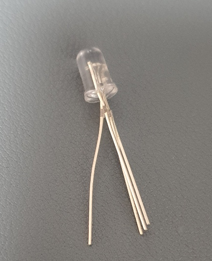

Arduino를 만지다 보면, 단순히 LED를 껐다 키는

행위가 생각보다 큰 원초적 희열을 가져다 준 다는 점을 알게 됩니다.

하지만.. 곧 위와 같은 단색 LED로는 한 가지 색깔밖에 낼 수 없단걸 깨닫고, 몬가몬가 "어떤 색깔이든 낼 수 있는 LED"를 찾게 되는데요..

모험을 떠나다 보면 아래와 같은 Cathode (-), Anode (+) LED를 만나게 됩니다.

그리고 이제 결선도를 찾아보면 대충 이런게 나오고

대충 따라 만들다 보면 음... 아두이노 Digital Output 따라서 껐다 켰다가 잘 됩니다.

근데? 이제? 뭔가 진짜 쓸만한 걸 만들어 보고 싶어서? 여러 개의 LED를 병렬로 잇는다던가 할 때가 되면? 어떻게 해야 할 지? 고민이 됩니다. 뭔가 단색 LED보다 회로도 많이 복잡해 진 것 같고...

근데 사실 별거 없습니다!
사진은 3색 Anode LED인데, Cathode도 딱히 다르지 않습니다(..)

원리를 파악해봅시다.

1) LED를 다음과 같이 RGB 핀과 + 핀 (Cathode LED는 - 핀)을 분리해 줍니다.

2) 그리고 굴러다니는 3V짜리 단추 건전지에 +극에 +핀을, RGB 핀을 반대쪽에 대 봅니다.

?? 그렇습니다. 사실 3색 LED는 그냥 단색 LED 세개가 병렬로 묶여 있었던 것입니다..

3) 그래서 한 핀씩 빼 보면, 사실 나머지 핀과 관계 없이 단색 LED처럼 잘 동작하는걸 알 수 있습니다(...)

아.. 그래서 대충 3색 LED가 단색 LED 세개를 병렬로 묶어놓은 거란걸 알면,

대충 단색 LED 연결할 때 저항 어쩌고 했던 기억이 납니다. 저항을 세개 쓰는게 대충 적정 전압 인가해 준 것 같습니다.

위 아두이노 회로도 사실 이해가 갑니다. 사실 단색 LED 세개 병렬로 이은 것과 같은 회로였던 것입니다..

아.. 이걸 몰라서 3색 LED가 몇달동안 창고에 쳐박혀 있었습니다.

다음엔 하나 해먹을 각오 하고서라도 막 굴려 봐야겠다 하는 생각이 듭니다..
