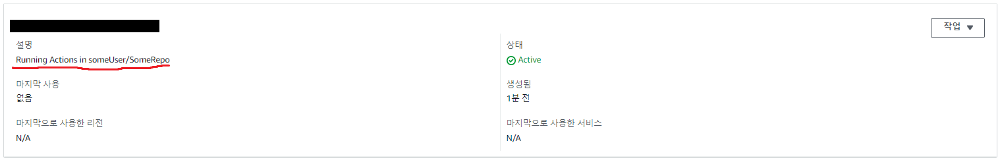
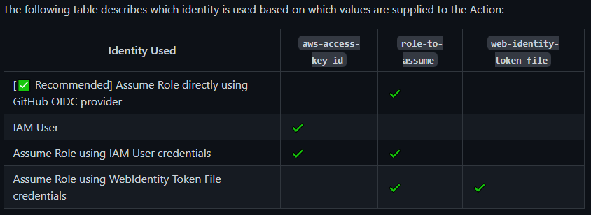
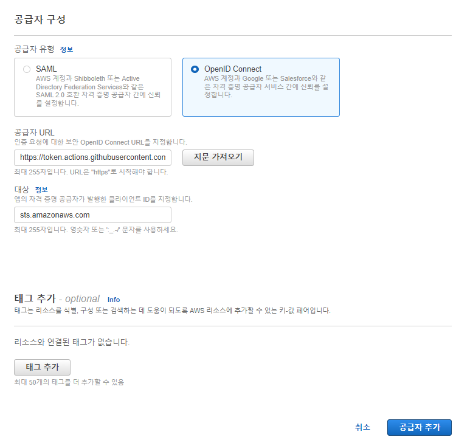
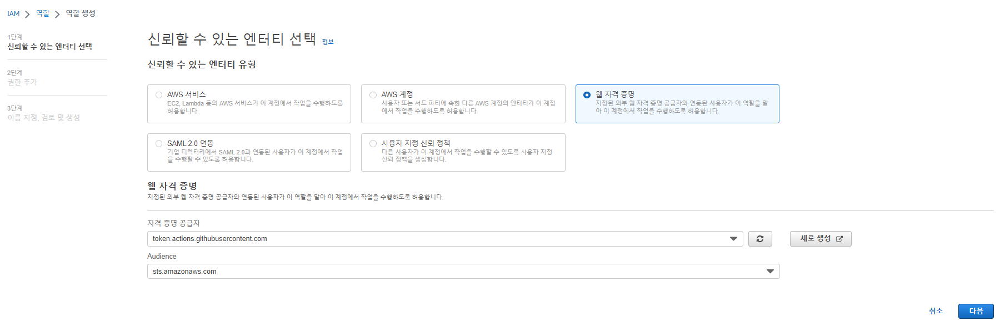
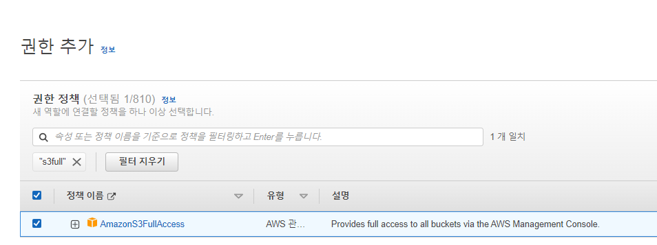
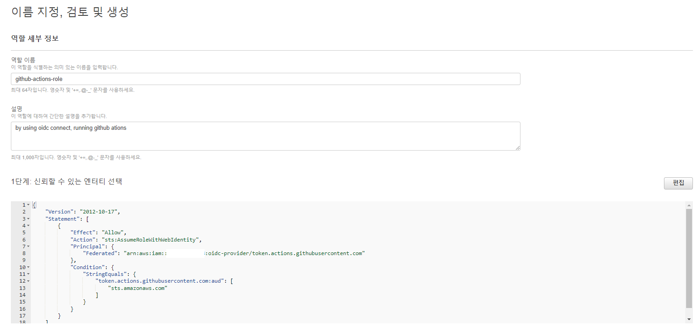
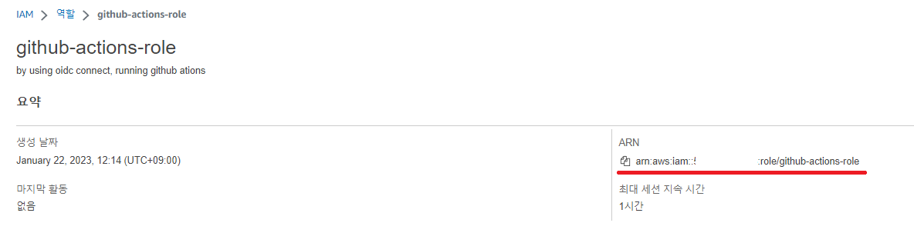
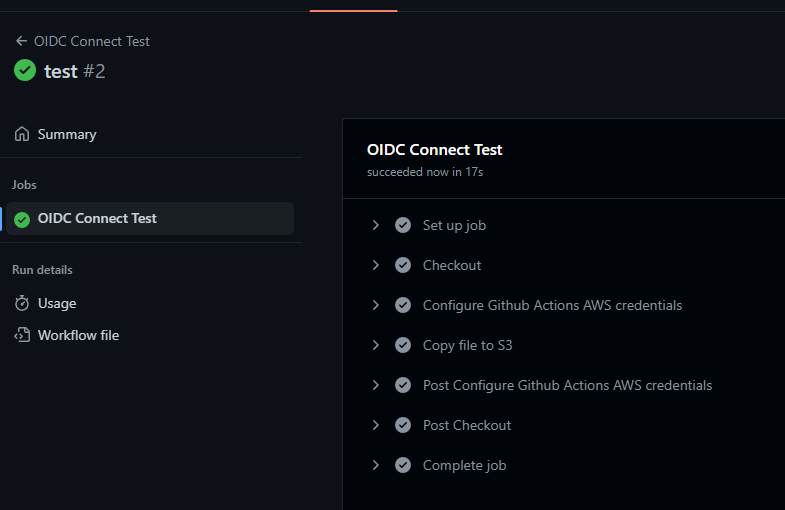
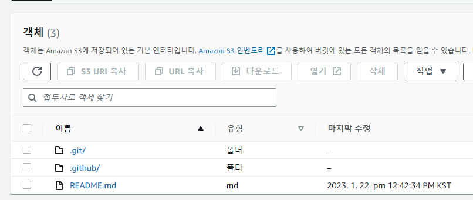

Github Actions에서 AWS를 사용하려면 보통 다음과 같은 과정을 거칩니다.

- IAM 창에 들어가서 새로운 유저를 발급합니다.
- Github Actions에서 IAM Role을 추가하고, Programmatic access 방식을 추가해 `AWS_ACCESS_KEY_ID`, `AWS_SECRET_ACCESS_KEY` 를 발급받습니다.
- 레포지토리에 설정에서, Github Secrets에 방금 발급받은 `AWS_ACCESS_KEY_ID`, `AWS_SECRET_ACCESS_KEY`를 추가합니다.
- 이후 github actions에서 다음과 같은 워크플로우를 추가한 뒤 AWS 리소스에 접근합니다.

```yaml
- name: Configure AWS Credentials
    uses: aws-actions/configure-aws-credentials@v1
    with:
    aws-access-key-id: ${{ secrets.AWS_ACCESS_KEY_ID }}
    aws-secret-access-key: ${{ secrets.AWS_SECRET_ACCESS_KEY }}
    aws-region: us-east-2
```

프로젝트가 하나라면, 이런 식으로 관리해도 큰 문제가 없습니다.

하지만 AWS를 사용하는 프로젝트가 늘어나기 시작하면 몇 가지 고민에 빠지게 됩니다.

예를 들어 한 레포지토리마다 하나의 IAM User를 발급을 할 것인지? 아니면 슈퍼 유저를 하나 발급해서 `ACCESS_KEY`, `ACCESS_SECRET`을 돌려 쓸지? 

슈퍼 유저를 발급하면 혹시라도 관련 키가 유출되었을 경우 큼지막한 AWS 영수증을 받아 볼 수 있어 좋은 Practice라고 보긴 어렵고,

여러 유저를 발급하자니 유저 수가 많아짐에 따라 어떤 Key가 어디서 사용하는지 관리하기 어려워지는 문제점이 있습니다.

그나마 최근에 Access Key마다 Description을 붙일 수 있는 기능이 추가되어 관리가 조금 나아졌지만, 그 전엔 어떤 Key를 어디서 쓰는지 몰라서 건드리지 못 하는 일이 비일비재했습니다.



여기서 한발자국 더 나아가서! Access Key 관리 모범 사례를 준수하려 하면 머리가 더 아파오기 시작합니다.


모범 사례에 따르면 주기적으로 장기 자격 증명을 교체해줘야 하는데, 주기적으로 새 Key 발급받고 레포지토리에서 Secrets 갈아끼울 생각을 하니 머리가 아픕니다.

(여러분이 받은 만료되지 않는 `ACCESS_KEY`, `ACCESS_SECRET` 를 장기 자격 증명이라고 합니다.)

**내가 매번 Secrets에 Key를 끼워주지 않아도, 알아서 내 리포지토리에만 내 키를 알아서 끼워주면 얼마나 편할까요?**

또한,

**매번 Actions이 돌 때마다 잠깐만 쓸 수 있는 임시 Token을 발급받아서, 혹시 Token이 털리더라도 시간이 지나면 만료되어서 못 쓰게 된다면 얼마나 좋을까요?**

OIDC 연결을 통해 가능합니다! 또한, AWS가 권장하는 보안 모범 사례 ([Link](https://github.com/aws-actions/configure-aws-credentials#assuming-a-role)) 이기도 합니다!



한번만 세팅해 두면 Actions 돌리기가 꽤 편해지는 방법을 소개합니다!

---

* 설정 방식은 공식 문서가 있습니다. 혹시 막히는 부분이 있다면 공식 문서를 참고하세요 ( [Link](https://docs.github.com/en/actions/deployment/security-hardening-your-deployments/configuring-openid-connect-in-amazon-web-services) )

### 1. OIDC 자격 증명 공급자 생성하기

* IAM Console로 접속합니다. https://console.aws.amazon.com/iam/ 
* 왼쪽 메뉴에서 **작업 증명 공급자** 메뉴를 선택한 뒤, **공급자 추가** 를 선택합니다.
* 다음과 같이 설정합니다.
    * 공급자 URL : `https://token.actions.githubusercontent.com`
    * 대상 : `sts.amazonaws.com`




* 이후 지문 가져오기를 누른 후, 공급자를 추가합니다.

### 2. OIDC 연동 Role 생성

* **역할** 메뉴를 선택하여 새로운 역할을 만듭니다.
* **웹 자격 증명** 을 선택하고, 다음과 같이 1에서 생성한 Github Provider를 선택해 줍니다.




* 권한의 경우, 지금은 간단한 예시이므로 Managed Policy에서 `S3FullAccess` 를 사용했습니다.
    * 실제로 사용하실 땐 직접 Policy를 만들어서 사용하실 수도 있습니다.



* 적당한 이름과 설명을 넣고, Role을 생성합니다.



* 생성이 끝났습니다! 이후 해당 Role의 ARN을 어디 기록해 둡시다.



### 3. Github Actions에서 해당 Role 사용하기

* 다음과 같은 식으로 방금 생성한 Role을 사용할 수 있습니다.
* 새로운 Repository를 판 후 `.github/workflows/oidc-connect-test.yaml` 을 생성합니다.
* **Access key나 Secret 등은 전혀 설정하지 않아도 됩니다!**

* 아래는 현재 레포지토리를 그대로 S3에 업로드하는 Github Actions입니다.

* 다음과 같은 부분을 자신에 맞게 바꿉니다.
    * role-to-assume 부분을 2. 에서 기록한 Role의 ARN으로 변경합니다.
    * 테스트를 위해 버킷을 아무 이름으로 하나 파고, <버킷 이름> 부분을 생성한 버킷 이름으로 교체합니다.

```yaml
name: OIDC Connect Test

on:
  push:
    branches: [ main ]

jobs:
  deploy:
    name: OIDC Connect Test
    runs-on: ubuntu-latest
    # These permissions are needed to interact with GitHub's OIDC Token endpoint.
    permissions:
      id-token: write
      contents: read
    steps:
      - name: Checkout
        uses: actions/checkout@v3

      - name: Configure Github Actions AWS credentials
        uses: aws-actions/configure-aws-credentials@v1
        with:
          role-to-assume: arn:aws:iam::123456461:role/github-actions-role # 아까 생성한 Role을 사용
          aws-region: ap-northeast-1

      - name: Copy file to S3 
        run: |
          aws s3 sync . s3://<버킷 이름>
```

* 이후, Actions가 정상적으로 작동하고



* 실제로 S3에 리포지토리 파일이 올라갔다면 세팅에 성공하신 겁니다!



---

### Appendix 1. 보안 강화하기

* 개인 사용 용이라 현재는 모든 레포지토리가 Credentials를 받아올 수 있지만, 특정 리포지토리만 한정할 수도 있습니다.
* Role 생성시 아래와 같이 repo를 추가하면, octo-org/octo-repo의 모든 브랜치/PR에서만 AWS를 사용하도록 할 수 있습니다.

```json
{
    "Version": "2012-10-17",
    "Statement": [
        {
            "Effect": "Allow",
            "Principal": {
                "Federated": "arn:aws:iam::123456123456:oidc-provider/token.actions.githubusercontent.com"
            },
            "Action": "sts:AssumeRoleWithWebIdentity",
            "Condition": {
                "StringLike": {
                    "token.actions.githubusercontent.com:sub": "repo:octo-org/octo-repo:*" # 이 부분을 추가
                },
                "StringEquals": {
                    "token.actions.githubusercontent.com:aud": "sts.amazonaws.com"
                }
            }
        }
    ]
}

```

### Appendix 2. Role은 어떻게 관리하나요?

* 한번 세팅을 해 두었으니, 앞으로 새로운 Role이 필요하면 2 (OIDC 연동 Role 생성) 부분을 진행해 새로운 Role을 생성하고, role-to-assume 부분만 갈아 껴 주면 됩니다.

끝!
