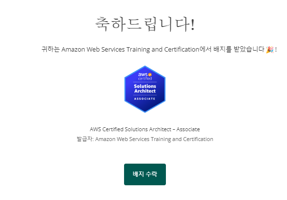
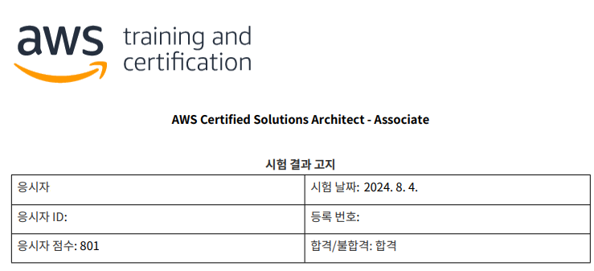

AWS에는 활용 자격증이 있습니다. ([Link](https://aws.amazon.com/ko/certification/exams/))

언젠간 따야지.. 따야지.. 하고 벼르고만 있다, 이러다간 평생 못 딸 것 같아서, 오늘 약속도 없겠다 당일에 시험 신청하고 온라인 시험으로 한번 봤습니다.

이게 어떤 자격증이고, 따면 뭐가 좋고.. 공부 방법은 어떻고.. 하는 글은 엄청 많으니, 다른 블로그에 맡기도록 하고 2024 기준으로 신청/유의사항/후기 정도만 정리해보려 합니다.

#### 1. 신청

[AWS 자격증](https://aws.amazon.com/ko/certification/) 링크에 들어가서 시험 일정 예약을 누르고 예약을 할 수 있습니다.

저는 Online with OnVUE 를 선택해 온라인으로 시험을 봤습니다.
시험 준비시에 **웹캠** 이 필요하니 만약 필요하다면 미리 준비해 주세요!

시험은 한국어로 신청하면 되고, 한국어로 신청해도 시험 도중에 번역이 이상한 것 같으면 영어 지문을 볼 수 있습니다.

추가로 팁을 드리면, AWS 할인 바우처는 찾아보면 하나쯤 있을 가능성이 높으니, 한번 찾아보시길 추천드립니다.

저는 [Reddit](https://www.reddit.com/r/AWSCertifications/comments/18woit6/2024_aws_vouchers_exam_discounts_other)의 할인 바우처 링크를 사용했는데, 시간이 괜찮으시다면 [AWS한국사용자모임](https://awskrug.github.io/) Slack 등에서 한번 할인 정보를 물어보시는것도 좋을 것 같습니다.

#### 2. 준비

프로그램 다운받고 지시에 따르면 시험 과정 세팅하는데는 큰 문제가 없습니다.

단, 백그라운드 프로세스중 일부가 문제를 일으키는 경우가 있었습니다. 저의 경우에는 하라는 대로 포그라운드 프로세스를 다 껐는데도, 백그라운드 프로세스 중 크롬 원격 데스크탑 서비스가 문제가 되어 시험 진행을 못 한 뻔한 경험이 있습니다.

만약 `chrome ¿ø°Ý µ¥½ºũÅé ¼­ºñ`가 뜬다면, 크롬 원격 데스크탑 관련 프로그램이니 작업 관리자 > 서비스 > chromoting 검색 > 중지 를 하면 시험 준비를 올바르게 마칠 수 있습니다.

#### 3. 시험

시험은
1. 시험 시간 30분 전에 Check in 하러 먼저 들어가서
2. 얼굴 사진 찍고, 신분증 사진 찍고, 시험 칠 공간 (주변 사진) 찍고
3. 감독관이랑 웹캠으로 연결 후 워치 차고 있는지 손 보여주기, 전신 보여주기, 웹캠으로 데스크에 아무것도 없는지, 주변에 아무것도 없는지 확인하기
4. 이후 시험 진행

순으로 진행됩니다.

문제는 일반적으로 평이했는데, 잘 모르는게 있다면

1. 비슷한 서비스가 여러 개 있다면 최근에 나온거 찍기 (EG > CLB랑 ALB가 있다면 ALB가 정답일 가능성이 높겠죠?)
2. Serverless 등 AWS가 밀어주는 키워드 찍기

가 찍기 팁 정도가 되겠습니다(...)

#### 4. 결과 발송

예전에는 시험 끝나자마자 결과가 나왔다고 하는데, 저는 그렇진 않았습니다.

저는 11시쯤 당일 13시 15분 시험을 신청했고, 12시 45분부터 체크인을 시작해 시험을 2시쯤 끝내고 나왔습니다.

시험 결과는 19시 15분쯤 왔으니, 대충 처리하는데 5~6시간정도 걸리는 것 같습니다.

합격하면 다음과 같은 메일이 날아옵니다.

AWS를 쓴지 오래 돼서, 그냥 기억을 더듬더듬 더듬으며 풀었던 문제가 많았습니다. 

가격이 비싸서 엄두도 못 내고 있었는데, 이러면 평생 못 볼 것 같으니 한번 떨어진다고 생각하고 쳐 보자 하니 좋은 결과가 있었씁니다~

다음엔 Developer 자격증을 따 볼까 생각중인데, 언제 딸지는 고민해볼 생각입니다. 그럼 안녕~