회사나 조직에서 AWS를 사용하다 보면, 다음과 같은 SSO (Single Sign On) 페이지를 통해 로그인 하는 아래와 같은 페이지를 본 적이 있으실 겁니다.

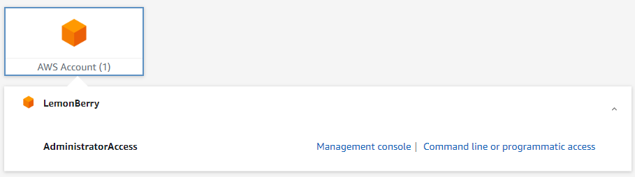

한번 설정해 보면 세션이 유지되는 동안 매번 id/password를 입력해 주지 않아도 되어서 사용하기도 편하고,

또한 aws-cli나 aws-sdk를 사용할 때도 `AWS_ACCESS_KEY`, `AWS_ACCESS_SECRET` 같은 유출되면 안 되는 정보들을 로컬 컴퓨터에 평문으로 저장하지 않아도 되어서, 보안 상으로도 이점이 있습니다.

또한 무료 서비스라 ([Link](https://aws.amazon.com/ko/iam/identity-center/faqs/)) 추가 비용도 **전혀** 들지 않습니다!

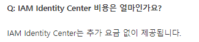

그러면 한번 설정해 봅시다!

---

## 1. IAM Identity Center 설정하기

### 1. AWS에서 SSO를 검색해서 IAM Identity Center 를 찾습니다.

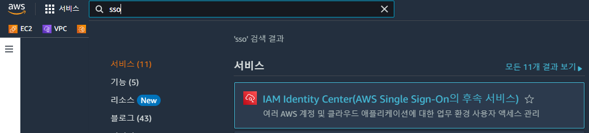

### 2. 활성화를 눌러줍니다! 
- 이 때, Identity Center는 한 리전에서만 활성화 가능하니 주로 쓰는 리전에 활성화 해 주면 추후 관리하기 좀 더 편합니다.

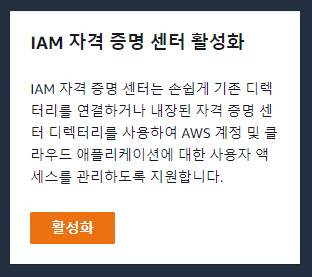

### 3. AWS Organization을 먼저 설정해 줍니다.

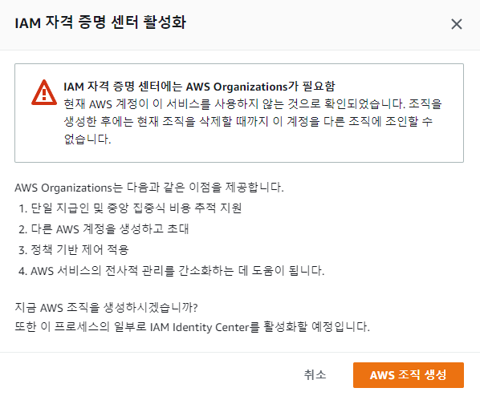

- 다음과 같은 에러창을 만날건데, AWS Organization을 먼저 생성해 줍니다.
- AWS Organization도 마찬가지로 *무료* 서비스입니다. ([Link](https://docs.aws.amazon.com/ko_kr/organizations/latest/userguide/orgs_introduction.html#pricing))

### 4. 그러면 Dashboard가 생성되는데, 추가 설정을 위해 설정으로 이동 버튼을 눌러줍니다.

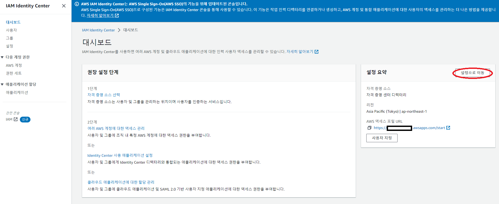

### 5. 일단 SSO 로그인 페이지에 별칭을 부여해 봅시다.
 - 기본으로 제공해 주는 로그인 페이지는 `aadfbasdf-d.awsapps.com/start` 과 같이 자동 생성된 페이지라 기억하기 어렵습니다.
 - 이걸 `lemonlogin.awsapps.com/start` 처럼 별명을 지정해 봅시다.
 - 딱 한 번만 설정할 수 있으므로, 신중하게 설정합시다!

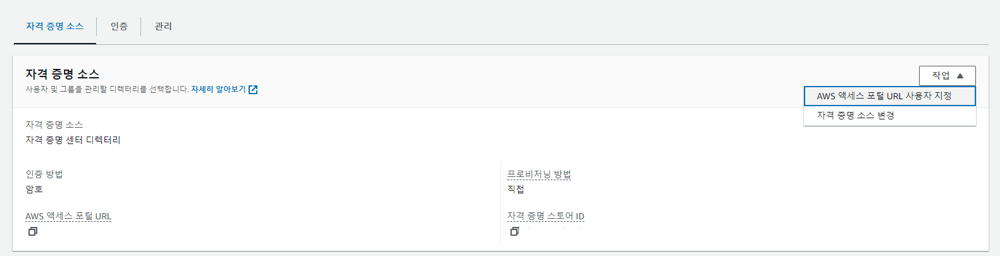

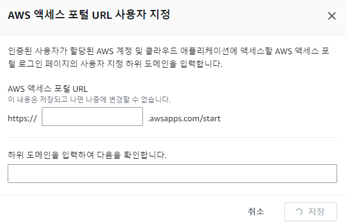

### 6. 그룹을 추가합시다!

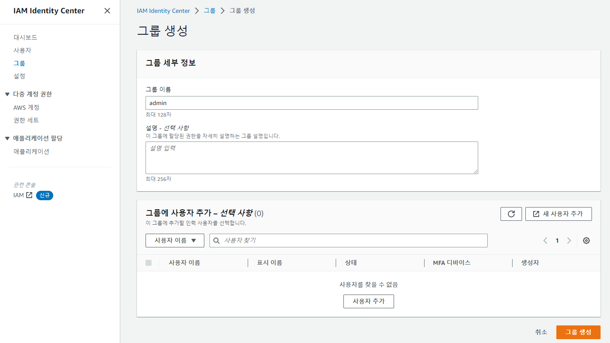

그룹을 

### 7.사용자를 추가합시다!

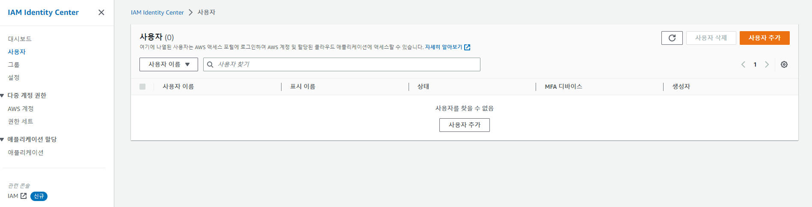

- 사용자 추가 버튼을 누른 뒤에..

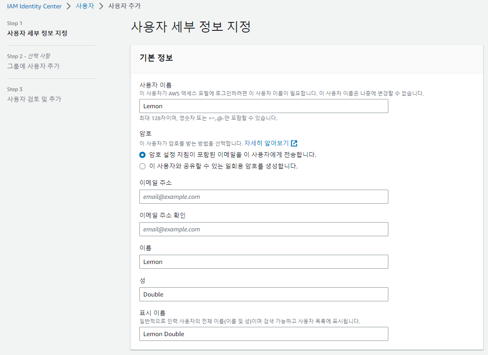

- 사용자 정보를 입력해 줍니다. 암호는 이메일로 설정 메일을 받을 수도, 일회용 패스워드를 받을 수도 있습니다.
- 기본값으로 이메일로 받도록 합시다.

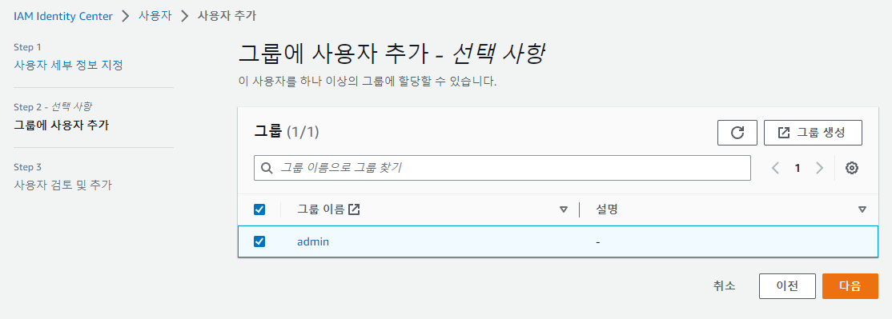

- 이후 Group을 선택할 수 있는데, 5.에서 설정했던 그룹을 추가해 줍니다.

- 이후 이메일을 확인하여 초대를 수락하고, 해당 계정에 Password를 설정한 후 어딘가에 기록해 둡니다!

### 8. 권한을 추가합시다!

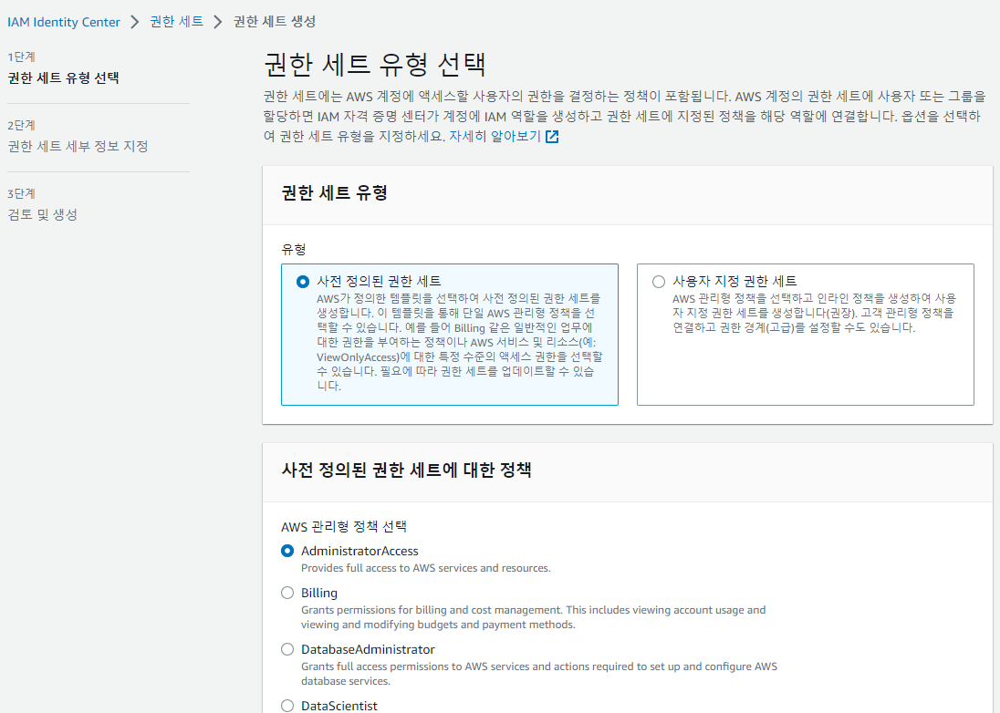

- 권한 세트를 선택합니다. 저는 `AdministratorAccess`를 선택했지만, 다른 값을 선택할수도 있습니다.
- 사전 정의된 권한 세트에 원하는 Role이 없다면 사용자 지정으로 직접 선택할 수도 있습니다.

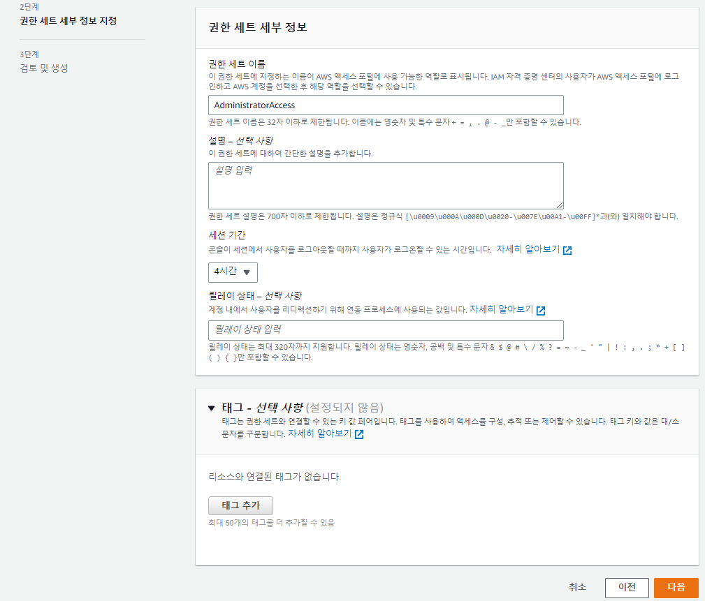

- 이후 나머지 설정을 적어 줍니다. 
- 세션 기간의 경우, 해당 시간이 지나면 자동으로 AWS가 로그아웃 시키는 시간입니다.
- 기본은 1시간인데, 너무 자주 로그아웃 되면 귀찮아서 저는 4시간 정도로 늘렸습니다.
- `릴레이 상태` 는 로그인 성공 시 Redirect할 URL을 정할 수 있습니다. 예를 들어 Billing 권한이라면 로그인 성공시 Billing 페이지로 리다이렉션되는 식입니다.
- 필요하다면 문서([Link](https://docs.aws.amazon.com/ko_kr/singlesignon/latest/userguide/howtopermrelaystate.html)) 를 참고해서 설정해 주세요. 저는 빈 칸으로 남겨뒀습니다.

### 9. SSO 로그인 설정하기

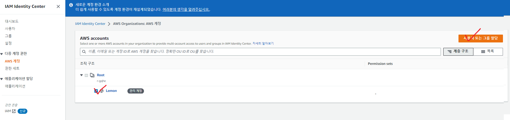

- 이후 AWS 계정 탭에서 내 계정을 선택하고, `사용자 또는 그룹 할당` 을 눌러주세요.

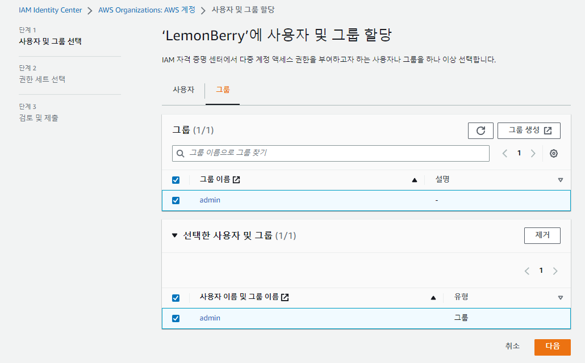

- 위에서 설정한 그룹을 추가하고

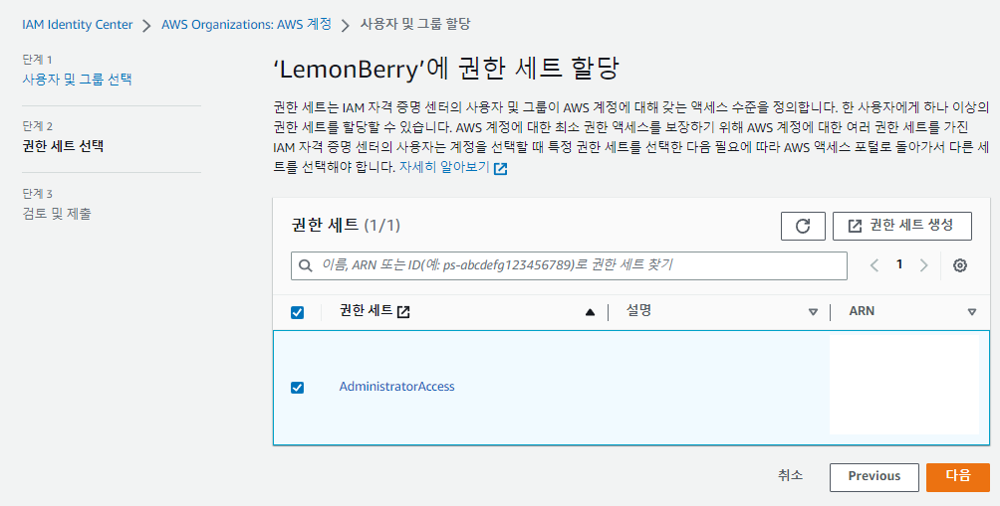

- 위에서 설정한 권한을 추가해 주세요.

### 10. SSO 로그인

- 이제 5에서 추가했던 aws 로그인 주소로 가서 로그인 해 봅시다. `별칭.awsapps.com/start` 로 들어가서 로그인합니다.

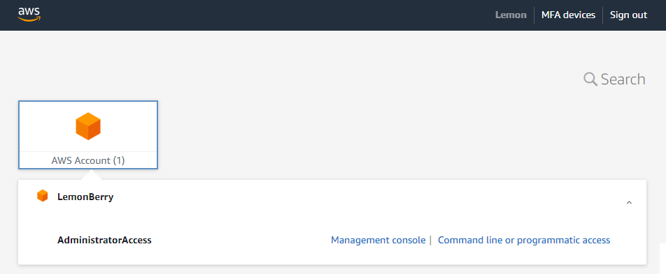

- SSO 설정에 성공하셨습니다!

### Appendix 1. 보안 강화하기

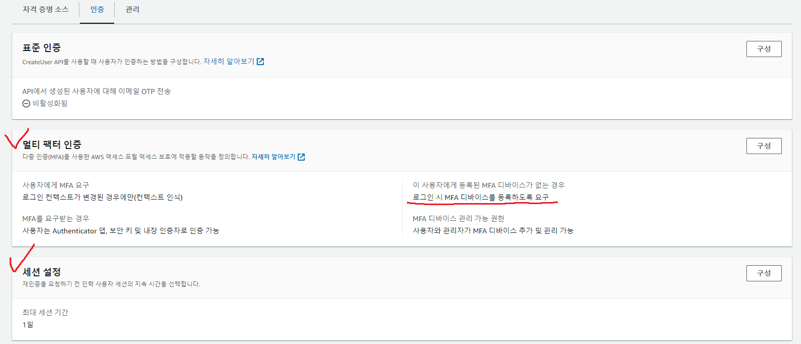

- IAM Identity Center - 설정에 들어가 SSO 계정에 대한 MFA 설정, 세션 길이 설정 등을 할 수 있습니다.
- 다른 내용은 그대로 쓰더라도, `이 사용자에게 등록된 MFA 디바이스가 없는 경우 - 로그인 시 MFA 디바이스를 등록하도록 요구` 옵션은 키는 것을 추천드립니다.

### Appendix 2. AWS SSO로 AWS_CLI 사용하기

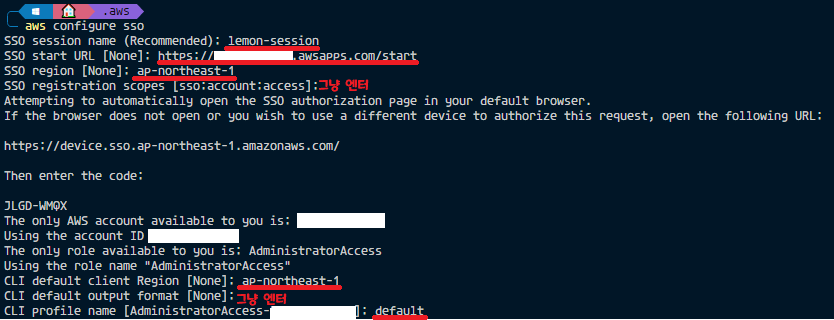

- SSO 설정 이후 위와 같이 aws configure sso를 이용하여 로그인 설정을 해 줍니다. (빨간색으로 밑줄친 줄은 직접 입력합니다.)
- 설정 이후 `aws s3 ls` 커맨드 등을 이용하여 정상 세팅되었는지 확인합니다. 