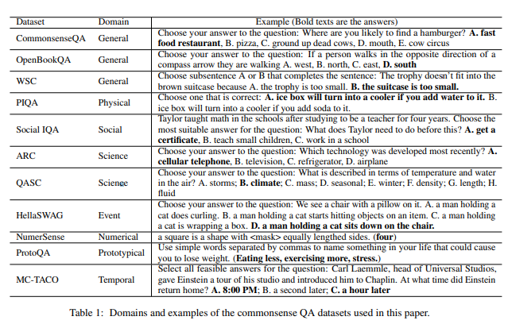
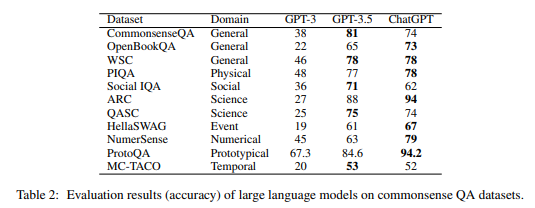
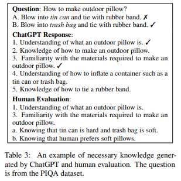
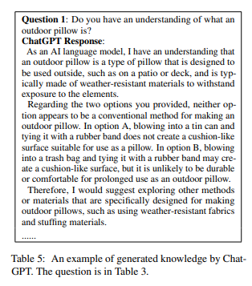
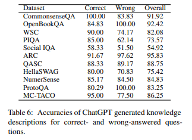
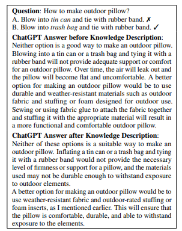
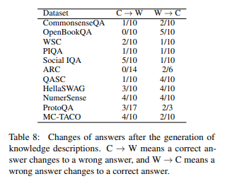

요즘 심심할 때 논문을 하나씩 읽는 취미가 생겼습니다.
그 중, arxiv에서 재밌는 논문을 하나 읽게 되어서, 정리하고 공유해 보려고 합니다.

논문 제목은 `ChatGPT is a Knowledgeable but Inexperienced Solver: An Investigation of Commonsense Problem in Large Language Models` ([Arxiv Link](https://arxiv.org/abs/2303.16421)) 입니다.

주제는, **대규모 언어 모델(ChatGPT) 는 상식적인 문제를 잘 풀 수 있는가?** 입니다. 꽤 재밌는 주제라서, 제가 공부하는 겸 공유하는 겸, 겸사겸사 읽은 내용을 정리해 보려고 합니다.

제가 논문을 읽어 본 적도 없고, 학부 기억도 가물가물 해서 틀릴 수 있음을 미리 알려드립니다! (틀린거 있음 알려주세요 헤헤)

## 1. 요약

논문은 다음과 같은 질문을 던집니다.
1. GPT는 상식에 관한 질문에 효과적으로 답할 수 있는가?
2. GPT는 상식에 대해 잘 알고 있는가?
3. GPT는 특정 질문에 답하기 위해 필요한 상식과 아닌 상식을 잘 구분할 수 있는가?
4. GPT는 주어진 상식을 효과적으로 활용하여 질문에 답할 수 있는가?

그리고 이에 대한 간략한 답은 다음과 같습니다.

1. 효과적으로 답할 수 있으나, 사회규범, 인과관계, 시간과 관계된 특정 분야에 대해선 잘 답하지 못한다.
2. 대부분의 상식을 잘 알고 있다.
3. 질문에 대답하는데 밀접한(필요한) 상식과 아닌 상식을 잘 구분하지 못 한다.
4. 문맥상에서 추가적인 상식을 입력해 주더라도, 잘 사용하지 못 한다.

## 2. 상식의 분류

연구진은 상식을 8가지 카테고리로 분류했습니다.
각각 다음과 같습니다.

---

**1. 일반(General) 상식 (널리 공유되는 상식)**
- 해는 동쪽에서 뜬다

**2. 물리적(Physical) 상식 (물리적 세계에 대한 지식)**
- 유리컵은 떨어지면 깨진다. 물은 아래로 흐른다

**3. 사회적(Social) 상식 (사회규범에 대한 지식)**
- 도움을 받았으면 감사합니다~ 라고 해야 한다.

**4. 과학(Science) 상식 (과학 개념의 원리/지식)**
- 중력은 모든 물체를 지구 중심으로 끌어당긴다

**5. 인과 관계(Event) 상식 (인과 관계 및 순서에 대한 지식)**
- 물컵을 넘어트리면 -> 물이 쏟아진다

**6. 숫자와 관련된(Numerical) 상식 (숫자와 관련된 상식)**
- 사람 손가락은 2개고 손가락은 10개

**7. 전형적인(Prototypical) 상식 ( 개념에 대한 지식)**
- 제비는 새의 일종이며, 날개가 있다

**8. 시간과 관련된(Temporal) 상식**
- 해외여행은 산책보다 시간이 오래 걸린다.

--- 

그리고, 연구진은 각 카테고리별로 상식에 관련된 데이터 셋 11개를 준비했습니다.

왼쪽부터 데이터셋 이름 / 카테고리 / 예시 질문 입니다.

## 3. ChatGPT는 상식 질문에 효과적으로 답할 수 있을까?

연구진은 위 데이터셋마다 100개씩 문제를 뽑아 GPT3, GPT3.5, ChatGPT 모델에 물어봤습니다.

아래는 GPT3, GPT3.5, ChatGPT의 각 질문에 대한 정답 비율입니다.

주목할 점은 다음과 같습니다.

* 전체적으로 잘 답변함
  * 과학 (Science) 분야는 약 94%로 가장 높은 정답률을 보임.
  * 사회규범(Social), 인과관계(Event), 시간 (Temporal) 에 대한 정답률은 저조 (70% 미만)
* 전체적으로 GPT 3.5 모델에 비해, 튜닝 모델인 ChatGPT의 정확도가 높음
  * 일부 질문에 대해 GPT 3.5가 정답률이 높은 것으로 나와있으나, 이는 ChatGPT가 "주어진 데이터만으로는 정답을 알 수 없습니다" 라는 답변이 나와 생긴 착시에 가까움.

## 4. ChatGPT는 질문에 답변하기 위해 필요한 상식과 아닌 상식을 잘 구분할 수 있을까?

연구진은 위 질문 데이터셋에서, 각 데이터셋마다 20개를 다시 뽑았습니다.

이후, GPT에게 "이 질문에 답변하기 위해 어떤 지식이 필요한지" 물어본 뒤, 인간의 답변을 바탕으로 Precision(정확도), Recall(재현율), F1 Score를 구했습니다.

Precision? Recall? 어려운 말이 나오니까 한번 정리하고 들어갈게요.

---

* Precision : GPT가 낸 정답의 정확도
  * GPT의 답변 중 정답은 몇 %인가?
  * 예를 들어 5개의 답변 중, 3개는 정답 2개는 오답이라면 Precision은 60%
  
* Recall : 전체 정답 중 GPT가 찾아낸 정답의 개수
  * 사람이 예측한 정답 중, GPT가 몇 개나 찾아냈는가?
  * 예를 들어 예측 정답이 5개고, GPT가 답변 10개 중 4개는 정답, 6개는 오답이라면 Recall은 80% (4/5)
  * Recall을 계산할 때 오답은 중요하지 않음!

* F1 Score : Precision과 Recall의 조화평균
  * Precision만 지표로 삼으면? : 확률 제일 높은 답을 **딱 하나만** 하면 됨
  * Recall만 지표로 삼으면? : 답변을 10000개씩 쓰면 그 중 **몇개는 얻어걸림**
  * 하지만 우리가 원하는 건 "정확한 답을" "충분히 많이" 해 주는 AI 모델
  * 따라서 Precision과 Recall의 조화평균을 내면 "정확도" 비슷한 지표가 나옴!
  * 즉, F1 Score가 높음 == 답변을 잘 했다!

---

어려운 이야기를 했는데! 결론적으로, 다음과 같은 결과를 얻었습니다.

- GPT는 Precision은 높지만 Recall은 높음
  - 전체 데이터셋에서 Precesion은 **55.88%**지만, Recall은 **84.42%**
  - **즉, 질문을 해결하는데 필요한 지식을 거의 대부분 알려주지만, 정확도가 높진 않음**
- GPT는 과학 분야에선 비교적 성능이 좋지만, (F1 74~76%), 사회규범, 시간 분야에서 특히 성능이 낮음(F1 50% 이하)

## 5. ChatGPT는 상식에 박식할까?

연구진은 3. 에서 생성된, 필요한 지식을 기반으로 질문 프롬프트를 수동으로 만들었습니다. 이후, GPT가 생성한 답변이 정답인지 오답인지를 수동으로 평가했습니다.

위 질문의 경우는 ChatGPT가 생성한 오답의 예시입니다.

GPT는 `blowing into a trash bag and tying it with a rubber band may create a cushion-like surface, but it is unlikely to be durable or comfortable for prolonged use as an outdoor pillow` (번역 : 쓰레기 봉투에 바람을 불어 고무줄로 묶으면 쿠션같은 표면을 가지지만, 야외용 배개로 오래 쓰기엔 내구성이 떨어지거나 편하지 않을 것) 이라 했지만, **쓰레기 봉투로 배개를 만드는 건 흔한 관행이므로 오답으로 처리**했다고 합니다.

위 결과 표에 따라, 연구진은 다음과 같은 결과를 얻었습니다.

- GPT는 박식하며, 질문에 답변하기 위한 대부분의 상식을 알고 있음.
  - 전체 데이터셋에서 평균 82.66%의 정확도를 보임
  - 대부분의 데이터셋에서 70% 이상의 정확도를 보임.
  - 단, 사회규범 영역에서 54.92%로 성능이 낮음.
- 하지만, GPT의 답변 중 오해의 소지가 있거나, 지나치게 일반화되어 필요없는 지식도 들어가 있음
  - 전체 답변의 26.25%에 관련성이 낮고 오해의 소지가 있는 정보가 포함되어 있음.
  - 15% 정도의 설명이 지나치게 일반화되어, 질문 답변에 필요한 구체적 정보가 아님

## 6. ChatGPT는 응답시 대화 맥락에서 추가된 상식을 활용하여, 답변에 활용할 수 있을까?

연구진은 GPT가 문맥에서 나온 상식을 이용하여 답변에 활용할 수 있는지 확인하기 위해, 4.에서처럼 GPT에게 질문에 답변할 때 필요한 상식을 추론하게 한 후, 같은 질문에 다시 답하게 하여 답변이 평가되는지 확인했습니다.

위 예시는, 이전에 오답이었던 답변이 추가 설명을 생성한 뒤에도 변경되지 않는 예시를 보여줍니다.

위 결과 표에 따라, 연구진은 다음과 같은 결과를 얻었습니다.

- GPT는 GPT가 생성한 상식 설명을 대화 맥락 추가하는 것 만으로는, 효율적으로 답변에 활용할 수 없음.
  - 맥락에 설명이 추가되는 경우, 오답이 정답으로 바뀌는 경우 (C->W) 및 정답이 오답으로 바뀌는 경우 (W->C)가 모두 존재
  - Social IQA 데이터셋의 경우, 맥락에 추가된 상식이 잘못되어 오히려 정답이 오답으로 바뀌는 것이(5개) 오답이 정답으로 바뀌는 것보다(1개) 많았음.
  - 연구진은 이미 Model에 생성된 지식이 있어, 단순히 추가 정보를 생성하는 것이 큰 효과가 없는 것으로 추정함.

심지어, 대화 맥락에 "GPT가 생성한 상식" 이 아닌, "유저가 직접 올바른 상식"을 추가해줘도 정답률이 100%가 되지 못 했음.

- 사람이 주석을 단 CoS-E, ECQA 데이터셋을 바탕으로 대화 맥락에 정답 (Golden Knowledge) 를 추가함.
  - CoS-E는 오답->정답이 4개 증가
  - ECQA는 오답->정답이 8개, 정답->오답이 1개 증가
  - 연구진은 복잡한 추론 (예를 들어, 부정 추론) 등을 활용할 수 있는 능력이 부족하다고 추론
    - 부정 추론의 예시
      - Q: 농구공에 구멍이 났지만, 모양이 그대로라면 틀린 것은?
      - A: 구멍이 뚫렸다, B:미국에서 인기가 있다, C: 공기가 가득 차 있다
    - CoS-E 데이터셋은 "구멍이 뚫린 물체에는 공기가 머무를 수 없다" 라고 설명했지만, GPT는 여전히 A를 예측

// TODO : 더 쓰기..