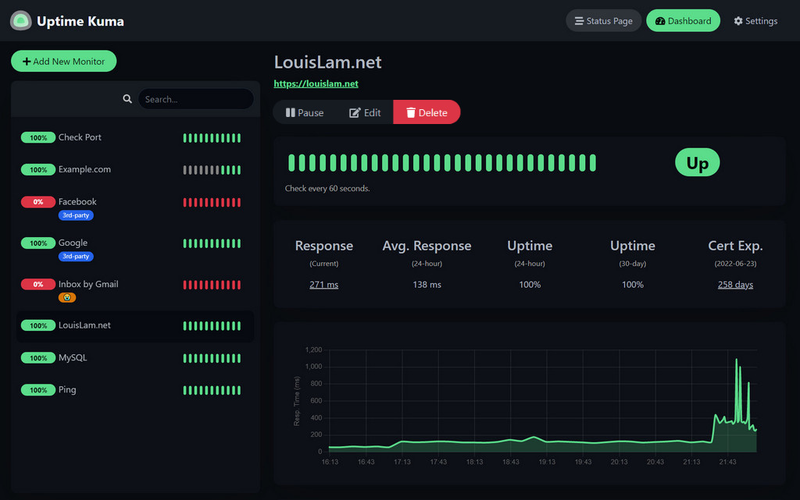
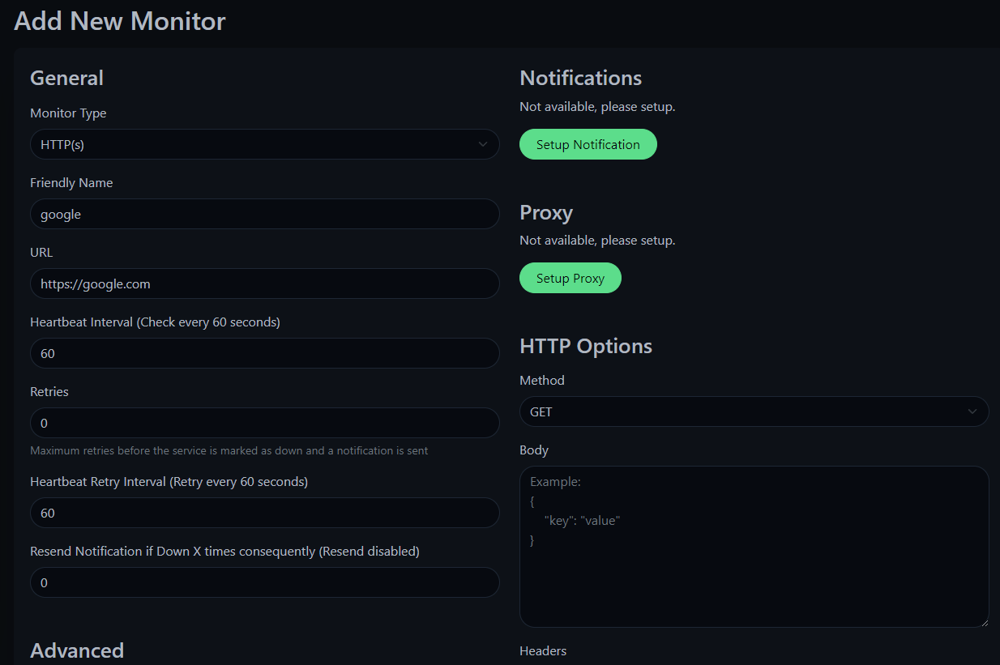
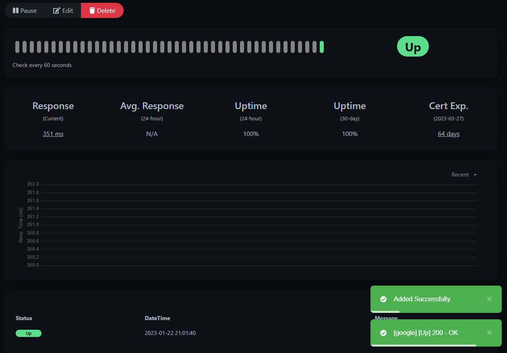
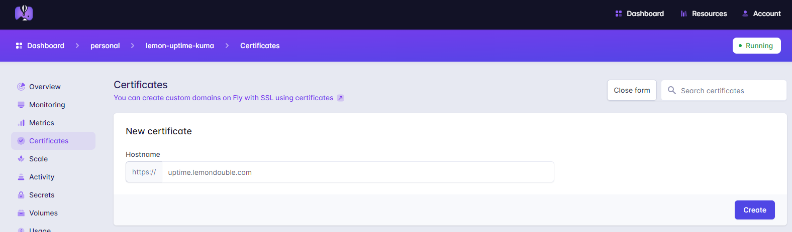

이번에 소개할 프로젝트는 서버의 Uptime을 기록해 주는 Uptime Kuma라는 서비스입니다.

내 클러스터/서버 등을 모니터링하고, 문제가 생긴 경우 Telegram, Slack, Discord, E-mail... 등의 여러 방법을 통해 서버가 죽었음을 알려줄 수 있습니다.



이렇게 생겼어요!

Github 주소 ( [Link](https://github.com/louislam/uptime-kuma) ) 에 가시면 Demo 서비스도 체험해 볼 수 있습니다.

Fly.io에 대한 소개는 이전 글 ([Fly.io 소개 및 Fly.io에 올리기 좋은 서비스 추천 (VaultWarden)](https://lemondouble.github.io/p/fly.io-%EC%86%8C%EA%B0%9C-%EB%B0%8F-fly.io%EC%97%90-%EC%98%AC%EB%A6%AC%EA%B8%B0-%EC%A2%8B%EC%9D%80-%EC%84%9C%EB%B9%84%EC%8A%A4-%EC%B6%94%EC%B2%9C-vaultwarden/)) 에서 많이 했으니 글을 참고해 주시고, 이번 글에서는 설치법에만 집중하겠습니다.

### 1. fly.toml 파일 생성

* 적절한 위치에 가서, `flyctl launch` 를 입력하여 fly.toml 파일을 생성합니다.

### 2. volume 생성

* 모니터링 기록 저장, ID/Password 저장 등을 위해 Volume이 필요합니다.
* 그렇게 많은 볼륨이 필요하진 않아서, 저의 경우는 1GB로 생성했습니다.

```bash
flyctl volume create uptime_kuma_data --region nrt --size 1
```


### 3. fly.toml 파일 변경

* 다음 toml 파일을 참고해 배포 파일을 작성해 주세요.
* 

```toml

# 앱 이름은 flyctl launch 할 때 설정한 값입니다.
app = "lemon-uptime-kuma"
kill_signal = "SIGINT"
kill_timeout = 5
processes = []

# 추가 :1 은 Debian Stable Build입니다.
# https://hub.docker.com/r/louislam/uptime-kuma
[build]
  image = "louislam/uptime-kuma:1"

[env]

# 추가, 아까 생성한 Volume을 Mount합니다.
[mounts]
source="uptime_kuma_data"
destination="/app/data"

[experimental]
  auto_rollback = true

[[services]]
  http_checks = []
  internal_port = 3001 # 변경, 기본 설정시 Kuma는 내부에서 3001 포트를 사용합니다.
  processes = ["app"]
  protocol = "tcp"
  script_checks = []
  [services.concurrency]
    hard_limit = 25
    soft_limit = 20
    type = "connections"

  [[services.ports]]
    force_https = true
    handlers = ["http"]
    port = 80

  [[services.ports]]
    handlers = ["tls", "http"]
    port = 443

  [[services.tcp_checks]]
    grace_period = "1s"
    interval = "15s"
    restart_limit = 0
    timeout = "2s"
```

### 4. 배포하기!

```
flyctl deploy 
```
커맨드를 입력하여 배포합니다.

### 5. 접속하여 ID/Password 설정하기

`<앱 이름>.fly.dev` 로 접속하거나,
주소를 잘 모르겠으면 `https://fly.io/apps` 로 접속하여 앱을 선택하고 주소를 가져옵니다.

이후 ID/Password를 설정합니다.


### 6. 모니터링 추가하기



Add New Monitor를 입력한 뒤, 다음과 같이 설정합니다.

이후 Save 버튼을 누르면..



모니터링이 정상 작동합니다!

### Appendix 1. TMI

* 한국어를 지원합니다! Settings -> Appearance 에서 언어 설정을 할 수 있습니다.

### Appendix 2. Custom Domain 사용하기

* 저의 경우, 제 도메인이 있어 Integration 하려고 합니다.
* 앱 페이지에 가서, IPv6을 가져옵니다. (IPv$는 Shared IPv4라 IPv6을 사용했습니다.)

* 자신의 DNS 페이지에 가서 `CNAME` 유형을 선택하고, 값으론 `<앱이름>.fly.dev` 를 입력합니다.
* 이후 https://fly.io/apps 대시보드에 들어가, kuma 앱 -> Certificates -> Add Certificate를 누른 후, 내가 입력한 커스텀 도메인을 입력합니다.



* 잠시 후 내가 생성한 커스텀 도메인으로 접속이 가능한걸 확인할 수 있습니다!