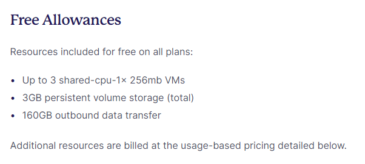
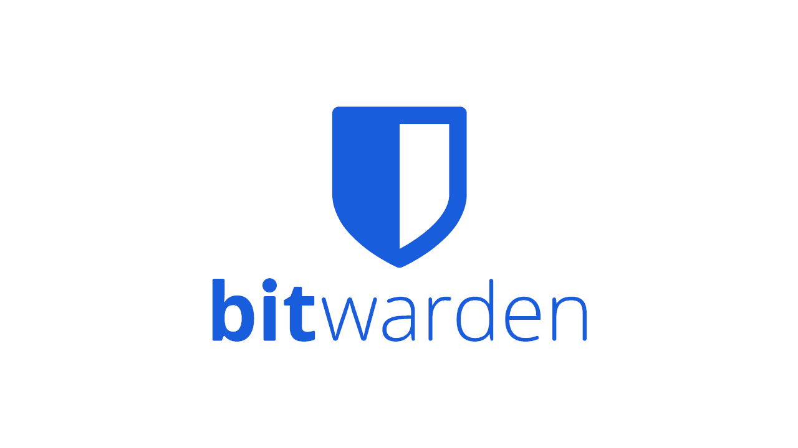
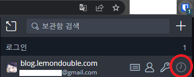
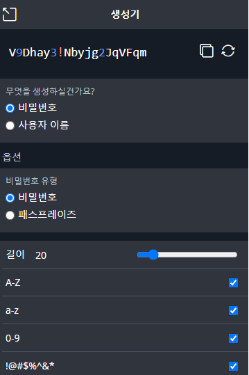
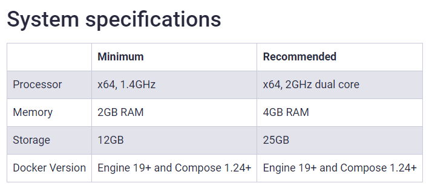
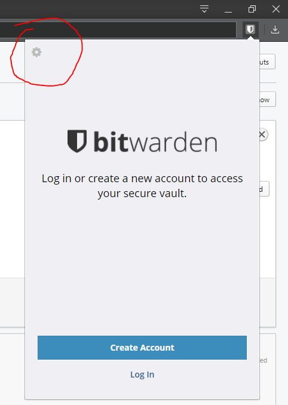
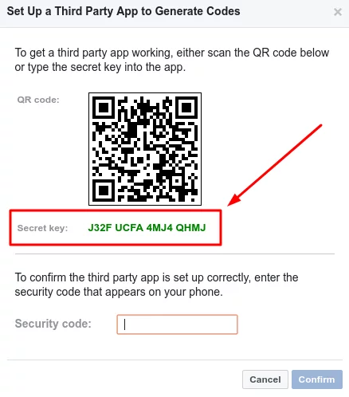
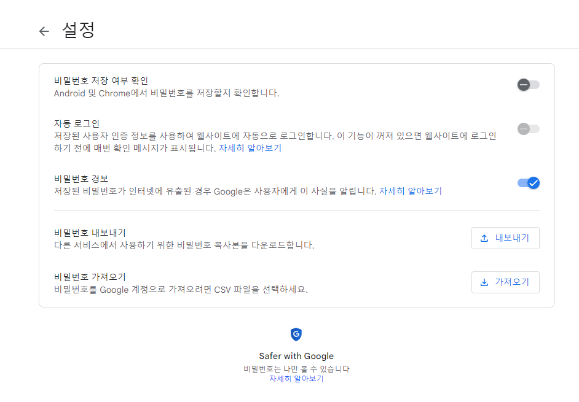
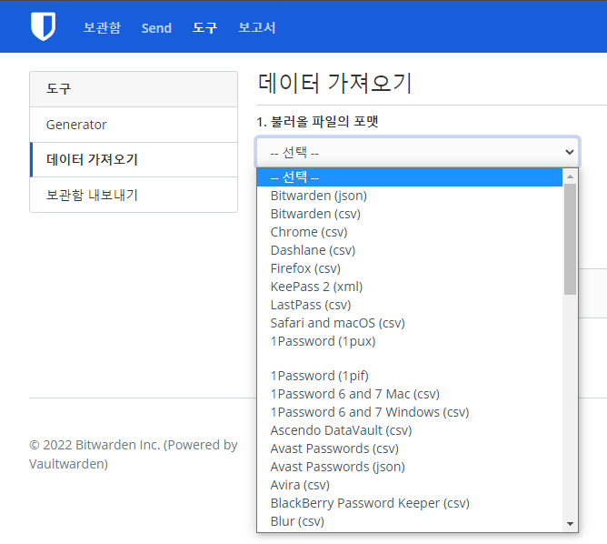

Fly.io 라는 회사에선 도커 이미지만 준비하면 간단히 도커 이미지를 특정 국가 등에 배포할 수 있는 기능을 제공합니다.

(가입 완료 후) fly.toml 이란 파일을 적절히 작성 후

```bash
flyctl deploy
```

만 입력하면, 잘 지지고 볶아서 이미지를 서버에 올려 주고, DNS, https 설정, IP 발급, 모니터링 (Grafana) 설정 등을 해 줍니다.

그리고 클릭 몇 번으로 Scale-up도 해 줍니다. 직접 세팅해도 되긴 하지만, 꽤 귀찮은 작업을 많이 해 줘서 편합니다. 

또한, 프리 티어에서도 아래와 같은 스펙을 제공합니다.




하지만 프리 티어인 만큼 스펙이 그리 널널하진 않습니다.
그래서 "데이터 관리가 중요해서 클라우드 서비스를 사용하고 싶지만, 그리 많은 컴퓨팅 자원을 사용하지 않는" 어플리케이션 사용이 필요합니다.

그런 용도로 적절한 Password Manager인 Vaultwarden을 설치하는 방법을 포스팅하려고 합니다.

---

### VaultWarden (Bitwarden 호환 서버)



Bitwarden 은 패스워드 매니저로써, 웹 브라우저, 윈도우, ios, android 앱 등을 통해 여러 디바이스에서 비밀번호 공유가 가능하게 해 줍니다.

크롬을 사용하신 분이라면, "크롬 자동완성" 기능을 생각하시면 이해가 빠릅니다.

Bitwarden은 거기에 더해 OTP 기능을 지원하며,



비밀번호 생성기와



Organization (조직) 설정 등으로 패스워드 등을 공유하는 기능도 제공합니다.

만약 같이 개발을 하는데, Slack Webhook URL이나, 환경변수, 개발 DB ID 및 패스워드 등을 공유해야 할 때 유용합니다. 

그 이외에도 해킹된 DB 중 내 비밀번호가 일치하는게 있는지, 재사용된 비밀번호가 있는지 등의 보안 감사 기능과, 종단간 암호화를 이용한 민감한 데이터 전송 기능인 SEND 기능 등을 제공합니다.

하지만, Bitwarden은 오픈소스라 패스워드 서버를 Self-hosting 가능하지만, 프로덕션 레벨에서 고가용성을 확보하기 위해 높은 사양과 많은 설정을 요구합니다. ( [Bitwarden Install Docs](https://bitwarden.com/help/install-on-premise-linux/) )




이런 문제를 해결하기 위해, Bitwarden Client와 호환되지만 사양을 낮추고, Database도 SQLite를 사용하여 하나의 Docker Image만으로도 서버를 실행시킬 수 있는 [Vaultwarden](https://github.com/dani-garcia/vaultwarden)이란 프로젝트가 있습니다.


공식 서버가 2GB RAM을 요구하는 것에 반해, 해당 서버는 Idle 상태일 때 약 100MB의 Memory를 사용하므로, Fly.io를 이용하여 배포하면 간단히 사용할 수 있습니다!


다음 스탭을 따라하여, 한번 Vaultwarden 서버를 배포해 봅시다.
1. Fly.io Docs ( [Link](https://fly.io/docs/hands-on/install-flyctl/) ) 를 따라가 본인 OS와 맞는 flyctl을 설치하고, 로그인까지 진행합니다.
2. Shell에서 아무 폴더나 하나 만들고, (저의 경우 ~/flyio/vaultwarden 이란 폴더에서 작업했습니다.) 해당 폴더로 이동합니다.
3 . 아래 커맨드를 입력하여 fly.toml 이란 설정 파일을 만듭니다. 이 때, app-name은 원하는 대로 수정합니다. 입력시, Region을 선택하라는 창이 나오는데 저는 가장 가까운 Tokyo(nrt) 리전을 선택했습니다.

```bash
flyctl launch --name app-name --image vaultwarden/server:latest --no-deploy
```

4. 아래 커맨드를 입력하여 저희 데이터를 영구적으로 저장할 Volume을 만듭니다. Volume은 컨테이너가 죽어도 파일이 날아가지 않도록 저장할 수 있는 SSD와 비슷하다고 생각하시면 됩니다. 앱 이름은 3에서 설정한 app 이름과 맞춰 주시고, Region은마찬가지로 가장 가까운 Tokyo(nrt) 리전을 선택해 줍니다.

```bash
flyctl volumes create vaultwarden_data --size 1 --app app-name
```

5. 아래 명령어를 이용해 어플리케이션 시작시 주입될 Admin Token Secrets를 만들어 줍니다. ADMIN_TOKEN은 관리자 페이지를 들어갈 수 있는 비밀번호라고 생각하시면 됩니다. 
유출되지 않도록 별도의 비밀번호를 만들어 주시고, 저희는 초기 세팅을 위해 admin page로 진입하기 위해 해당 Secrets 값을 추가해 줍니다.

```bash
flyctl secrets set ADMIN_TOKEN=abc123456 
```


6. 폴더에 있는 fly.toml 파일을 다음 파일을 참고하여 수정해 줍니다.
기존 파일에서 [env] 부분, [mounts] 부분, [[services]] -> internal_port 부분을 수정해주면 됩니다.

```yml
app = "app-name"
kill_signal = "SIGINT"
kill_timeout = 5
processes = []

[env]
  ROCKET_PORT = 8080

[experimental]
  allowed_public_ports = []
  auto_rollback = true

[mounts]
  destination = "/data"
  source = "vaultwarden_data"

[[services]]
  http_checks = []
  internal_port = 8080
  processes = ["app"]
  protocol = "tcp"
  script_checks = []
  [services.concurrency]
    hard_limit = 25
    soft_limit = 20
    type = "connections"

  [[services.ports]]
    force_https = true
    handlers = ["http"]
    port = 80

  [[services.ports]]
    handlers = ["tls", "http"]
    port = 443

  [[services.tcp_checks]]
    grace_period = "1s"
    interval = "15s"
    restart_limit = 0
    timeout = "2s"
```


7. 해당 폴더에서 아래 명령어를 쳐서 앱을 배포합니다.

```bash
flyctl deploy
```

8. 배포 후, 아래 커맨드를 입력해 웹 페이지에 접속합니다. 이후, 계정 만들기를 눌러 계정 생성과 마스터 패스워드 생성을 진행합니다.

```bash
flyctl open
```

9.  (Optional) 이후 아래 커맨드를 이용해 어드민 화면으로 진입하고, 위에서 생성했던 ADMIN_TOKEN으로 로그인합니다. 이후 필요한 세팅이 있다면 설정합니다. 저의 경우는 신규 가입을 불허하고, 초대 기능을 껐습니다.

```bash
flyctl open /admin
```


10. 이후 Bitwarden 클라이언트를 다운받아 좌상단의 화살표를 클릭하고, 배포한 어플리케이션 주소를 입력해 줍니다. app-name.fly.dev, 혹은 방금 여러분이 들어간 웹 페이지를 입력해 주시면 됩니다.



축하드립니다! 여기까지 오셨으면, 세팅을 완료하셨습니다!

이후, 꽤 편한 패스워드 매니저를 써 보시면 됩니다.

Appendix 1. OTP 추가는 어떻게 하나요?
ID/Password 추가 시, 아래와 같은 TOTP 란에





위와 같은 Secret Key를 넣어주면 됩니다.

Appendix 2. 이미 사용하고 있는 구글 패스워드를 쓸 순 없을까요?

A. 가능합니다!

구글 패스워드 매니저에서 비밀번호를 내보내기 한 후,



Vaultwarden 웹 콘솔 -> 로그인 -> 도구 -> 데이터 가져오기 하면 크롬에서 쓰던 패스워드를 그대로 사용할 수 있습니다.

