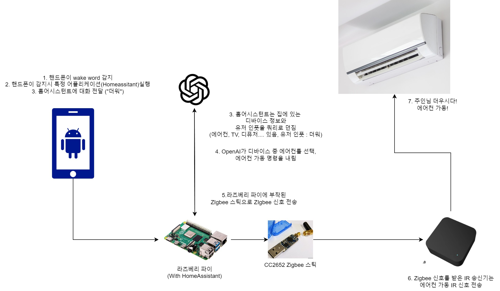

## 만든 스마트홈 미리보기 (일본어 주의)

- [Link](smart-home.mp4)

### 1. HomeAssistant?

이전에 한번 [글을 쓴 적이 있는](https://lemondouble.github.io/p/homeassistant%EB%A1%9C-iot-%ED%95%9C%EB%B2%88-%ED%95%B4-%EB%B3%B4%EC%A7%80-%EC%95%8A%EC%9D%84%EB%9E%98%EC%9A%94/) HomeAssistant라는 플랫폼에서 출발합니다.

2023년은 HomeAssistant에겐 [음성의 해](https://www.home-assistant.io/blog/2022/12/20/year-of-voice/) 였습니다.

LLM을 필두로 한 인공지능이 점점 고도화되며, 이제는 정말 자비스를 만들 수 있겠다! 는 생각을 하던 해였죠.

### 2. 그래서 말하고 싶은게 뭔데?

그냥 자랑 한번 해 보고 싶었습니다(...)

### 3. 사용/참고한 정보

[HotWordPlugin](https://play.google.com/store/apps/details?id=nl.jolanrensen.hotwordPluginFree&hl=ko) - 안드로이드에서 Wake word 감지

[Tasker](https://play.google.com/store/apps/details?id=net.dinglisch.android.taskerm&hl=ko) - 안드로이드에서 HotwordPlugin 이벤트를 감지해서 특정 앱 실행

[Whisper](https://openai.com/index/introducing-chatgpt-and-whisper-apis/) - Speech To Text 엔진

[extended_openai_conversation](https://github.com/jekalmin/extended_openai_conversation) - 집에 있는 디바이스 정보를 이용, function calling 기능을 이용해 실제 디바이스 상태 조절 함수를 호출해 줌.

[Bert-VITS2 (TTS)](https://lemondouble.github.io/p/bert-vits2%EB%A1%9C-%EB%82%98%EB%A7%8C%EC%9D%98-tts-%EB%A7%8C%EB%93%A4%EA%B8%B0/) - 캐릭터 목소리 귀엽죠?

[Zigbee2Mqtt](https://www.zigbee2mqtt.io/) Zigbee 신호를 MQTT Queue와 연결해 주는 오픈소스 프로젝트에요.

[SONOFF ZBDongle-P](https://ko.aliexpress.com/item/1005003758328408.html) - 라즈베리 파이에서 Zigbee 신호를 쏘게 해 주는 동글이에요

[Tuya IR 리모컨](https://ko.aliexpress.com/item/1005006007728129.html) - Zigbee를 받아서 IR 신호를 쏴 줘요