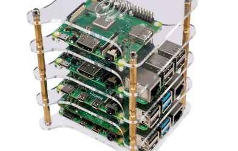
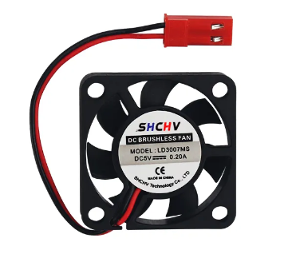
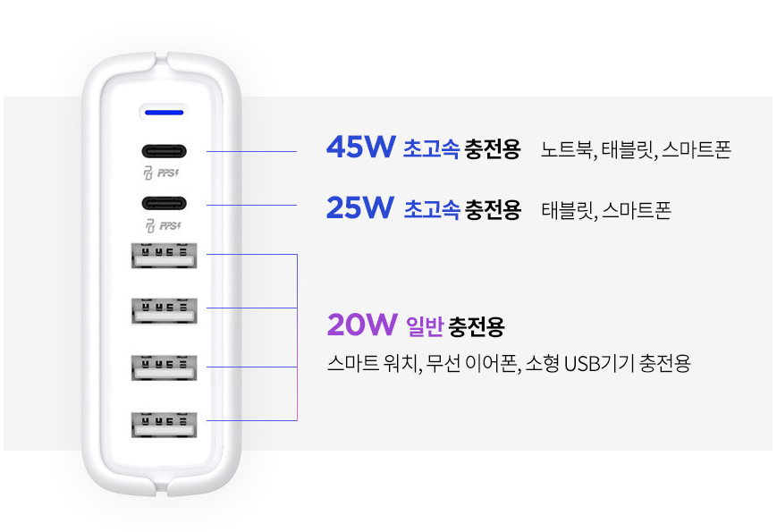
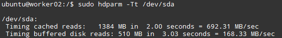
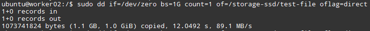

첫 시간은 하드웨어 시간입니다! 간단한 것부터 조금 복잡한 이야기부터, 빠르게 시작해 봅시다!

### 1. SBC (Single Board Computer)

역시 제일 중요한건 SBC겠죠? 

개인적으로는 당X마켓에 알림 걸어놓고, **Raspberry PI 4B 4GB 모델 or 8GB** 모델이 올라올 때마다 하나씩 맞추시는걸 추천합니다.

레퍼런스가 가장 많고, 소프트웨어 유지보수 및 테스트가 잘 진행되며, 중고로 구입하는 경우 가격적 디메리트도 어느정도 상쇄가 가능합니다.

참고로 현재 적정가는 **8~10만원** 사이인 것 같습니다. (2023.12 서울 기준)

참고로 라즈베리 파이는 ARM 아키텍쳐를 사용하다 보니, 일부 X86만 지원하는 프로그램을 굴리는 데 어려움을 겪을 수 있습니다. (대표적으로 셀프호스트 [Sentry](https://sentry.io/) 가 있습니다.)

경제적 여유가 되고, 이런 경우를 피하고 싶다면 **Intel NUC**나 알리익스프레스발 **N100 탑재 Mini PC** 도 좋은 선택이 될 수 있지 싶습니다.

### 2. 케이스

라즈베리 파이 기준으론, 사진과 같은 타워 케이스를 추천드립니다.

공간을 효율적으로 사용할 수 있고, 가격이 싸고, 결정적으로 ~~선 정리를 하면 이뻐서 기분이 좋습니다~~ 선 정리 및 관리하기가 용이합니다.

단, 기본 구매시 딸려오는 쿨링 시스템이 부실하므로 별도의 추가 쿨링이 필요합니다.

위 사진과 같은 5V 팬을 클러스터 노드 중 하나에 꼽아서 사용하거나, (5V 팬 라즈베리 파이 라고 검색하면 자료가 많이 나옵니다.) 핸디 선풍기 등을 옆에 놔둬주는걸 추천합니다.

### 3. 전력 공급기

라즈베리 파이 4B 모델을 기준으로, 한 컴퓨터에는 15W (5V 3A)의 전원 공급이 필요합니다. ([Link](https://www.raspberrypi.com/products/raspberry-pi-4-model-b/), A 15W로 검색)

따라서, 파이 하나당 15W의 전력을 필요로 하고, 만약 4대의 클러스터를 구성한다면 최대 **60W** 출력이 필요합니다.

따라서, 예를 들어 위와 같은 충전기의 USB A타입 (아래 4개) 에 병렬 연결하면 요구 용량보다 공급 용량이 적어 충전기가 과부하가 걸리게 됩니다.

5V 3A를 공급해 주는 충전기가 시중에 많지 않아 (대부분 2.1A 또는 2.4A Max입니다.) 전용 충전기를 사는게 아니라면 어느정도 과부하가 걸리게 되고, 경험상 1A 차이 정도는 큰 문제가 없었지만, **멀티 충전기에 4대를 연결하는 등의** 연결은 자제하도록 합시다.

멀티 충전기에서 5V 3A.. 아니 5V 2.4A를 여러 포트에 공급해 주는 멀티 충전기도 판매하는 곳이 없으므로, 만약 전원 공급 선을 정리하고 싶다면 SMPS(Switching Mode Power Supply) 라는 전력 공급기를 사는 것이 제일 안전한 방법일 것입니다. 이 내용은 나중에 기회가 된다면 포스팅하겠습니다.

결론적으로, 전력 공급은

1. 멀티 충전기를 사용한다면, 총 전력량을 잘 보고, 지나치게 과부하되지 않도록 선을 분배하기 (6포트 충전기가 있다고, 6개에 다 꼽으면 안 됩니다!)
2. 아니라면 2.1V짜리 1구 충전기를 여러개 사서 꼽기

정도로 일단 정리해 볼 수 있을 것 같습니다.

### 4. SSD와 USB UASP(USB Attached SCSI Protocol) 

라즈베리 파이는 별도로 Sata 선이나 NVME 슬롯이 없어 USB를 통해 SSD를 연결하게 됩니다.

이 때, **SATA3** 을 사용하는 SSD의 전송 속도는 최대 **6Gbps**이고, **USB 3.0**의 전송 속도는 최대 **5Gbps** 입니다. (물론, 이론적인 속도이며 실제로는 이것보다 훨씬 덜 나옵니다.)

그런데, USB3.0에서 UASP라는 기능을 지원하지 않는 경우, USB 3.0이 데이터를 주고받는데 비효율적인 방법으로 주고 받아 (자세히 설명하면 너무 길어지므로 생략..), UASP(USB Attached SCSI Protocol) 라는 프로토콜을 지원하는 케이블/커넥터를 사용해야 전체 쓰루풋을 손실 없이 사용할 수 있습니다.

그런데 몇천원짜리 싼 저렴이 선들은 이 UASP 프로토콜을 지원하지 않아, 구입하시기 전에 UASP 프로토콜을 지원하는 프로토콜인지 확인이 필요합니다.

저의 경우는 `새로텍 FHD-260U3`을 사용하고 있으며 (바이럴 아님), Aliexpress의 `Ugreen`사의 케이블도 괜찮다는 평을 듣고 있는 것으로 알고 있습니다.

아래는 제 테스트 결과입니다.

- 같이 보면 좋은 게시글 : [UASP makes Raspberry Pi 4 disk IO 50% faster](https://www.jeffgeerling.com/blog/2020/uasp-makes-raspberry-pi-4-disk-io-50-faster)

그리고 SSD의 경우는, 적당히 핫딜 떴을 때 SATA3 사용하는 SSD로 아무거나 주워오시면(?) 됩니다

### 5. 네트워크 장비

네트워크 구성은 이후 시스템 구축시 이야기할 기회가 많으니, 장비만 간단하게 설명하면

스위치허브로는 저는 적당히  `ipTIME H6008-IGMP`를 사용하였는데, 1Gbps 이상을 지원하는 스위치허브라면 아무거나 구매하셔도 상관없을 것 같습니다.

마찬가지로, 랜선도 Cat5e 이상(아무거나 사면 보통 Cat5e 이상입니다.) 으로 사면 문제 없을 것 같습니다.

### 마치며

1편에선 안정적인 클러스터를 구축하기 위한 하드웨어에 대해 간단히 알아봤습니다.

혹시라도 잘못된 부분이나, 수정할 부분이 있다면 알려주시면 감사하겠습니다!