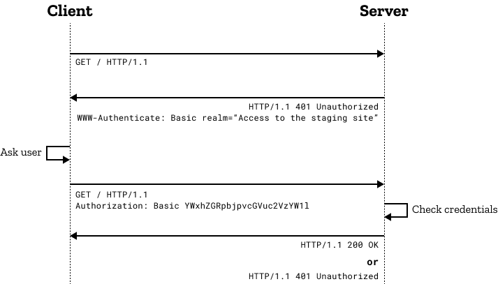

**아래 내용은 Sealed Secrets [섹션 3](https://lemondouble.github.io/p/%EC%A7%91%EC%97%90%EC%84%9C-%EB%9D%BC%EC%A6%88%EB%B2%A0%EB%A6%AC-%ED%8C%8C%EC%9D%B4-%ED%81%B4%EB%9F%AC%EC%8A%A4%ED%84%B0%EB%A1%9C-%EB%8D%B0%EC%9D%B4%ED%84%B0%EC%84%BC%ED%84%B0-%EC%B0%A8%EB%A6%AC%EA%B8%B0-7.-sealed-secrets%EB%A5%BC-%ED%86%B5%ED%95%9C-%EB%B9%84%EB%B0%80-%EA%B4%80%EB%A6%AC--traefik-basic-auth-%EC%84%A4%EC%A0%95/#3-sealed-secrets-%EC%9D%B4%EC%9A%A9%ED%95%98%EC%97%AC-basic-auth-%EB%93%B1%EB%A1%9D%ED%95%B4%EB%B3%B4%EA%B8%B0)과 겹치는 부분이 많습니다. 해당 섹션을 진행하셨고, Basic Auth에 대해 잘 아신다면 스킵해도 무방합니다.** 

### 1. 서론

쿠버네티스를 하다 보면, 이런저런 서비스를 많이 올리게 됩니다.

물론 내부망에서만 서비스하는것이 보안상 가장 좋겠지만, 클러스터 관리를 항상 내부망에서만 할 수 없을 수도 있습니다. 예를 들어 놀러갔는데 갑자기 문제가 생겼다거나 하는 경우가 있을 수도 있겠죠.

이런 경우 해결방법이 두 가지가 있을 수 있습니다.

1. VPN을 사용하여, 다른 컴퓨터에서 내부망에 접속해서 관련 서비스 사용
2. 인터넷에 서비스를 열어놓되, 인증 매커니즘을 추가하여 사용

저의 경우는 2를 선택했고, 개인적으로 SSO 서버를 구축해 사용하고 있습니다.

하지만 SSO 시스템은 구축 과정이 방대한 관계로 가장 간단한 인증 매커니즘 먼저 진행해 보려고 합니다.

### 2. Basic Auth의 흐름



Basic Auth는 엄청 간단합니다!

1. 서버에게 페이지를 요청합니다.
2. 서버는 요청을 받고, 인증 정보가 없으면 401 응답과 함께 인증 방법 (Basic Auth) 를 요구합니다.
3. 클라이언트는 응답을 받고, Basic Auth를 진행합니다.
    - 이 때, HTTP Authorization Header에 `Basic ${인증 토큰}` 의 값을 담아 보냅니다.
    - 이 때, 인증 토큰은 Base64Encode("userId:password") 입니다.
    - 예를 들어 id가 lemondouble, 패스워드가 1q2w3e4r!라면 `"lemondouble:1q2w3e4r!"` 를 base64로 인코딩한 값인 `bGVtb25kb3VibGU6MXEydzNlNHIh`를 사용합니다.
4. 서버는 이 토큰을 확인한 후, 정상 응답을 돌려줍니다.

### 3. Basic Auth의 장단점?

장점 : 

1. 빌트인이다! : 대부분의 브라우저에서 별다른 설정 없이도 지원합니다. 
2. 구현이 간편하다. : 대부분의 웹 프레임워크에서 기본 지원합니다!

단점 :

1. 보안이 취약하다 : 최대 단점입니다. 
   - 패스워드가 base64로 인코딩 (=평문)으로 매 요청마다 전송됩니다.
     - Https 프로토콜을 사용한다면 괜찮겠지만, HTTP 프로토콜을 사용하면 매 요청마다 평문으로 패스워드가 전송됩니다!
   - 무차별 대입 공격 등을 방어하지 않는다.
     - Id/Password의 문제이겠지만, Traefik의 기본 설정대로라면 일정 수 이상 틀린 요청을 시킨 클라이언트를 드롭한다던가 하는 기능이 없습니다.
     - Id/Password가 취약하다면, 어떤 악의적 공격자가 무차별 대입 공격을 통해 서비스에 접근할 수 있습니다.

따라서, 가능하다면 해당 기능은

1. 접근해도 별 문제 없는 서비스를 대상으로, 혹은 몇몇 유저에게만 공유하고 싶은 서비스를 대상으로
2. https 프로토콜을 사용해서
3. 충분히 긴 패스워드를 사용하는 것

을 권장합니다!

### 4. Basic Auth 설정 방법

- 저희는 Seaeld Secrets를 이용해, 접속 정보 (Id/Password)를 암호화해 Git에 저장하는 방식을 사용할 예정입니다.
- 이렇게 하는 이유는 다음과 같습니다.
  - 불시의 사고가 일어났을 때, 접속 정보를 포함하여 신속하게 클러스터를 복구하기 위해서 (Secrets 정보도 Git에 있으므로, 배포만 하면 됨)
  - 아무리 Private Repo를 사용한다고 하더라도, 순간의 실수로 Id/Password가 노출되는 것을 막기 위해

Disclaimer : 아래 내용은 Sealed Secrets [섹션 3](https://lemondouble.github.io/p/%EC%A7%91%EC%97%90%EC%84%9C-%EB%9D%BC%EC%A6%88%EB%B2%A0%EB%A6%AC-%ED%8C%8C%EC%9D%B4-%ED%81%B4%EB%9F%AC%EC%8A%A4%ED%84%B0%EB%A1%9C-%EB%8D%B0%EC%9D%B4%ED%84%B0%EC%84%BC%ED%84%B0-%EC%B0%A8%EB%A6%AC%EA%B8%B0-7.-sealed-secrets%EB%A5%BC-%ED%86%B5%ED%95%9C-%EB%B9%84%EB%B0%80-%EA%B4%80%EB%A6%AC--traefik-basic-auth-%EC%84%A4%EC%A0%95/#3-sealed-secrets-%EC%9D%B4%EC%9A%A9%ED%95%98%EC%97%AC-basic-auth-%EB%93%B1%EB%A1%9D%ED%95%B4%EB%B3%B4%EA%B8%B0)과 동일합니다!

Longhorn Dashboard를 외부에서 접근할 수 있게 설정하며, Basic Auth 설정 방법을 배워봅시다.

1. `apt install apache2-utils` 실행하여 htpasswd 커맨드를 사용할 수 있도록 합니다.
2. `htpasswd -nb <id> <password> | openssl base64` 를 이용하여, id,password가 담긴 Secret String을 얻습니다.
3. 아무 텍스트 편집기로 secret.yaml을 생성하고, 다음을 참고하여 Secret을 추가합니다.

```yaml
apiVersion: v1
kind: Secret
metadata:
  name: longhorn-system-basic-auth
  namespace: longhorn-system
data:
  users: <2에서 얻은 String>
```

4.`cat secret.yaml | kubeseal --controller-namespace=sealed-secrets-system --controller-name=sealed-secrets -oyaml > sealed-secrets.yaml` 를 입력하여 sealed-secrets.yaml 을 얻습니다.
5. 다음을 참고하여 ingress를 등록합니다.

`modules/longhorn-system/ingress.yaml`

```yaml
apiVersion: traefik.containo.us/v1alpha1
kind: IngressRoute
metadata:
  name: longhorn-dashboard
  namespace: longhorn-system
spec:
  tls:
    certResolver: le
  routes:
    - kind: Rule
      match: Host(`<원하는 subdomain, 예시:longhorn.lemon.com>`)
      middlewares:
        - name: basic-auth
          namespace: longhorn-system
      services:
        - name: longhorn-frontend
          port: 80
---
apiVersion: traefik.containo.us/v1alpha1
kind: Middleware
metadata:
  name: basic-auth
  namespace: longhorn-system
spec:
  basicAuth:
    secret: longhorn-system-basic-auth
```

`modules/longhorn-system/sealed-basic-auth-secret.yaml` 에는, 방금 생성한 sealed-secrets.yaml을 복사 붙여넣기 해 줍시다.

```yaml
apiVersion: bitnami.com/v1alpha1
kind: SealedSecret
metadata:
  creationTimestamp: null
  name: longhorn-system-basic-auth
  namespace: longhorn-system
spec:
  encryptedData:
    users: adfasdflavasdlfj...
  template:
    metadata:
      creationTimestamp: null
      name: longhorn-system-basic-auth
      namespace: longhorn-system
```

6. 이후 배포를 진행해 줍니다.
7. 이후 접속하면 정상적으로 id/password 확인 창이 뜨며, 로그인을 하지 않으면 해당 페이지가 보이지 않습니다!

### 5. 마치며

Basic Auth는 제 초기 클러스터 관리 방법이었습니다.

외부로 노출되는 서비스가 많지 않다면, Basic Auth를 설정하고 [Bitwarden](https://lemondouble.github.io/p/fly.io-%EC%86%8C%EA%B0%9C-%EB%B0%8F-fly.io%EC%97%90-%EC%98%AC%EB%A6%AC%EA%B8%B0-%EC%A2%8B%EC%9D%80-%EC%84%9C%EB%B9%84%EC%8A%A4-%EC%B6%94%EC%B2%9C-vaultwarden/) 등의 패스워드 매니저를 사용해 관리하는 것 만으로도 충분하다고 느꼈습니다.

하지만 나중에 프로젝트가 더 많아진다면?

그 경우를 해결하기 위한, SSO 인증 방법을 다음 포스트에 올리도록 하겠습니다.

단, 인증 서버를 DIY로 만들어 전체 소스 코드를 제공해드리기 힘들 것 같아, 일단 사용 가능한 Basic Auth 먼저 설명드림을 양해 부탁드립니다 🙇