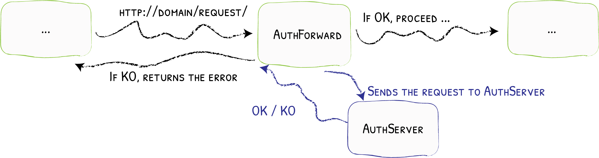
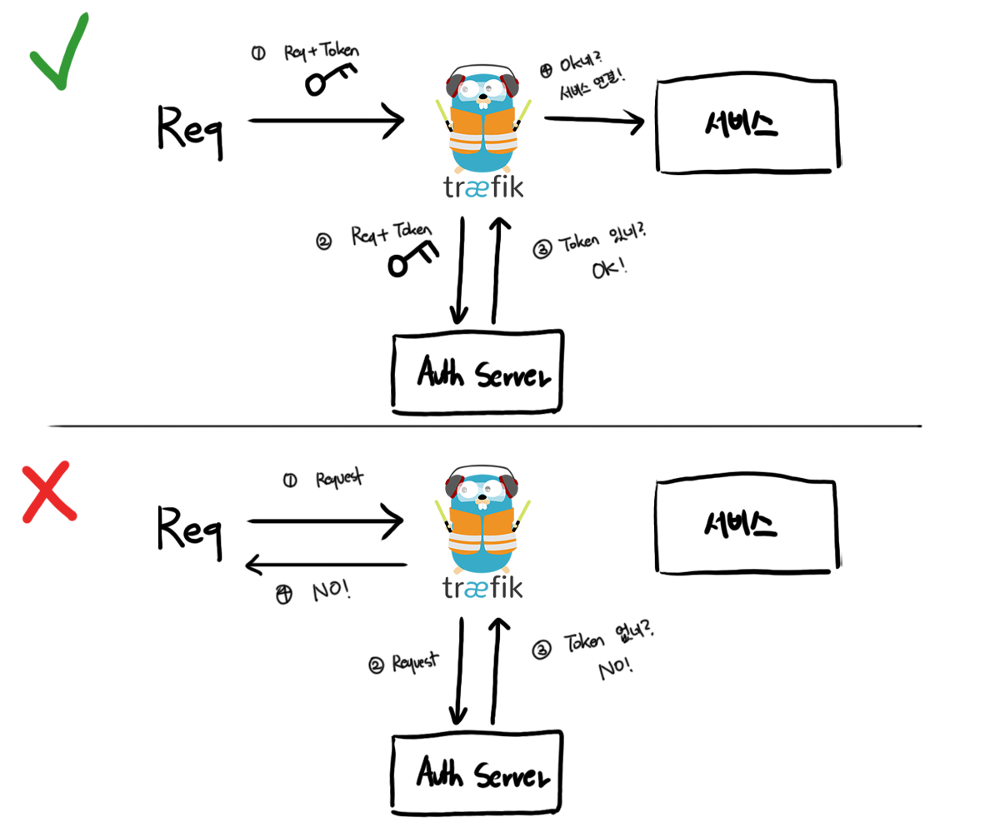
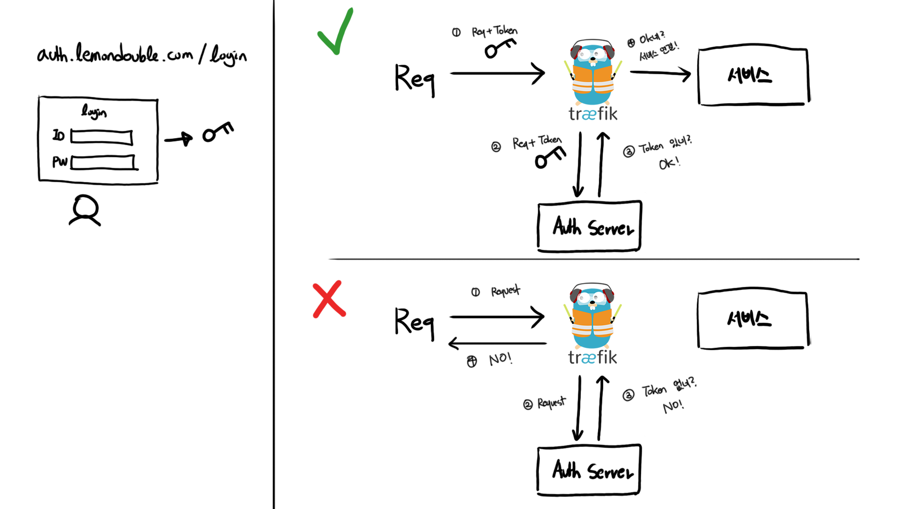
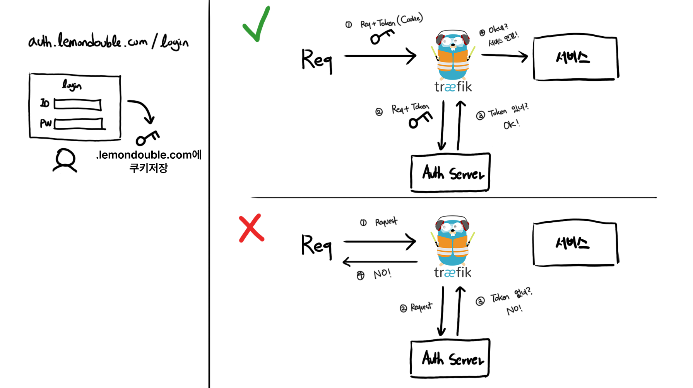
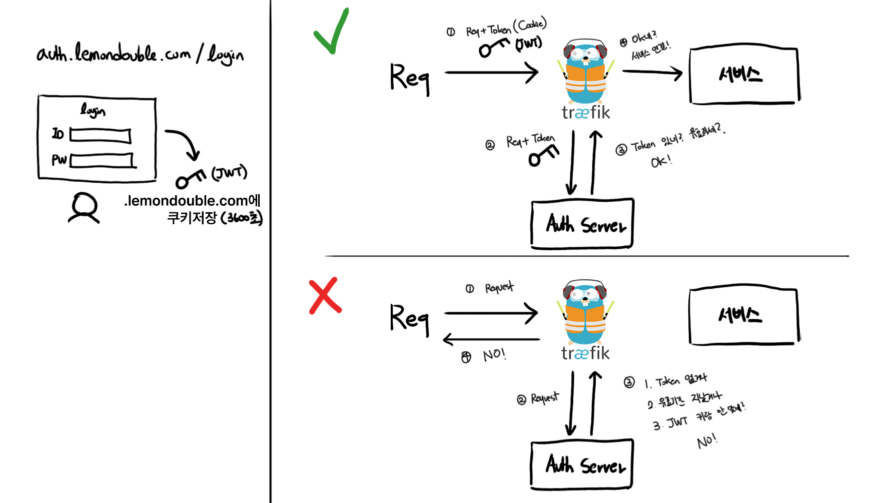
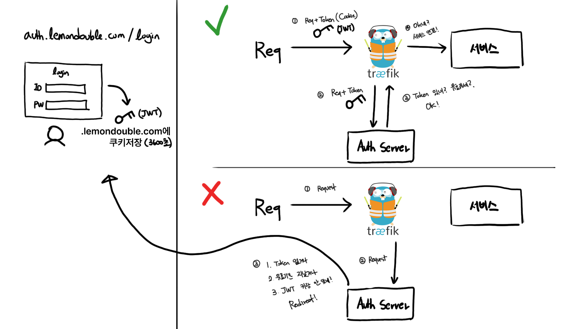
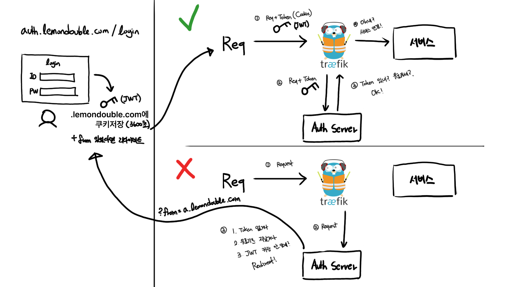
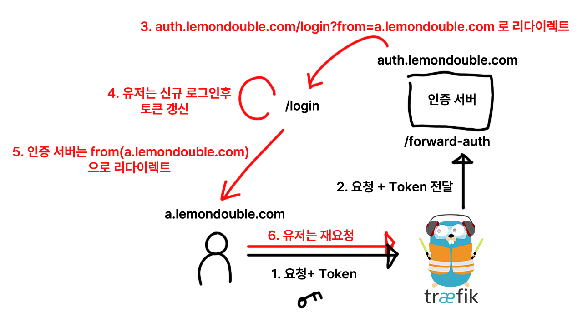
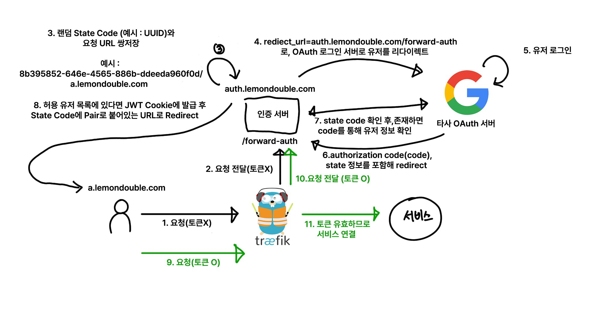

### 1. Forward Auth?

인증 로직이 필요할 떄, 우리는 인증 로직을 어디서 구현할 수 있을까요?

바로 드는 생각은, 어플리케이션에서 직접 구현하는 방법일 것입니다.

하지만 어플리케이션이 많아지면 어떨까요? 혹은, 일부 어플리케이션은 내가 만든 것이 아니라 다른 사람이 만든 어플리케이션이라, 내가 맘대로 인증 로직을 구현할 수 없다면 어떨까요?

우리는 쿠버네티스를 사용하고 있고, 모든 요청은 Traefik을 한번 거쳐갑니다. 

따라서, Traefik이 `"요청을 전달하기 전"` 에 인증 로직을 처리하면 어떨까요?



**간단합니다!**

1. 모든 요청은 Traefik을 지나갑니다.
2. 만약 Forward Auth가 설정되어 있다면, 외부 인증 서비스에 요청을 보냅니다.
3. 외부 인증 서비스는 다음과 같은 작업을 합니다.
   - 만약 유효한 요청이라면, 2XX대의 OK 코드를 보냅니다. 이 경우 정상적으로 
   - 만약 유효하지 않은 요청이라면 인증 서버의 응답을 그대로 반환합니다. (에러 반환)

그럼 이걸 어떻게 쓸 수 있을까요?

### 2. OAuth2와 Cookie, Forward Auth

#### 2-1. 가장 간단한 Forward Auth 서버

처음부터 천천히 생각해 봅시다.

일단, 가장 간단한 Forward Auth 서버를 생각해 봅시다.

어떤 요청에 대해서는 OK, 어떤 요청에 대해서는 NO를 주려면 어떻게 해야 할까요?

맞습니다! 우리가 Basic Auth때 한번 본 적이 있듯, 각 요청에 대해 인증 정보를 같이 보내고, 그 인증 정보가 유효한 경우 통과시켜주면 될 것입니다.

그림으로 그려보면, 가장 간단한 예시는 다음과 같습니다.



#### 2-2. 인증 토큰은 어디에 저장하지?

좋습니다!

일단 가장 간단한 Forward Auth Server를 생각해 보았습니다. 그러면 다음은, "그러면 토큰은 언제, 어디서 받아야 하는데?" 라는 질문이 남습니다.

간단한 방법으론, 로그인 페이지를 하나 만들어서 로그인에 성공하면 Token을 발급해주는 방법이 있을 것 같습니다.

그림으로 그려보겠습니다.



어? 그런데 `auth.lemondouble.com` 에서 로그인했다면, 토큰을 어떻게 공유할 수 있을까요? 어디에 토큰을 저장해야 할까요?

그런데 나는 a.lemondouble.com, b.lemondouble.com같은 다른 사이트에서도 해당 토큰을 이용해서 로그인을 유지해야 합니다.

(사실 꽤 자주 있는 일이긴 하지만) a.lemondouble.com에서 이미 SSO 로그인을 했는데, b.lemondouble.com에서 로그인을 다시 시킨다면, (유저 정보가 공유되더라도) 너무 귀찮은 일일 것입니다!

우리는 이를 해결하기 위해서, Cookie에 토큰을 담을 예정입니다. 

예를 들어, `.lemondouble.com` 에다가 Cookie를 설정하면, 해당 Cookie는 모든 서브도메인, 즉 `a.lemondouble.com` , `auth.lemondouble.com`, `'b.lemondouble.com'` 에 접속할 시 자동으로 같이 전송된다는 점을 이용하는 것입니다.

```javascript
res.cookie('forward-auth-token', token, {
    domain: '.lemondouble.com',        //subdomain까지 공유하려면 앞에 "."을 붙여줘야함!
});
```

그러면, 많은 일이 간단해집니다! 정리해보죠.

1. Forward Auth는 토큰이 있다면 허용, 토큰이 없다면 거부한다.
2. 로그인 페이지를 만들어, 로그인 페이지는 로그인 성공시 `.lemondouble.com` 에 쿠키를 설정하도록 합니다.

여기까지 정리해보면 다음과 같은 그림이 나옵니다.



#### 2-3. JWT 토큰 사용 및 만료 설정, 유효성 검증

자! 그런데 토큰 안에는 어떤 값이 들어가면 좋을까요?

이 경우, JWT가 적절할 것으로 보입니다. Stateless해야 하고, 위변조가 아주 어려운 토큰이야 말로 이 사용사례에 아주 적합해 보입니다.

안의 내용은.. 유저 ID나 이메일 정도가 좋겠네요.

그런데 토큰을 한번 발급했으면 천년만년 써도 될까요...? 그러면 토큰을 한번 탈취당하면 천년 만년 서버가 털리겠죠..? 따라서, 토큰 유효 기간 설정이 필요할 것 같습니다. 보안과 편의성 사이에 고려하면 될 것 같은데, 저는 편의상 3600초 (1시간) 을 사용한다고 가정해 보겠습니다.

그러면

1. JWT를 Exp (Expired Time)을 현재시간 + 3600초로 로그인 서버에서 발급해 줘야 할 것 같네요. 편의상, Cookie 유지 시간도 3600초로 통일하면 좋겠네요.
2. Forward Auth에서 기존은 토큰이 있다면 무조건 통과였지만, 토큰 JWT 검증 및, 만료 토큰일 시 값이 유효하더라도 거절하는 로직을 추가해야 할 것 같습니다.

그림으로 다시 그려보겠습니다.



#### 2-4. 리다이렉트 처리

그런데 만약 토큰이 유효하지 않거나, 토큰이 없다면 그냥 에러 페이지만 보여줘도 괜찮을까요?

물론... 내가 혼자 쓰면 안 될거 뭐 있겠습니까마는... 굉장히 매번 귀찮을 것입니다. 그냥 인증 실패하면 자동으로 로그인 페이지로 리다이렉트 시켜주면 편할 것 같네요.

바로 추가해 봅시다.



그런데 보통 SSO 성공하면 기존 사이트로 돌아가잖아요? 그것도 한번 추가해 봅시다.

쿼리 파라미터나 헤더 등으로 "원래 어디서 왔는지"를 기억하고, 로그인에 성공하면 원래 어디서 왔는지 기억해서 로그인 서버가 리다이렉트 처리를 해 주면 될 것 같습니다.



아.. OAuth는 이야기도 안 꺼냈는데 벌써 복잡하네요. 일단 한번 더 해 봅시다..

만약 통합인증이 ID/Password 로그인이라면 여기서 완성입니다. 여기서 조금 헷갈릴 수 있어서 정리하고 가면, 로그인 서버와 Traeifk의 Forward Auth 서버는 동일해도 무방합니다.

굳이 그림까지 그리면서 이걸 다시 쓰는 이유는, Forward Auth 인증 서버와 로그인 서버를 분리할 필요가 없어서입니다!



#### 2-5. OAuth 시작!

일단 스펙을 정하고 가 봅시다.

저희가 만들 스펙은 다음과 같습니다.

1. 만약 어떤 서비스에 접근했는데, OAuth SSO가 필요하다면 바로 해당 Social Provider의 로그인 페이지로 이동합니다. (즉, 우리는 로그인 페이지를 만들지 않습니다!)
2. 로그인에 성공하면 원래 접근하려는 서비스로 리다이렉트됩니다!

그리고 Client ID 등록 등의 기본내용들은 생략합니다. 이걸 하나하나 설명하면 책 한 권이 나와서요.. 만약 OAuth 2.0 프로토콜에 대해 잘 모르신다면, 생활코딩의 [Web2 - OAuth 2.0](https://opentutorials.org/course/3405) 강의를 추천드릴게요. (공짭니다!)

#### 2-6. OAuth 전체 플로우

제가.. 진짜 이걸 쉽게 설명하려고 노력해봤는데... 솔직히 답이 안 서서요.. 

전체 플로우를 보여드리곘습니다.



핵심 아이디어는 State Code를 이용하는 것입니다!

- OAuth 인증 서버에 요청을 보낼 때, 임의의 문자열을 생성해 같이 (?state=임의의문자열) 보내면, 이후 유저가 로그인 성공 후 돌아올 때 해당 문자열을 같이 보내주는 스펙이 OAuth 2.0 표준에 있습니다. (필수 파라미터는 아니라, OAuth 연동을 하면서 못 보셨을 수도 있습니다!)
- 이를 이용해서 유저가 "어디서 왔는지" 를 데이터베이스에 기록하고, 로그인 성공 후 해당 URL로 리다이렉트 시켜주는 아이디어를 차용합니다.

전체 플로우는 위 그림을 참고해 주시고, 그러면 우리 인증 서버는 무엇을 구현해야 할까요? 

엔드포인트 단 하나를 구현하는데, 다음을 구현하시면 됩니다. (위에서 순서대로 처리해야 합니다. 처리 순서가 중요합니다!)

1. 쿼리 파라미터로 code와 state가 있는 경우, State Code가 DB에 저장된 값과 일치하는지 확인합니다. 만약 DB에 해당 State Code가 존재한다면, 타사 OAuth Server과 통신하여 Authorization Code를 유저 정보로 변환합니다. 변환한 유저 정보가 미리 등록된 권한 리스트에 있는지 확인하고, 만약 없다면 오류를 반환합니다. 만약 권한 리스트에 있다면, 로그인용 신규 JWT를 생성 후 Cookie에 `.yourdomain.com` 으로 저장합니다. 이 때, 보안을 위해 secure, httpOnly 설정을 켜 주면 좋습니다. 또한 sameSite 옵션은 `'Lax'`로 설정합니다. 이후 State Code와 한 쌍인 URI로 유저를 Redirect 시킵니다.

2. Cookie에 JWT 토큰이 있는 경우, JWT 검증 후 정상 JWT라면 200을 반환합니다.


3. 만약 Cookie에 JWT 토큰이 아예 없거나, 만료된 Cookie라면 만료된 Cookie를 지우고, State Code에 `X-Forwarded-Host` 헤더와 `X-Forwarded-Uri`를 파싱하여 현재 URI를 추출합니다. 이후 신규 State Code와 해당 URI 페어를 DB에 저장하고, 현재 API를 Redirect URL로 설정해 State Code와 함께 전송합니다.

- TIP : 유저가 요청한 URI : `https://" + GetHeader("X-Forwarded-Host") + GetHeader("X-Forwarded-Uri")`

#### 2-7. 추가 설정

마지막으로.. Traefik 설정에 다음 두 줄을 추가합니다.

```
- "--entryPoints.web.forwardedHeaders.insecure"
- "--entryPoints.websecure.forwardedHeaders.insecure"
```

해당 줄이 없으면, X-forwared-for 헤더들이 넘어오지 않습니다!

제 블로그의 글 ([4. Traefik https 인증 및 ArgoCD 설정](https://lemondouble.github.io/p/%EC%A7%91%EC%97%90%EC%84%9C-%EB%9D%BC%EC%A6%88%EB%B2%A0%EB%A6%AC-%ED%8C%8C%EC%9D%B4-%ED%81%B4%EB%9F%AC%EC%8A%A4%ED%84%B0%EB%A1%9C-%EB%8D%B0%EC%9D%B4%ED%84%B0%EC%84%BC%ED%84%B0-%EC%B0%A8%EB%A6%AC%EA%B8%B0-4.-traefik-https-%EC%9D%B8%EC%A6%9D-%EB%B0%8F-argocd-%EC%84%A4%EC%A0%95/)) 을 참고하셨다면, 다음과 같이 설정하시면 됩니다.

```yaml
# https://traefik.io/blog/https-on-kubernetes-using-traefik-proxy/
apiVersion: helm.cattle.io/v1
kind: HelmChartConfig
metadata:
  name: traefik
  namespace: kube-system
spec:
  valuesContent: |-
    ports:
      web:
        redirectTo:
          port: websecure
          priority: 10
    additionalArguments:
      - "--log.level=INFO"
      - "--certificatesresolvers.le.acme.email=yourMail@gmail.com"
      - "--certificatesresolvers.le.acme.storage=/data/acme.json"
      - "--certificatesresolvers.le.acme.tlschallenge=true"
      - "--certificatesresolvers.le.acme.caServer=https://acme-v02.api.letsencrypt.org/directory"
      - "--entryPoints.web.forwardedHeaders.insecure"
      - "--entryPoints.websecure.forwardedHeaders.insecure"
```

이후 kubectl apply를 실행하여, Forwared Auth 설정을 마무리 해 줍시다.!

### 마치며

사실 내용이 너무 방대해서.. 가능한 쉽게 쓴다고 노력했는데, 제대로 전달은 안 되었을 것 같습니다. 나중에 글을 한번 수정해야 되지 않나 싶네요.

그래도 혹시 모르니, 참고하여 구축하실 분들은 이해 안 되는 부분이 있다면 아래 댓글이나, contact@lemondouble.com 으로 편하게 연락 주세요! 트러블슈팅까지 같이 도와드리겠습니다.

아 그리고 혹시 Golang을 할줄 아신다면, [traefik-forward-auth](https://github.com/thomseddon/traefik-forward-auth) 를 참고하셔도 좋습니다.