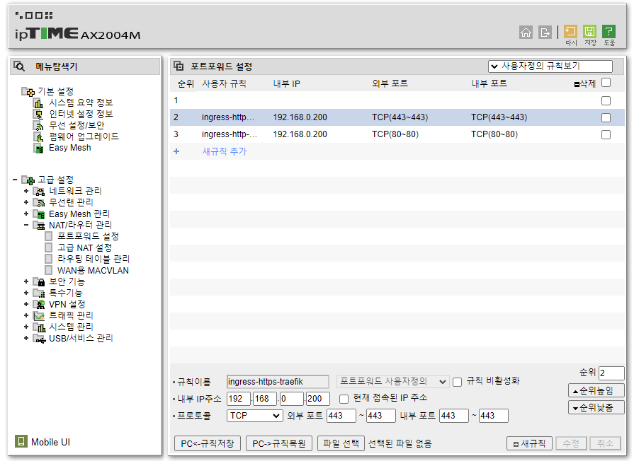
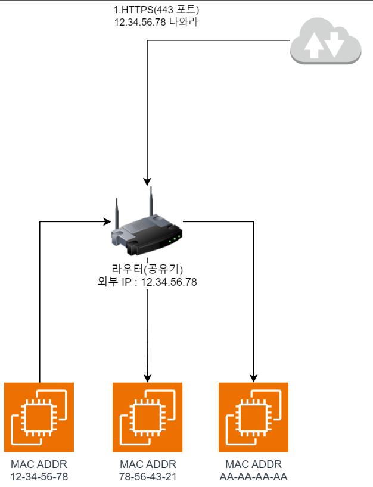
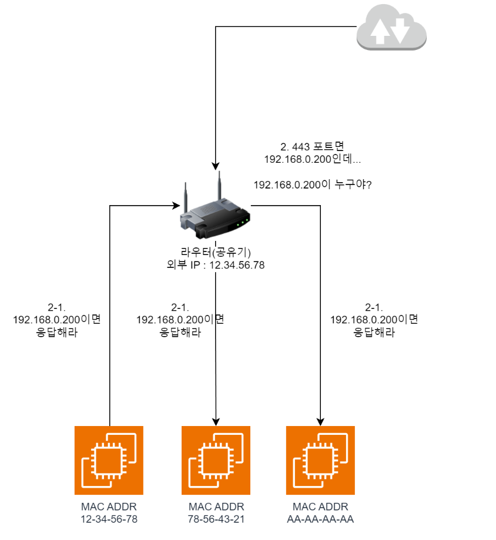
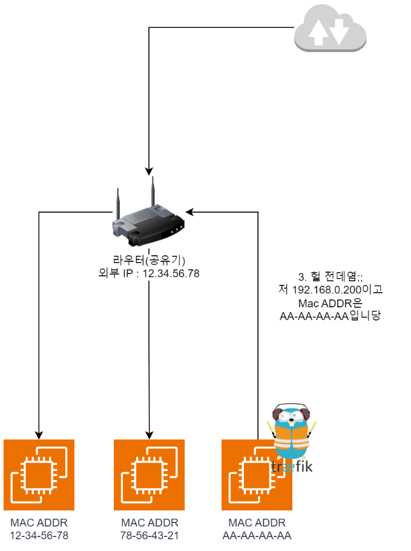
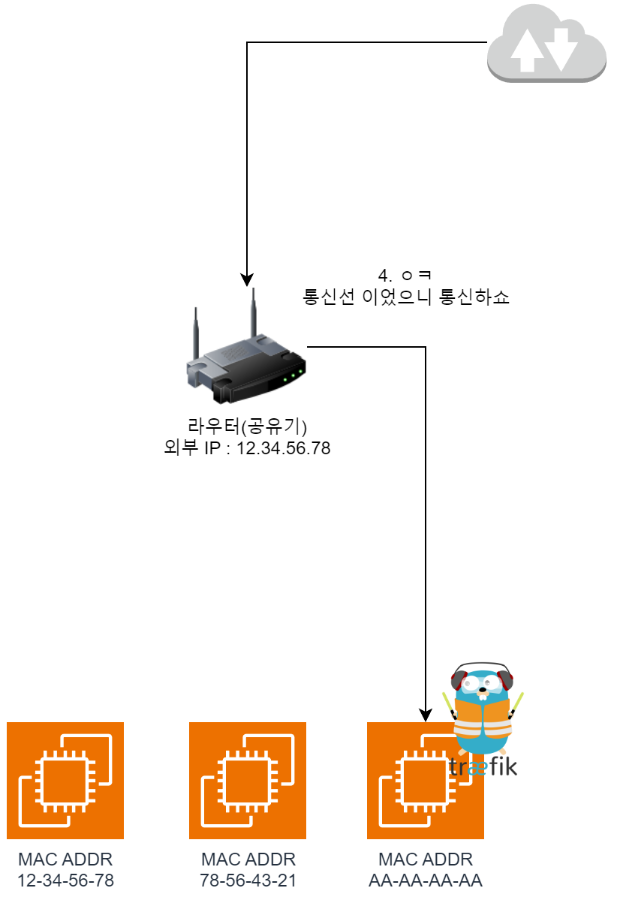

### Helm 설치

- 참고한 글 : [Installing Helm](https://helm.sh/docs/intro/install/)

다음 커맨드를 차례로 입력하여 Helm을 설치합니다.

```sh
curl -fsSL -o get_helm.sh https://raw.githubusercontent.com/helm/helm/main/scripts/get-helm-3
chmod 700 get_helm.sh
./get_helm.sh
```

이후, kubeconfig 파일을 설정해 줍니다.

```sh
cp /etc/rancher/k3s/k3s.yaml ~/.kube/config
chmod 600 ~/.kube/config
```

이후 bashrc 제일 밑에 다음 한 줄을 추가한 후, `source ~/.bashrc` 로 Shell 설정을 즉시 적용시킵니다.
```sh
export KUBECONFIG=~/.kube/config
```


Helm은 쿠버네티스의 패키지 매니저와 비슷한 역할을 합니다.

예를 들어서, 제가 Kafka를 클러스터 모드로 설치하려고 한다고 가정해 봅시다.

제가 일일히 Kafka를 쿠버네티스에 띄우려면, Kafka Container 이미지를 가져와서 클러스터 옵션을 키고, 내부 네트워크 연결을 해 주고... 하는 작업을 전부 해 줘야 할 것입니다.

또한, Kafka 버전 업그레이드를 한다고 상상을 해 봅시다.

우리가 작성한 Kafka 클러스터 Yaml 파일에서 컨테이너 이미지 버전을 올리고.. 만약 클러스터 설치를 하면서 다른 리소스를 가져다 썼다면 호환이 되는지 확인하고... 등등등의 복잡한 작업이 기다리고 있을 것입니다.

하지만 누가 이 작업을 미리 해 두었다면?

그것을 `Helm Chart` 라고 부르고, 저희는 `Helm install Kafka` 만 입력하면 이미 네트워크, 클러스터 설정이 완료된 카프카 클러스터를 얻을 수 있게 됩니다.

근데 만약 모두 같은 Helm Chart를 사용한다면, 실험용으로 Kafak 컨테이너 한 대만 띄워보기를 원하는 우리같은(?) 사람과, Kafka 수백대가 클러스터를 이뤄야 하는 큰 회사가, 서로 같은 설정을 사용할 수 밖에 없을 것입니다.

이런 경우를 대비해, Helm및 Chart는 `Values.yaml` 이라는 추가 설정 파일을 제공합니다.

즉, 만약 내가 컨테이너 한 대만 필요하다면 차트의 `values.yaml` 을 잘 읽고, `kafka.container-count : 1` 과 같이 설정하면 해당 변수가 주입됨으로써, Helm Chart를 내가 필요한 설정을 넣어 유연하게 사용할 수 있는 식입니다. (마치 서버의 환경 변수 같이요!)

### MetalLB 설치

- 참고한 글 : [Installation With Helm](https://metallb.universe.tf/installation/)

이제 Helm을 사용해 로드밸런서인 MetalLB를 설치해 봅시다!

다음 커맨드를 순차적으로 입력합니다. 별다른 말이 없다면 모든 커맨드는 `Control Node`에서 입력합니다.

```sh
helm repo add metallb https://metallb.github.io/metallb
helm upgrade --install metallb metallb/metallb --create-namespace --namespace metallb-system --wait
```

이후 `ip-address-pool.yaml` 이란 파일을 하나 생성해, 다음과 같이 작성하고 `kubectl apply -f ip-address-pool.yaml` 을 입력하여 적용시킵니다.

아래는, 로드밸런서 등의 IP가 필요한 서비스에 192.168.0.200~192.168.0.250 사이의 IP를 할당해 주겠다는 뜻입니다.

```yaml
apiVersion: metallb.io/v1beta1
kind: IPAddressPool
metadata:
  name: ipaddresspool
  namespace: metallb-system
spec:
  addresses:
    - 192.168.0.200-192.168.0.250
---
apiVersion: metallb.io/v1beta1

kind: L2Advertisement
metadata:
  name: default
  namespace: metallb-system
spec:
  ipAddressPools:
  - ipaddresspool
```

이제, 정상적으로 설정되었다면 LoadBalancer를 사용하는 서비스에 IP가 할당됩니다.

`kubectl get svc -n kube-system` 를 입력해 `traefik`의 `EXTERNAL-IP` 부분이 192.168.0.xxx 를 할당받았는지 확인합니다.

아마 별도로 설정하지 않았다면, 192.168.0.200을 할당받았을 것입니다.

### 공유기 포트 포워딩 설정

Traefik의 IP를 확인했다면, (다음 시간에 해야 할 일을) 하나만 미리 해 두도록 합니다.

공유기의 포트포워딩 설정을 찾아, 80, 443번 포트를 위에서 확인한 Traefik의 IP로 포트포워딩 해 줍니다.



### MetalLB는 어떻게 작동하나요?

MetalLB는 ARP 모드와 BGP 모드 두가지로 작동할 수 있으나, 저희는 ARP 모드를 사용하므로 ARP 모드의 작동 방법에 대해 아주 간단히(?) 알아보도록 하겠습니다.

이미지를 보기 전에, 배경 지식이 약간 필요합니다.

1. Mac Addr는 하드웨어에 박혀있는 주소로, 공장 출고시부터 있으며 고유합니다.
2. 공유기(라우터)의 포트포워딩은, 특정한 포트로 외부 요청을 받았을 시 내부망의 특정 IP로 변환해 요청을 하는 역할을 해 줍니다.
    - 예를 들어 위에 설정한 80번 포트, 443번 포트에 192.168.0.200으로 설정을 해 두었다면, http(80포트), https(443포트) 에 대해 내부망에서 192.168.0.200 을 가진 노드를 연결해 줍니다.


**이후의 네트워크 요청 흐름은 다음과 같습니다.**



1. `https://` 로 서버에 접근하면, `443` 포트를 외부에서 요청하게 됩니다.



2. 저희가 위에서 설정한 `포트 포워딩` 설정으로 인해, 라우터는 `192.168.0.200`에게 트래픽을 전달해야 합니다. 그런데 라우터는 현재 `192.168.0.200` 주소를 모르므로 `내부망의 모두에게 192.168.0.200 나와라` 는 요청을 뿌립니다. (ARP Request)



3. 그러면 Traefik이 있는 Node가 `헉 전데염;;` 하고 자기 `Mac Address`를 담은 응답을 보냅니다. 이로 인해 라우터는 외부에서 들어온 트래픽을 `AA-AA-AA-AA`로 보내면 된다는걸 알게 됩니다.



4. 따라서 이제 서로 트래픽 전달이 가능하니, 통신이 가능하게 됩니다.

### 헷갈리는 점

그러면? 헷갈리는 부분이 생깁니다. 하나하나 대략 정리해보면

1. **아니 그러면 한 노드가 IP가 여러개를 가질 수 있나?**
    - 예를 들어, 아까의 예시라면 AA-AA-AA-AA는 이미 DHCP 서버로부터 내부 IP 하나를 할당받았을 것입니다.
    - 그러면 여기에 추가로 IP를 할당받는 건가? 라고 생각하면 맞습니다!
    - `MetalLB 시스템에선 한 노드가 여러개의 내부 IP를 할당받을 수 있습니다.`

2. **만약 Traefik이 있는 노드가 죽으면 어떻게 돼요?**
    - 당연히? 잠깐 동안 접근이 불가능하게 다운됩니다.
    - 대신 Traefik이 다른 노드에 뜰 거고, 그 뒤 새로 ARP Request/Response를 진행하면 새로운 Mac Address(Node)로 포워딩되므로 장애가 복구되게 됩니다.

3. **ARP Response는 누가 해주는거에요?**
   - MetalLB 컨테이너가 ARP Response 및, 해당 주소로 들어온 트래픽을 Pod (여기서는 Traefik) 으로 운반해주는 역할을 합니다.


### 마치며

해당 내용은 문서를 찾아보며 한 독자연구입니다. (특히 MetalLB 쪽은)

혹시 틀린 게 있다면 언제든지 수정해주시면 감사하겠습니다!