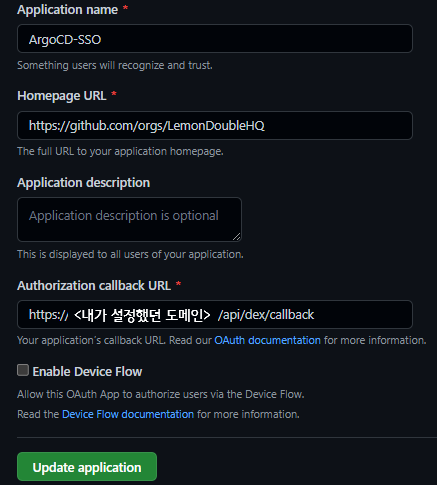
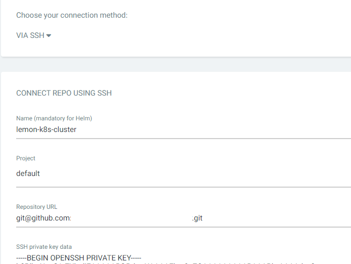

만약, 시스템을 Git을 통해 관리하면 어떨까요?
내가 필요한 컨테이너 종류, 개수 등을 전부 Git에 선언하고 Git에 선언되어 있는 그대로 클러스터가 운영된다면, 굉장히 편하지 않을까요?

굳이 클러스터 이곳저곳을 확인하지 않더라도, Git에 올라와 있는 설정값만 확인하면 될 테니까요.

또한, 만약 배포 도중 문제가 생겼다면 바로 Revert해버릴 수 있지 않을까요? 또, 여러 사람이 같은 클러스터를 관리하면서 생기는 문제도 우리가 항상 하는 PR을 통해 관리할 수 있을 거구요.

마지막으로, 만약 클러스터에 갑작스럽게 문제가 생겨 모든 노드가 다운되어 버렸더라도, 선언한 상태값이 Git에 있으므로 다른 클러스터를 통해서라도 빠르게 복구를 진행할 수 있을 겁니다.

그러한 방법을 GitOps라고 부르며, ArgoCD는 Git에 선언된 상태와 클러스터의 상태를 똑같이 맞춰주는데 도움을 주는 툴입니다.

이후 배포해야 할 시스템이 정말 정말 많아서, 제일 먼저 이러한 GitOps를 도와주는 ArgoCD를 먼저 설치합시다.

또한 ArgoCD 외부 접속이 가능하도록, Traefik의 LetsEncrypt 설정 등을 같이 진행해 봅시다.

### Traefik Letsencrypt Certification 적용

- 참고한 글 : [HTTPS on Kubernetes Using Traefik Proxy](https://traefik.io/blog/https-on-kubernetes-using-traefik-proxy/)

Control Node에서 다음을 참고하여 traefik-update.yaml을 하나 만들어 줍니다.

```yaml
# https://traefik.io/blog/https-on-kubernetes-using-traefik-proxy/
apiVersion: helm.cattle.io/v1
kind: HelmChartConfig
metadata:
  name: traefik
  namespace: kube-system
spec:
  valuesContent: |-
    ports:
      web:
        redirectTo:
          port: websecure
          priority: 10
    additionalArguments:
      - "--log.level=INFO"
      - "--certificatesresolvers.le.acme.email=yourMail@gmail.com"
      - "--certificatesresolvers.le.acme.storage=/data/acme.json"
      - "--certificatesresolvers.le.acme.tlschallenge=true"
      - "--certificatesresolvers.le.acme.caServer=https://acme-v02.api.letsencrypt.org/directory"
```

이후 `kubectl apply -f traefik-update.yaml`을 이용해 클러스터에 적용합니다.

이후, IngressRoute에서 CertifiactionResolver로 le(letsEcnrypt)를 사용할 수 있게 됩니다. (무슨 이야긴지 모르겠다면, 진행하다 보면 이해하게 됩니다.)

### ArgocD 설치

ArgoCD를 설치하고, Github SSO를 연동해 봅시다.

1. DNS 설정을 진행합니다. ArgoCD를 외부에서 접근시 사용할 서브도메인을 현재 IP 주소와 연결해 줍니다.
    - [내 IP 보기](https://www.findip.kr/) 에 들어가서 내 IP를 확인합니다.
    - DNS를 구매한 곳에 가서 A 레코드로 IP4 Address에 방금 확인한 내 IP를 입력합니다.

2. `Github Organization`을 하나 생성하고, 적절한 Role을 하나 만듭니다. 저의 경우는 개인용 Organization에 Admin이란 Role을 추가했습니다.

3. Orignization -> Settings -> Developer Settings -> OAuth Apps에 가서 새로운 OAuth 앱을 하나 추가합니다.



이때, Authorization callback URL을 `https://<방금 설정한 도메인>/api/dev/callback` 으로 설정합니다.
나머지는 자유롭게 바꾸셔도 상관없습니다.

이후 `Client ID, Secret` 을 발급 후 기억합니다.

4. values.yaml 파일 생성

다음 파일을 참고하여 `values.yaml` 파일을 작성합니다.

```yaml
configs:
  params:
    # Traefik이 Https 연결 해 주므로 Insecure 모드로 가동
    server.insecure: true
  rbac:
    # Built-in Policy : https://github.com/argoproj/argo-cd/blob/master/assets/builtin-policy.csv
    policy.default: role:readonly
    policy.csv: |
      g, <Github Organization 이름>:<생성한 Role 이름>, role:admin

server:
  config:
    url: https://<설정한 도메인 이름>

    dex.config: |
      connectors:
      - type: github
        id: github
        name: github
        config:
          clientID: <방금 발급받은 Client ID>
          clientSecret: <방금 발급받은 Client Secret>
          orgs:
          - name: <Github Organization 이름>
```

예를 들어 다음과 같습니다.

```yaml
configs:
  params:
    # Traefik이 Https 연결 해 주므로 Insecure 모드로 가동
    server.insecure: true
  rbac:
    # Built-in Policy : https://github.com/argoproj/argo-cd/blob/master/assets/builtin-policy.csv
    policy.default: role:readonly
    policy.csv: |
      g, LemonLemon:Admin, role:admin

server:
  config:
    url: https://argo.lemon.com

    dex.config: |
      connectors:
      - type: github
        id: github
        name: github
        config:
          clientID: vadf45a6sdfad
          clientSecret: adsfvasd45f6ads4f56asd7
          orgs:
          - name: LemonLemon
```

5. ingress.yaml 파일 생성

```yaml
apiVersion: traefik.containo.us/v1alpha1
kind: IngressRoute
metadata:
  name: argocd-ingress
  namespace: argocd
spec:
  entryPoints:
    - websecure
  routes:
    - kind: Rule
      match: Host(`<설정한 도메인 이름>`)
      priority: 10
      services:
        - name: argo-cd-argocd-server
          port: 80
    - kind: Rule
      match: Host(`<설정한 도메인 이름>`) && Headers(`Content-Type`, `application/grpc`)
      priority: 11
      services:
        - name: argo-cd-argocd-server
          port: 80
          scheme: h2c
  tls:
    certResolver: le
```

아래는 예제입니다.

```yaml
apiVersion: traefik.containo.us/v1alpha1
kind: IngressRoute
metadata:
  name: argocd-ingress
  namespace: argocd
spec:
  entryPoints:
    - websecure
  routes:
    - kind: Rule
      match: Host(`https://argo.lemon.com`)
      priority: 10
      services:
        - name: argo-cd-argocd-server
          port: 80
    - kind: Rule
      match: Host(`https://argo.lemon.com`) && Headers(`Content-Type`, `application/grpc`)
      priority: 11
      services:
        - name: argo-cd-argocd-server
          port: 80
          scheme: h2c
  tls:
    certResolver: le
```

6. `values.yaml`과 `ingress.yaml`을 작성했다면, 다음 커맨드를 입력하여 argocd를 설치합니다.

```sh
kubectl create namespace argocd
helm repo add argo https://argoproj.github.io/argo-helm
helm install -n argocd argo-cd argo/argo-cd -f values.yaml

kubectl apply -f ingress.yaml
```

잠깐 기다린 후, 설정한 도메인 (제 경우는 `https://argo.lemon.com`) 로 들어가면 정상적으로 ArgoCD가 반겨줍니다.

이후 `Log in Via Github` 버튼을 클릭해 로그인합니다.

로그인이 성공했다면 정상적으로 설치된 경우입니다!

※ Tip : 401 에러가 난다면, 한번 argocd 네임스페이스의 argocd-server 팟을 한번 죽여보세요

### ArgoCD Git Private Repo 연결

만약 클러스터를 Public Repo로 사용한다면 이 설정은 생략해도 되겠지만, 혹시 모를 사고를 방지하기 위해 Git에서도 private Repo를 사용하고, ArgoCD에서도 연결해서 사용해 봅시다.

Github에서 새로운 레포지토리 (빈 레포지토리) 를 하나 추가한 후, 해당 레포지토리를 ArgoCD와 연동해 봅니다.

1. ArgoCD 로그인 후 Settings -> Repository -> Connect Repo를 누릅니다.
2. connection method via ssh, Name은 아무거나, Proejct는 default, Repository URL은 git clone시 `ssh 주소`를, SSH private key data는 Control01 노드의 `~/.ssh/id_rsa` 를 복사해서 붙여넣어 줍니다.
3. Git을 연결합니다.



### 마치며

오늘은 Traefik Ingress 설정, ArgoCD 설치 및 Git 연동까지를 진행해 보았습니다.

다음 포스트에서는 지금까지 어질러 놨던(?) yaml 파일을 정리하고, App of Apps를 이용하여 리포지토리 구조를 정리하고, 만약 장애가 나더라도 클릭 한 번으로 복구할 수 있는 시스템을 만들어 볼 예정입니다.

언제나 그렇듯, 틀린 내용이 있다면 알려 주세요!