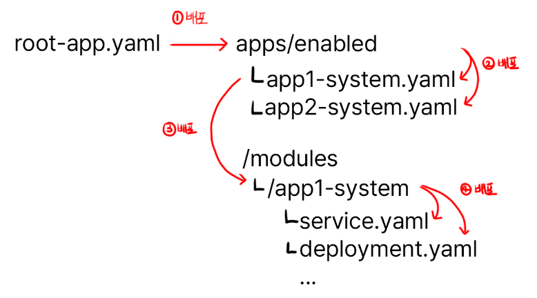
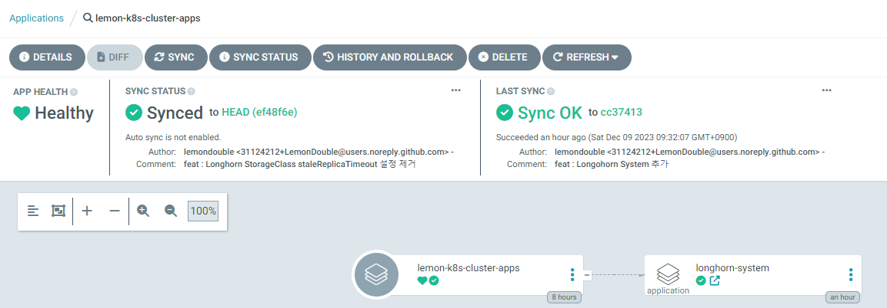

### 1. GitOps 시작

이제 ArgoCD를 설치하였으니, 리포지토리 구조를 정리해 봅시다.

저희는 App On Apps 패턴을 이용하여 간결한 배포 방법을 만들어 볼 것입니다.

이해가 되지 않더라도 일단 따라와 주세요.

지난 시간에 만든 빈 레포지토리를 다음과 같은 구조로 만들어 주세요.

```sh
/apps
    ㄴ/disabled
    ㄴ/enabled
/init
/modules
```

이후, init 폴더에 이전에 작업했던 ip_address_pool.yaml, (argoCD의) ingress.yaml, traefik-update.yaml, values.yaml을 전부 추가합니다.

Git에 최초 설정 당시의 파일들을 저장해 둠으로써, 이후 클러스터를 복구해야 하는 상황에서 빠르게 해당 설정 파일들을 `kubectl -f 파일명` 으로 적용하기 위해서입니다.

아래와 같이 파일들을 추가하고, README.md를 하나 추가해서 지금까지 어떤 작업을 했는지 적어두면, 클러스터가 문제가 생겼을 때 복구시 큰 도움이 됩니다. README.md는 직접 작성해 주세요!

```sh
/init
    ㄴ ip_address_pool.yaml
    ㄴ ingress.yaml
    ㄴ traefik-update.yaml
    ㄴ values.yaml
```

이후, init 폴더 안에 다음 yaml 파일을 참조해 root-app.yaml을 추가합니다.

```yaml
apiVersion: argoproj.io/v1alpha1
kind: Application
metadata:
  name: <좋아하는 아무 이름 (제 경우는 lemon-k8s-apps)>
  namespace: argocd
spec:
  destination:
    namespace: argocd
    server: 'https://kubernetes.default.svc'
  source:
    repoURL: 'git@github.com:<YourOrganizationName>/<YourRepositoryName>.git'
    targetRevision: HEAD
    path: apps/enabled
  project: default
  syncPolicy:
    syncOptions:
      - CreateNamespace=true
```

하나하나 뜯어보면

1. ArgoCD가 관리하는 어플리케이션을 하나 추가
2. 어플리케이션은 Github의 내 레포지토리를 참고
3. Path는 위에서 설정한 apps/enabled 안에 있는 모든 yaml 파일을 실행

입니다.

이후 `kubectl apply -f root-app.yaml` 하여 root app을 설치합니다.

이후, ArgoCD로 돌아가 내 새로운 첫 어플리케이션이 잘 떴는지 확인합니다. Sync가 실패하고, 리포지토리에 해당 Path가 없다고 나온다면 정상 연결된 것입니다.

### 2. Longhorn 설치

* 메인 USB (OS가 깔려있는 USB) 이외에 최소한 하나 이상의 스토리지용 USB, SSD, HDD가 꽂혀 있다고 가정합니다.

**2023.12 기준 ArgoCD로 최초 설치시 Longhorn의 초기 Batch Job이 실패하는 버?그가 있어 수동으로 한번 설치 후, ArgoCD로 이전하는 작업을 진행합니다.**

Longhorn은 분산 스토리지 관리자로써, 다음과 같은 기능을 제공합니다. (읽기 귀찬다면, 간단히 S3와 비슷한 기능들을 제공합니다!)

1. **분산 스토리지 저장**

내 파일을 설정에 따라 N개의 스토리지에 분산 저장합니다.

만약 어떤 재해로 인해 한 스토리지가 파괴되더라도 해당 스토리지에 있었던 데이터들을 다른 스토리지로 자동으로 이전하여 최소 N개의 복재본이 유지되도록 합니다.

이를 통해, 만약 SSD 하나가 뻑나더라도 다른 스토리지에 동일한 데이터가 있으므로, 프로그램 및 시스템이 정상 운용되도록 할 수 있습니다.

2. **Storage Tiering**

만약 어떤 시스템은 I/O가 굉장히 헤비한 워크로드라 높은 스토리지 성능을 필요로 하고,

어떤 시스템은 자주 읽지 않는 파일이 엄청 많아, 스토리지 성능보단 용량이 필요할 수 있습니다.

Longhorn은 StorageClass를 지원하여, 이를 통해 단계별로 스토리지를 나눠 사용할 수 있습니다.

예를 들어 I/O가 중요한 경우는 NVME SSD만 모여있는 스토리지 클래스를, 단순 파일 저장이 많이 필요한 경우는 HDD만 있는 스토리지 클래스를 할당하는 식으로 사용합니다.

따라서! 다음 명령어를 통해 Longhorn을 설치합니다.

```sh
helm repo add longhorn https://charts.longhorn.io
helm repo update
helm install longhorn longhorn/longhorn --namespace longhorn-system --create-namespace --set service.ui.loadBalancerIP="192.168.0.201" --set service.ui.type="LoadBalancer"
```

정상적으로 설치되었다면, 브라우저에서 `http://192.168.0.201`로 들어가서 Longhorn UI가 나오는 것을 확인합니다.

### 3-1. ArgoCD를 이용해 설치하기 - 설정파일 추가

이제 설치가 한번 완료되었으니, 기존 설치했던 Longhorn을 ArgoCD로 옮겨보도록 합시다.

폴더 구조 및 배포 전략은 다음과 같습니다. 아래와 같은 구조로, root-app을 배포하면 하위 앱들이 자동으로 뜨도록 합니다.



이것도 마찬가지로, 일단 따라해 보도록 합니다. 아래 파일을 추가합니다.

* `apps/enabled/longhorn-system.yaml`

```yaml
apiVersion: argoproj.io/v1alpha1
kind: Application
metadata:
  name: longhorn-system
  namespace: argocd
spec:
  destination:
    namespace: longhorn-system
    server: 'https://kubernetes.default.svc'
  source:
    path: modules/longhorn-system
    repoURL: 'git@github.com:<YourOrganizationName>/<YourRepositoryName>.git'
    targetRevision: HEAD
  project: default
```
modules/longhorn-system 을 자동 배포하는 어플리케이션을 추가합니다.

* `modules/longhorn-system/longhorn.yaml`

```yaml
apiVersion: argoproj.io/v1alpha1
kind: Application
metadata:
  name: longhorn
  namespace: argocd
spec:
  destination:
    namespace: longhorn-system
    server: 'https://kubernetes.default.svc'
  source:
    repoURL: 'https://charts.longhorn.io'
    targetRevision: 1.5.3
    chart: longhorn
    helm:
      parameters:
        - name: service.ui.loadBalancerIP
          value: 192.168.0.201
        - name: service.ui.type
          value: LoadBalancer
  project: default
```

`helm.paramters` 를 통해 위와 같이, values.yaml에 들어갈 값을 추가할 수 있습니다.


* `modules/longhorn-system/longhorn.yaml`

```yaml
kind: StorageClass
apiVersion: storage.k8s.io/v1
metadata:
  name: longhorn-ssd
provisioner: driver.longhorn.io
allowVolumeExpansion: true
reclaimPolicy: "Delete"
volumeBindingMode: Immediate
parameters:
  numberOfReplicas: "2"
  fsType: "ext4"
  diskSelector: "ssd"
---
kind: StorageClass
apiVersion: storage.k8s.io/v1
metadata:
  name: longhorn-hdd
provisioner: driver.longhorn.io
allowVolumeExpansion: true
reclaimPolicy: "Delete"
volumeBindingMode: Immediate
parameters:
  numberOfReplicas: "1"
  fsType: "ext4"
  diskSelector: "hdd"
```
ssd, hdd 스토리지를 추가합니다. 만약 USB 등을 사용하고 계시다면, 이름을 longhorn-usb 등으로 변경하셔도 됩니다.

`numberOfReplicas` : 복제본의 개수입니다. 저의 경우 SSD는 어플리케이션에 필요한 데이터 저장용이니 안정성을 위해 최소 2개, HDD는 단순 파일 저장용이라 1개로 설정했습니다.
`fsType` : 파일시스템의 타입입니다. ext4를 사용할 예정입니다. 가이드를 따라오신다면, 동일하게 설정하면 됩니다.
`diskSelector` : 이후 Disk 등록시 사용합니다. 기억해 두도록 합니다.

작업을 완료하셨다면, Git commit 후 Push합니다!

### 3-2. ArgoCD를 이용해 설치하기 - 실제 배포하기

이제 초기 설정했던 ArgoCD에 들어가 직접 배포를 진행합니다.



저희가 알아야 하는 것은 `Sync`, `Refresh` 버튼입니다.

- `Sync` : Git에서 새로운 클러스터 상태를 가져온 후, 실제 클러스터 상태를 Git과 동기화합니다.
- `Refresh` : Git에서 새로운 클러스터 상태를 가져옵니다. 클러스터를 동기화하진 않습니다.

따라서, Sync를 누르면 ArgoCD가 배포를 시작합니다.

이후 Longhorn-system -> Longhorn을 차례차례 타고 가 Sync 버튼을 눌러 배포를 진행합니다.

### 마치며

고생하셨습니다! 드디어 지금까지 중구난방으로 있던 Yaml 파일들을 정리하고, GitOps를 향한 첫 발을 내딛었습니다.

이제 다음 시간에는 실제 SSD, HDD를 Longhorn을 통해 등록해 보겠습니다.