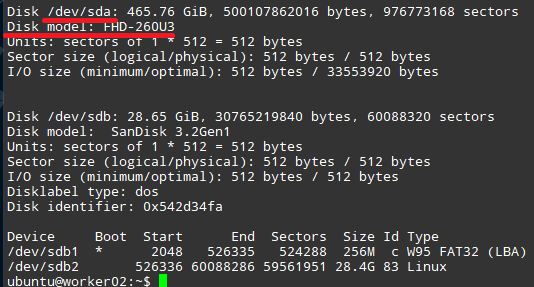
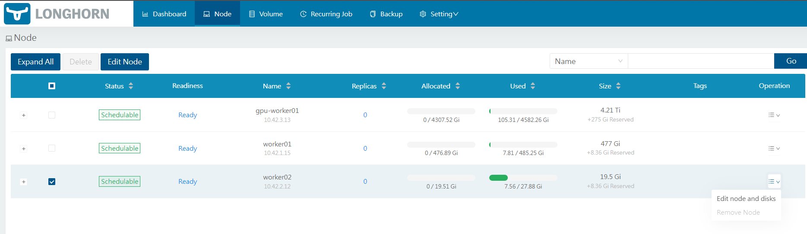
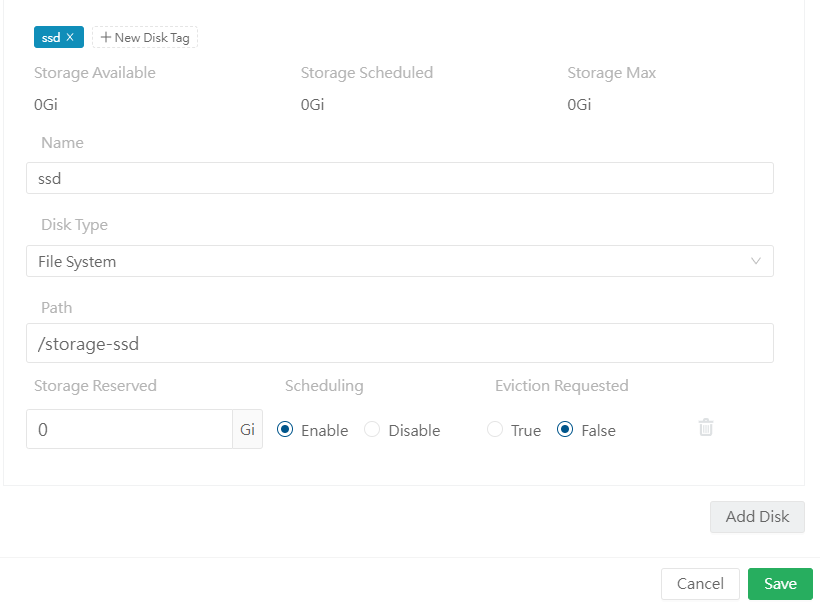

### 1. 신규 디스크 추가 및 마운트

- 해당 내용은 일반적인 SSD / HDD 마운트와 동일합니다! 뭔가 잘 안 된다면, `우분투 하드디스크 마운트` 등을 검색하셔서 따라해도 무방합니다!

1. SSD, HDD를 라즈베리 파이에 연결합니다. 

2. `sudo fdisk -l` 커맨드를 입력하여, 마운트한 하드 디스크의 이름을 찾습니다. 제 경우 `/dev/sda`입니다.

3. `sudo wipefs -a /dev/<방금 확인한 디스크>` 를 입력하여 주의하여 디스크를 포맷합니다. (예시 : `sudo wipefs -a /dev/sda`)
4. `sudo mkfs.ext4 /dev/<방금 확인한 디스크>` 를 입력하여 디스크를 ext4 포맷으로 만듭니다.
5. `sudo blkid -s UUID -o value /dev/<방금 확인한 디스크>` 를 입력하여, 해당 디스크의 고유 ID (680dfccb-9d8f-431c-ab3b-8c1e6c86e04f 형태)를 받아옵니다.
6. `sudo mkdir /storage-ssd` (위치는 자유, 저는 편의상 Root에 `/storage-ssd` 라는 폴더에 마운트했습니다.) 로 마운트할 폴더를 생성합니다.
7. sudo 권한으로 `/etc/fstab`을 열어 제일 마지막 줄에 `UUID=7cf3fc21-74d6-4c01-a835-f8bd36bc3f7b /storage-ssd ext4 defaults 0 0`를 추가합니다. (6번에서 생성한 폴더에 마운트)
8. `sudo mount -a`를 통해 방금 등록한 디스크를 마운트합니다.

### 2. 신규 디스크 Longhorn 등록

이제 새로운 디스크를 Longhorn에 등록해 봅시다!

1. 아까 설정한 로드밸런서 ip (`http://192.168.0.201/`) 를 브라우저로 들어갑니다.
2. Node -> 해당 Node 선택 -> Edit Node and disks를 선택합니다.

3. disk tag에 StorageClass시 설정한 `diskSelector` 과 같은 태그를 입력해 해당 디스크가 해당 StorageClass에 속한다는 것을 알려줍니다. 이후 Path를 위에서 설정한 Mount 폴더로 지정합니다. 

4. 이후 저장을 누르고, 정상적으로 볼륨이 인식되는지 확인합니다.

### 3. 마치며

수고하셨습니다! 이제 Longhorn을 이용해 이후의 어플리케이션에 안정적으로 분산 스토리지 시스템을 공급할 수 있게 되었습니다!

이 다음으론 Sealed Secrets를 통해 패스워드 등의 민감정보를 Git을 통해 관리하는 법을 알아보고, 그 다음 Private Docker Registry를 구현해 볼 예정입니다.

감사합니다!