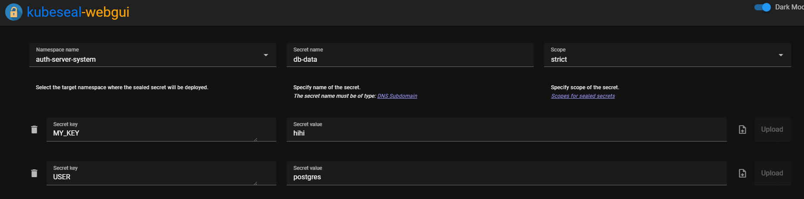

### 1. 서론

Sealed Secrets 다 괜찮은데, 문제가 하나 있다면 매번 설정할 떄마다 Secrets.yaml 만들고... CLI로 Sealed Secrets로 변경한 뒤에.. Git에 추가하는게 끝내주게 귀찮다는 점입니다.

이걸 좀 더 편하게 하기 위해 [kubeseal-webgui](https://github.com/Jaydee94/kubeseal-webgui)를 이용해 간단히 Web UI를 만들어 볼 예정입니다.



### 2. 설치

ArgoCD를 이용해 또 간단히 설치해 봅시다!

`modules/sealed-secrets-system/kubeseal-webgui.yaml`

```yaml
# https://github.com/Jaydee94/kubeseal-webgui
apiVersion: argoproj.io/v1alpha1
kind: Application
metadata:
  name: kubeseal-webgui
  namespace: argocd
spec:
  destination:
    namespace: sealed-secrets-system
    server: 'https://kubernetes.default.svc'
  source:
    repoURL: 'https://jaydee94.github.io/kubeseal-webgui'
    targetRevision: 5.1.4
    chart: kubeseal-webgui
    helm:
      parameters:
        - name: api.url
          value: https://<web ui를 사용할 subdomain 예시:seal.lemon.com>
        - name: sealedSecrets.autoFetchCert
          value: 'true'
        - name: sealedSecrets.controllerName
          value: sealed-secrets
        - name: sealedSecrets.controllerNamespace
          value: sealed-secrets-system
  sources: []
  project: default
```

`modules/sealed-secrets-system/ingress.yaml`

```yaml
apiVersion: traefik.containo.us/v1alpha1
kind: IngressRoute
metadata:
  name: sealed-secrets-ingress
  namespace: sealed-secrets-system
spec:
  tls:
    certResolver: le
  routes:
    - kind: Rule
      match: Host(`<web ui를 사용할 subdomain 예시:seal.lemon.com>`)
      services:
        - name: kubeseal-webgui
          port: 8080
```

필요하다면 Basic Auth는 [이전 글](https://lemondouble.github.io/p/%EC%A7%91%EC%97%90%EC%84%9C-%EB%9D%BC%EC%A6%88%EB%B2%A0%EB%A6%AC-%ED%8C%8C%EC%9D%B4-%ED%81%B4%EB%9F%AC%EC%8A%A4%ED%84%B0%EB%A1%9C-%EB%8D%B0%EC%9D%B4%ED%84%B0%EC%84%BC%ED%84%B0-%EC%B0%A8%EB%A6%AC%EA%B8%B0-7.-sealed-secrets%EB%A5%BC-%ED%86%B5%ED%95%9C-%EB%B9%84%EB%B0%80-%EA%B4%80%EB%A6%AC--traefik-basic-auth-%EC%84%A4%EC%A0%95/)을 참고하여 추가합니다.

이후 해당 UI를 통해 간단히 Sealed Secrets를 만들 수 있습니다!