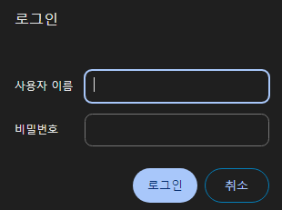

### 1. Sealed Secrets?

저희는 지금 GitOps를 하고 있습니다. 즉 Git에 클러스터와 관련된 모든 설정을 올리고 있습니다.

그런?데? 쿠버네티스 Secret은? 암호화 기능이 없습니다. base64로 디코딩하면 누구나 평문으로 내용을 볼 수 있습니다.

그러면 Git에?올리면?안?되겠죠?

이런 문제를 해결하기 위해 나온 것이 Sealed Secrets입니다.

1. 클러스터는 암/복호화 키를 가집니다.
2. 유저는 Git에 파일을 올리기 전, 해당 클러스터가 가지고 있는 키로 암호화를 합니다.
3. Git에 암호화된 Secret이 올라갑니다. 누구나 볼 순 있겠지만, 복호화는 불가능합니다. 따라서 안전합니다.
4. 이후 ArgoCD등으로 클러스터에 해당 Secret을 다시 불러오면, Sealed Secret 컨트롤러가 암호화를 풀어 자동으로 복호화 해 줍니다.

Sealed Secrets Github : [Link](https://github.com/bitnami-labs/sealed-secrets)

### 2. Sealed Secrets 추가하기

ArgoCD를 통해 순식간에 배포를 해치워 봅니다!

`apps/enabled/sealed-secrets-system.yaml`
```yaml
apiVersion: argoproj.io/v1alpha1
kind: Application
metadata:
  name: sealed-secrets-system
  namespace: argocd
spec:
  destination:
    namespace: sealed-secrets-system
    server: 'https://kubernetes.default.svc'
  source:
    path: modules/sealed-secrets-system
    repoURL: 'git@github.com:<YourOrganizationName>/<YourRepositoryName>.git'
    targetRevision: HEAD
  project: default
```

`modules/sealed-secrets-system/sealed-secrets.yaml`
```yaml
apiVersion: argoproj.io/v1alpha1
kind: Application
metadata:
  name: sealed-secrets
  namespace: argocd
spec:
  destination:
    namespace: sealed-secrets-system
    server: 'https://kubernetes.default.svc'
  source:
    repoURL: 'https://bitnami-labs.github.io/sealed-secrets'
    targetRevision: 2.13.3
    chart: sealed-secrets
    helm:
      releaseName: sealed-secrets
  project: default
```

이후 배포를 진행합니다.

이후로는, 다음 커맨드를 이용하여 kubeseal 커맨드라인 도구를 설치합니다.

```shell
KUBESEAL_VERSION='0.23.0' #2023.12 기준 최신버전
wget "https://github.com/bitnami-labs/sealed-secrets/releases/download/v${KUBESEAL_VERSION:?}/kubeseal-${KUBESEAL_VERSION:?}-linux-arm64.tar.gz"
tar -xvzf kubeseal-${KUBESEAL_VERSION:?}-linux-arm64.tar.gz kubeseal
sudo install -m 755 kubeseal /usr/local/bin/kubeseal
```


`secret.yaml`
```yaml
apiVersion: v1
kind: Secret
metadata:
  name: mysecret
  namespace: mynamespace
data:
  users: bGVtb246JGFwcjEkL0ZYczZGam0kMkpJZWNlQy45UWc5QjV5NUw2TzVoMAoK
```

다음과 같은 커맨드로, Sealed Secrets를 생성 후 등록할 수 있습니다.
```sh
cat secret.yaml | kubeseal --controller-namespace=kube-sealed-secrets-system --controller-name=sealed-secrets -oyaml > sealed-secrets.yaml
```

### 3. Sealed Secrets 이용하여 Basic Auth 등록해보기

Basic Auth는 엄청 엄청 간단히 말하면, ID Password 로그인입니다.



Longhorn Dashboard를 외부 인터넷에서도 접근할 수 있게 Ingress를 설정하고, Id/Password 로그인을 붙여 봅시다! (Control01에서 진행)

1. `apt install apache2-utils` 실행하여 htpasswd 커맨드를 사용할 수 있도록 합니다.
2. `htpasswd -nb <id> <password> | openssl base64` 를 이용하여, id,password가 담긴 Secret String을 얻습니다.
3. 아무 텍스트 편집기로 secret.yaml을 생성하고, 다음을 참고하여 Secret을 추가합니다.

```yaml
apiVersion: v1
kind: Secret
metadata:
  name: longhorn-system-basic-auth
  namespace: longhorn-system
data:
  users: <2에서 얻은 String>
```

4.`cat secret.yaml | kubeseal --controller-namespace=sealed-secrets-system --controller-name=sealed-secrets -oyaml > sealed-secrets.yaml` 를 입력하여 sealed-secrets.yaml 을 얻습니다.
5. 다음을 참고하여 ingress를 등록합니다.

`modules/longhorn-system/ingress.yaml`

```yaml
apiVersion: traefik.containo.us/v1alpha1
kind: IngressRoute
metadata:
  name: longhorn-dashboard
  namespace: longhorn-system
spec:
  tls:
    certResolver: le
  routes:
    - kind: Rule
      match: Host(`<원하는 subdomain, 예시:longhorn.lemon.com>`)
      middlewares:
        - name: basic-auth
          namespace: longhorn-system
      services:
        - name: longhorn-frontend
          port: 80
---
apiVersion: traefik.containo.us/v1alpha1
kind: Middleware
metadata:
  name: basic-auth
  namespace: longhorn-system
spec:
  basicAuth:
    secret: longhorn-system-basic-auth
```

`modules/longhorn-system/sealed-basic-auth-secret.yaml` 에는, 방금 생성한 sealed-secrets.yaml을 복사 붙여넣기 해 줍시다.

```yaml
apiVersion: bitnami.com/v1alpha1
kind: SealedSecret
metadata:
  creationTimestamp: null
  name: longhorn-system-basic-auth
  namespace: longhorn-system
spec:
  encryptedData:
    users: adfasdflavasdlfj...
  template:
    metadata:
      creationTimestamp: null
      name: longhorn-system-basic-auth
      namespace: longhorn-system
```

6. 이후 배포를 진행해 줍니다.
7. 이후 접속하면 정상적으로 id/password 확인 창이 뜨며, 로그인을 하지 않으면 해당 페이지가 보이지 않습니다!

### 3. 백업 및 복구

이제 우리는 Git에 Secret 같은 민감 정보도 저장할 수 있게 되었습니다!

근데 다 좋은데, 클러스터가 박살나서 복호화 키를 잃어버리면 우리도 비밀을 풀 수 없게 되어버리겠죠?

따라서, 암/복호화 키를 **반드시** 백업해야 합니다!

- 백업 방법

1. `kubectl get secret -n sealed-secrets-system -l sealedsecrets.bitnami.com/sealed-secrets-key -o yaml >master.key` 를 입력하여 mater.key를 어딘가에 꼭 백업해 둡니다.

- 복구 방법

1. 방금 백업했던 master.key를 클러스터에 복사하고, `kubectl apply -f master.key` 를 입력하여 master key를 등록합니다.
2. sealed-secrets-system에 존재하는 Pod 하나를 죽여서 새 Key를 읽게 만듭니다. (ArgoCD에서 간편하게 가능)

### 4. 마치며

저희는 이제 Sealed Secrets를 통해 Git에 모든 데이터를 저장할 수 있게 되었고,

Traefik Basic Auth를 이용해 내부 서비스를 외부에 (최소한의 보안을 갖춰) 공개할 수 있게 되었습니다!

그럼 다음 시간에는, Private Docker Registry를 구축하는 법을 알아보겠습니다!