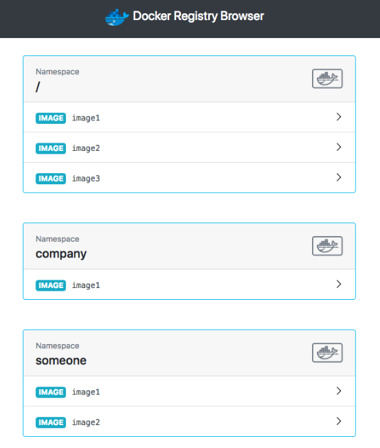
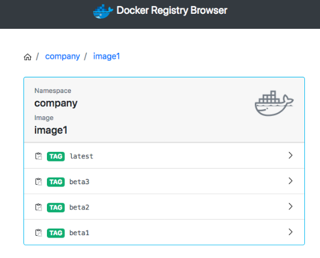

### 1. Private Registry는 좋은데, 관리하기가 너무 까다로워요!

CLI를 엄청 좋아하는 사람도 있지만.. 저는 커맨드 외우는걸 정말 못 하는 고로.. GUI와 기록을 선호합니다.

Docker Registry도 CLI로도 관리가 가능하지만, 좀 더 편하게 하기 위해 [docker-registry-browser](https://github.com/klausmeyer/docker-registry-browser) 를 사용합니다.

이런 느낌의 GUI를 사용할 예정입니다.





### 2. 설치

기존 docker-registry-system에 같이 설치합니다.

기존 파일 밑에 --- 추가 후 작성해 주세요.

`modules/docker-registry-system/deployment.yaml`

```yaml
... 기존 deployment
---
apiVersion: apps/v1
kind: Deployment
metadata:
  name: docker-registry-ui-deployment
  namespace: docker-registry-system
spec:
  replicas: 1
  selector:
    matchLabels:
      app: docker-registry-ui-app
  template:
    metadata:
      labels:
        app: docker-registry-ui-app
    spec:
      nodeSelector:
        node-type: worker
      containers:
        - name: docker-registry-ui-pod
          image: klausmeyer/docker-registry-browser:1.7.0
          imagePullPolicy: Always
          ports:
            - name: http
              containerPort: 8080
          envFrom:
            - secretRef:
                name: docker-registry-ui-secrets-sealed-secrets
```

`modules/docker-registry-system/service.yaml`

```yaml
... 기존 service
---
apiVersion: v1
kind: Service
metadata:
  name: docker-registry-ui-service
  namespace: docker-registry-system
spec:
  selector:
    app: docker-registry-ui-app
  type: ClusterIP
  ports:
    - name: http
      protocol: TCP
      port: 80
      targetPort: 8080
```

`modules/docker-registry-system/ingress.yaml`

```yaml
---
apiVersion: traefik.containo.us/v1alpha1
kind: IngressRoute
metadata:
  name: docker-registry-ui-ingress
  namespace: docker-registry-system
spec:
  tls:
    certResolver: le
  routes:
    - kind: Rule
      match: Host(`UI를 보여줄 URL 예시:docker-ui.lemon.com`)
      services:
        - name: docker-registry-ui-service
          port: 80
```

추가로 Basic Auth 설정을 진행하려면 [Sealed Secrets를 통한 비밀 관리 + Traefik Basic Auth 설정](https://lemondouble.github.io/p/%EC%A7%91%EC%97%90%EC%84%9C-%EB%9D%BC%EC%A6%88%EB%B2%A0%EB%A6%AC-%ED%8C%8C%EC%9D%B4-%ED%81%B4%EB%9F%AC%EC%8A%A4%ED%84%B0%EB%A1%9C-%EB%8D%B0%EC%9D%B4%ED%84%B0%EC%84%BC%ED%84%B0-%EC%B0%A8%EB%A6%AC%EA%B8%B0-7.-sealed-secrets%EB%A5%BC-%ED%86%B5%ED%95%9C-%EB%B9%84%EB%B0%80-%EA%B4%80%EB%A6%AC--traefik-basic-auth-%EC%84%A4%EC%A0%95/) 을 참고해 주세요.


`modules/docker-registry-system/sealed-docker-registry-ui-secrets.yaml`

sealed secrets GUI에 들어가 다음 Secret을 추가합니다. (참고 Docs [Link](https://github.com/klausmeyer/docker-registry-browser/blob/master/docs/README.md))

- BASIC_AUTH_USER : registry 로그인에 사용하는 유저명
- BASIC_AUTH_PASSWORD : 패스워드
- DOCKER_REGISTRY_URL : https://<내가 등록한 Registry 주소>
- ENABLE_DELETE_IMAGES : true
- SECRET_KEY_BASE : openssl rand -hex 64 실행 후 나온 값

```yaml
apiVersion: bitnami.com/v1alpha1
kind: SealedSecret
metadata:
  name: docker-registry-ui-secrets
  namespace: docker-registry-system
  annotations: {}
spec:
  encryptedData:
    BASIC_AUTH_USER: afdfads...
    BASIC_AUTH_PASSWORD: fadvbads..
    DOCKER_REGISTRY_URL: dfd..
    ENABLE_DELETE_IMAGES: afdgd...
    SECRET_KEY_BASE: dffdf...

```

사용법은 직관적이므로, 직접 사용해 보는 것을 추천드립니다!


### 3. Registry GC

Docker Registry UI에서 이미지를 지우더라도 (혹은 CLI로 이미지를 지우더라도) 즉시 디스크 용량이 줄어들진 않습니다.

이는 GUI/CLI에서 이미지를 지울 때, 실제로 물리적 삭제가 일어나는 것이 아닌 해당 이미지의 Manifest만을 지우기 때문입니다.

실제 데이터 삭제는 Registry GC를 명시적으로 수행할 때 일어납니다.

더 자세한 이야기를 할 수 있지만, 오늘은 일단 사용에 초점을 맞추기에 자세한 이야기는 생략합니다. 

(관련 내용이 좀 더 궁금하시면 [투명 셀로판지 이론을 통한 Overlay FS 사용 방법과 유니온 마운트](https://blog.naver.com/alice_k106/221530340759) 라는 글을 먼저 읽은 후, Docker registry와 이미지 삭제 등의 키워드로 검색해 보시면 좋을 것 같습니다.) 

* Registry GC 진행하기

**!! 주의! GC 진행 도중에는 레포지토리에서 Pull/Push가 일어나지 않아야 합니다. 이를 먼저 확인하고 작업해 주세요!**

1. `kubectl get pod -n docker-registry-system` 을 이용하여, Registry의 Pod을 찾아 줍니다.
2. `kubectl exec -it pod/<registry-pod-name> -n docker-registry-system -- /bin/registry garbage-collect /etc/docker/registry/config.yml` 을 실행하여 GC를 실행합니다.
3. 이후 Longhorn Dashboard에서 Volume 선택 -> Trim Filesystem을 눌러 Actual Size를 재계산해줍니다.

### 4. 마치며

이를 통해 Docker UI, GC 방법에 대해 알아 보았습니다.

이제 Private Registry 및 관리 방법이 생겼으니, 마음 편하게 서버를 개발(?) 하셔서 원하시는 서버를 집어넣을 수 있습니다!

다음 시간에는 CloudNativePG를 이용하여 쿠버네티스 위에서 데이터베이스를 굴리는 방법에 대해 알아보겠습니다.