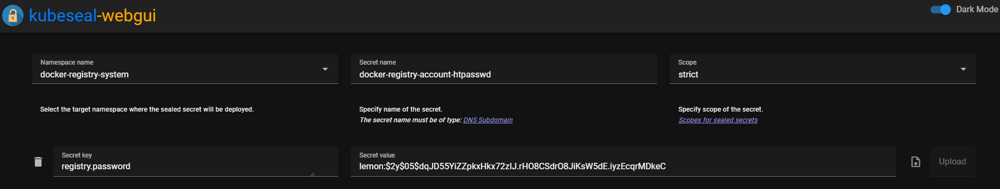

### 1. 서론

이왕 인프라 갖춘거 Private Docker Registry도 직접 만들어 봅시다.

저의 경우는, 이후 이 클러스터에 별도로 개인 서버들을 올려 사용하고 있어 해당 컨테이너를 관리하기 위해 Private Registry를 사용하고 있습니다.

만약 Dockerhub에 돈을 지불할 의향이 있거나, Public Image로도 충분하다면 이 가이드를 따르실 필요는 없습니다.

저희는 Private Repo를 사용할 것이기 떄문에, ID,Password 설정도 동시에 진행합니다!

### 2. 설치

이번에도 ArgoCD로 빠르게 설치해봅시다!

`modules/docker-registry-system/pvc.yaml`

```yaml
apiVersion: v1
kind: PersistentVolumeClaim
metadata:
  name: longhorn-docker-registry-pvc
  namespace: docker-registry-system
spec:
  accessModes:
    - ReadWriteOnce
  storageClassName: longhorn-ssd
  resources:
    requests:
      storage: 300Gi
```

저의 경우 ML 서버를 운영해 이미지 사이즈가 큰 관계로, 넉넉하게 300Gi정도 줬는데 필요하시다면 수정하셔서 사용하시면 됩니다.

`modules/docker-registry-system/service.yaml`

```yaml
apiVersion: v1
kind: Service
metadata:
  name: registry-service
  namespace: docker-registry-system
spec:
  selector:
    app: registry
  type: LoadBalancer
  ports:
    - name: docker-port
      protocol: TCP
      port: 5000
      targetPort: 5000
  loadBalancerIP: 192.168.0.202
```

`modules/docker-registry-system/deployment.yaml`

```yaml
apiVersion: apps/v1
kind: Deployment
metadata:
  name: registry
  namespace: docker-registry-system
spec:
  replicas: 1
  selector:
    matchLabels:
      app: registry
  template:
    metadata:
      labels:
        app: registry
        name: registry
    spec:
      nodeSelector:
        node-type: worker
      containers:
      - name: registry
        image: registry:2
        ports:
        - containerPort: 5000
        env:
        - name: REGISTRY_HTTP_ADDR
          value: 0.0.0.0:5000
        - name: REGISTRY_AUTH
          value: htpasswd
        - name: REGISTRY_AUTH_HTPASSWD_REALM
          value: docker-registry
        - name: REGISTRY_AUTH_HTPASSWD_PATH
          value: /auth/registry.password
        - name: REGISTRY_STORAGE_DELETE_ENABLED
          value: "true"
        volumeMounts:
        - name: lv-storage
          mountPath: /var/lib/registry
          subPath: registry
        - name: docker-registry-account-htpasswd
          mountPath: /auth
          readOnly: true
      volumes:
        - name: lv-storage
          persistentVolumeClaim:
            claimName: longhorn-docker-registry-pvc
        - name: docker-registry-account-htpasswd
          secret:
            secretName: docker-registry-account-htpasswd
```

docker-registry-account-htpasswd 라는 Secret을 통해 Registry에서 사용할 ID, Password를 지정합니다. 해당 내용은 뒤에서 다루겠습니다.

`modules/docker-registry-system/sealed-docker-registry-account-htpasswd.yaml`

Secrets 설정이 조금 복잡합니다. Step By Step으로 따라와 봅시다!

1. Control Node에서 `htpasswd -Bbn <id> <password>` 로 Docker Registry에서 사용할 id/password String을 얻습니다.
2. 기존 7-1에서 설정한 kubeseal-webgui를 이용하여 해당 Secret을 암호화합니다. 

1. 해당 Secret을 sealed-docker-registry-account-htpasswd.yaml 로 붙여넣기 합니다.

```yaml
apiVersion: bitnami.com/v1alpha1
kind: SealedSecret
metadata:
  name: docker-registry-account-htpasswd
  namespace: docker-registry-system
  annotations: {}
spec:
  encryptedData: 
    registry.password: dfadf...
```

`modules/docker-registry-system/ingress.yaml`
```yaml
apiVersion: traefik.containo.us/v1alpha1
kind: IngressRoute
metadata:
  name: docker-registry-ingress
  namespace: docker-registry-system
spec:
  tls:
    certResolver: le
  routes:
    - kind: Rule
      match: Host(`<사용할 subdomain>`)
      services:
        - name: registry-service
          port: 5000
```

### 3. 정상 작동 확인

정상 작동이 확인되었다면, 이후 배포합니다!

배포가 되었다면, 정상적으로 id/password로 로그인이 이뤄지는지 확인합니다.

docker가 깔려있는 곳에서 터미널로 다음을 실행합니다.

```shell
docker login <my-registry.lemon.com>
```

이후 id/password를 입력하고, 정상 로그인이 되는지 확인합니다.

### 4. Private Registry에서 이미지 받아오는 법

이제 Id/Password가 있는 Private Registry에서 이미지를 Pull 해오는 방법을 알아야겠죠? 그래야 올린 이미지를 쓸 수 있을테니까요.

제가 사용하는 방법을 일단 올려드립니다. 더 깔끔한 방법이 있을 것 같은데, 혹시 있다면 알려주세요!

만약 auth-server-system 이라는 namespace에서 

1. `kubectl create secret docker-registry regcred --docker-server=<your-registry-server> --docker-username=<your-name> --docker-password=<your-pword> --docker-email=<your-email>` 을 이용하여 default Namespace에 regcred라는 secret을 만듭니다.
2. `kubectl get secret regcred --output=yaml > secret.yaml` 을 이용하여 secret.yaml에 secret 정보를 저장합니다. 해당 Secret은 어딘가에 백업해 둡니다.
3. `kubectl delete secret regcred` 를 입력하여 default namespace에 만든 secret을 삭제합니다.
4. 이후 2의 Secret에 Namespace를 수정하여 내가 사용할 namespace로 변경합니다. (예시 : auth-server-system)

```yaml
apiVersion: v1
data:
  .dockerconfigjson: ddfadf...
kind: Secret
metadata:
  name: regcred
  namespace: auth-server-system # 매번 여기를 변경
type: kubernetes.io/dockerconfigjson
```

5. 이후 `cat secret.yaml | kubeseal --controller-namespace=sealed-secrets-system --controller-name=sealed-secrets -oyaml > sealed-regcred.yaml` 커맨드를 입력하여 Sealed Secret을 생성합니다.
6. Sealed regcred를 배포시 같이 배포하고, Deployment에 다음과 같이 ImagePullSecret을 추가합니다.  

```yaml
apiVersion: apps/v1
kind: Deployment
metadata:
  name: auth-server
  namespace: auth-server-system
spec:
  replicas: 1
  selector:
    matchLabels:
      app: auth-server
  template:
    metadata:
      labels:
        app: auth-server
        name: auth-server
    spec:
      nodeSelector:
        node-type: worker
      containers:
        - name: auth-server
          image: registry.lemon.com/auth_server_repository:2023.12.10.1
          imagePullPolicy: Always
          ports:
            - name: http
              containerPort: 80
      imagePullSecrets:
        - name: regcred # 이걸 추가
```

### 5. 마치며

축하합니다! 이제 Private Docker Registry 구축을 완료해,

Id/Password를 이용해 내 이미지들을 안전하게 지킬 수 있게 되었습니다!

이제 다음엔 Web UI를 통해 이미지를 관리하는 법을 알려보고, Docker GC 방법에 대해 알아보겠습니다.