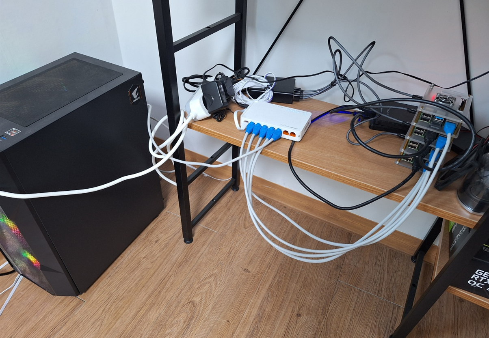
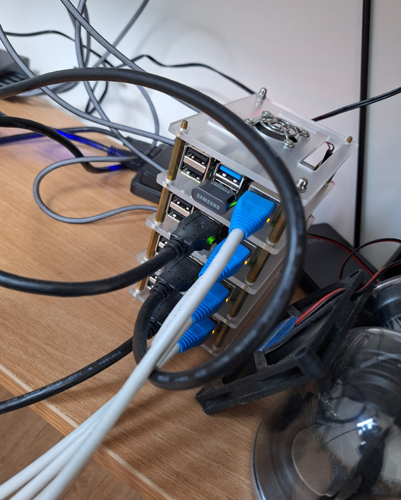

### 처음 라즈베리 파이 클러스터를 구축한 지 대략 300일이 지났습니다.

계기는 사실 그렇게 크진 않았습니다.

저는 매일 아침 [GeekNews](https://news.hada.io/) 라는 뉴스 큐레이팅 서비스를 보며 출근하는데, 그 중 [Chick-Fil-A 의 Edge Computing 기술 아키텍처 : Enterprise Restaurant Compute](https://news.hada.io/topic?id=8306) 라는 글이 눈에 보였습니다.

그 뒤로 칙필레도 쿠버네티스를 굴리는데, 서버 엔지니어로써 나도 관리하는 클러스터 하나쯤 있어야 하지 않을까? 가 모든 일의 시작이었습니다..

### 구성 환경

제 옥탑방(...) 클러스터는 대략 이렇게 생겼습니다.

구성 스펙을 정리해보자면,

- **Control Node**
  - Raspberry PI 4b+ 8GB Model * 1
  - Samsung MUF-AB FIT PLUS 64GB USB
- **ARM Worker + Storage Node**
  - Raspberry PI 4b+ 8GB Model + 500GB SSD(PNY CS900 500GB) * 3
  - Sandisk USB Ultra Fit USB 3.1 32GB * 3
- **GPU X86 Worker Node (For ML)**
  - Ryzen 5600x + 64GB DDR4 3200 RAM + GTX3090 + NVME SSD(WD Black) 1TB + WD RED Plus 4TB HDD

과 같이 구성하여 총 라즈베리 파이 4대, X86 GPU 서버 1대로 X86, ARM 혼합 클러스터를 운영하고 있습니다.

라즈베리 파이의 디스크 I/O는 안정성을 위해 SD카드 대신 USB 디스크를 사용하고 있습니다.

### 어? Control Node가 1대밖에 없으면 HA 못하는거 아니에요?

- 첫 클러스터 구축 시의 제일 큰 고민이었습니다.
  - 3대 이상을 HA로 구성하면 안전하지만, PI의 연산능력이 그렇게 많지 않다는 걸 감안했을 때, 가능한 낭비되는 컴퓨팅 파워를 줄이고 싶었습니다.

- 그 결론으로, **Master Node는 하나로** 둔 뒤, 아래와 같은 안전장치를 마련하고 있습니다.
  - etcd 대신 **External Database**를 상태 저장소로 사용하고 있습니다.
    - 현재는 **Supabase** 제공 Postgresql을 외부 저장소로 사용 중입니다.
  - Master Node는 Taint를 걸어 Job scheduling이 불가하게 설정해 두었습니다.
    - 이를 통해, 작업 할당 도중 마스터 노드가 갑작스럽게 사망하거나 하는 일을 줄였습니다.
  - Mater Node에는 조금 더 신뢰성있는 장비를 사용 중입니다. (USB, 쿨러 등)

그럼에도 불구하고 Matser Node가 여름에 과열로(..) USB가 사망한 적이 있으나, 모든 State가 외부 DB에 존재하므로 10분 이내로 복구할 수 있었습니다.

### 현재 소프트웨어적으로 구축한 내용

1. K3S와 External DB를 이용하여, 만약 Master Node가 다운되어도 복구할 수 있도록 시스템을 구축합니다.
2. ArgoCD와 Github를 이용하여, GitOps 시스템을 구축합니다.
3. [Mend Renovate](https://www.mend.io/renovate/) 를 이용하여, 설치한 Helm Chart 및 Private Registry의 새 버전이 나오면 자동으로 PR을 생성하고, 클러스터를 최신 상태로 유지합니다.
4. [Longhorn](https://github.com/longhorn/longhorn)을 이용하여 분산 스토리지를 구현, 만약 SSD 하나가 나가더라도 복구할 수 있는 시스템을 구축합니다.
5. Docker Private Registry를 구축하고, [Docker-registry-browser](https://github.com/klausmeyer/docker-registry-browser) 를 이용하여 업로드된 이미지를 확인할 수 있는 GUI를 구축합니다.
6. [Sealed-secrets](https://github.com/bitnami-labs/sealed-secrets)를 이용하여 Secret을 외부 서비스 없이 Git에 저장하여 관리합니다. 또한 [Kubeseal-webgui](https://github.com/Jaydee94/kubeseal-webgui) 를 이용하여 GUI를 이용하여 Secret을 편하게 추가할 수 있는 화면을 만듭니다.
7. [kube-prometheus-stack](https://github.com/prometheus-community/helm-charts/tree/main/charts/kube-prometheus-stack) 을 이용하여 모니터링 시스템을 구축하고 관리합니다.
8. [CloudNativePG](https://cloudnative-pg.io/) 를 이용하여 HA Postgres 데이터베이스 시스템을 구축하고, 혹시 모를 사고를 방지하기 위해 AWS 등에 자동 백업 시스템을 구축합니다.
9. [Portainer](https://www.portainer.io/) 를 이용하여 웹 UI를 기반으로 클러스터 관리를 수행하는 시스템을 만듭니다.
10. [MetalLB](https://metallb.universe.tf/) 설정을 통해 내부망에서만 접근 가능한 엔드포인트, 서비스를 쉽게 구축합니다.
11. [nvidia-device-plugin](https://github.com/NVIDIA/k8s-device-plugin) 을 이용하여 쿠버네티스 상에서 컨테이너가 CUDA 등의 디바이스를 사용할 수 있도록 합니다.
12. [traefik-forward-auth](https://github.com/thomseddon/traefik-forward-auth) 라이브러리의 아이디어를 차용하여, 자체 인증 시스템을 구축합니다. 비밀번호 이외에 SSO 로그인을 통해 내부 관리 시스템에 접근 가능하도록 합니다.

### 앞으로 쓸 글

앞으로는, 제가 구축한 내용을 복기하며 하드웨어부터 소프트웨어, 시스템 구축까지의 내용을 시간 날 때마다 하나씩 추가할 예정입니다.
위는 순서 없이 나열한 내용이며, 글을 적다 보면 내용이 변경될 수 있습니다.

덧붙여, 해당 구축 가이드는 2023.12 기준으로 제가 직접 따라가며 정상 동작을 확인한 방법입니다.

### 서론을 마치며

클러스터를 구축하며 관련 자료를 열심히 찾아봤는데, 

의외로 이런 자료가 그렇게 많지 않단 것을 알게 되었습니다.
[VladoPortos](https://github.com/VladoPortos) 님의 [Kubernetes with OpenFaaS on Raspberry Pi 4](https://rpi4cluster.com/) 자료가 도움이 많이 되었지만, 국내 자료가 그리 많지 않은 것이 아쉬웠습니다.

미약하나마, 이 가이드가 비슷한 길을 개척하려는 분께 도움이 되길 바랍니다.
