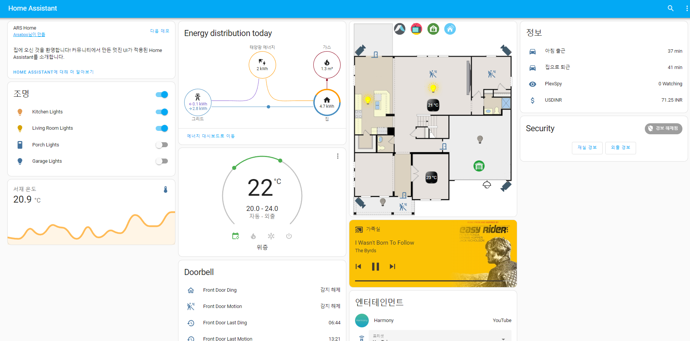
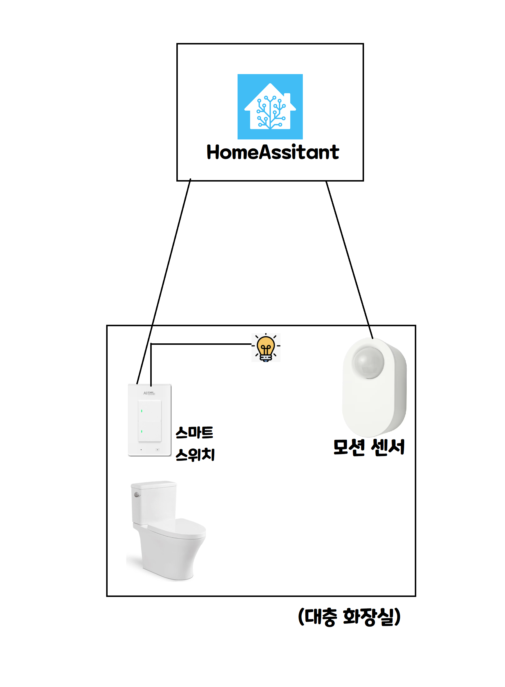
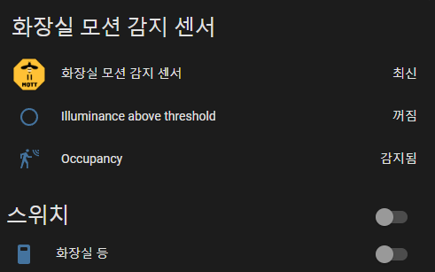
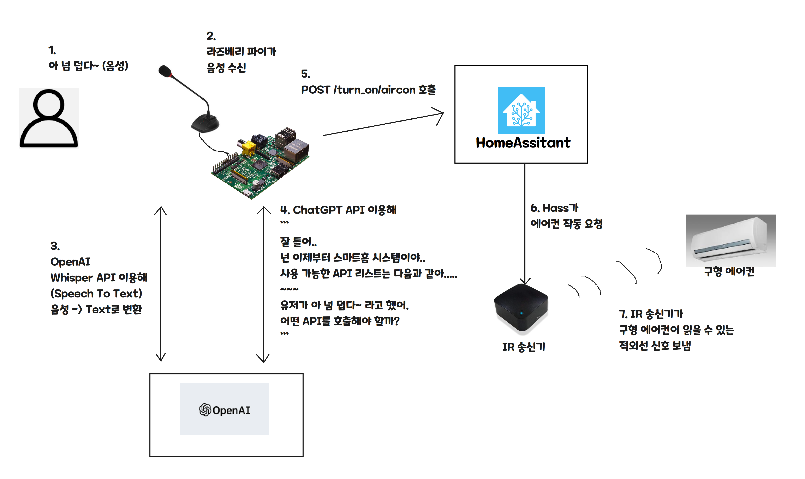
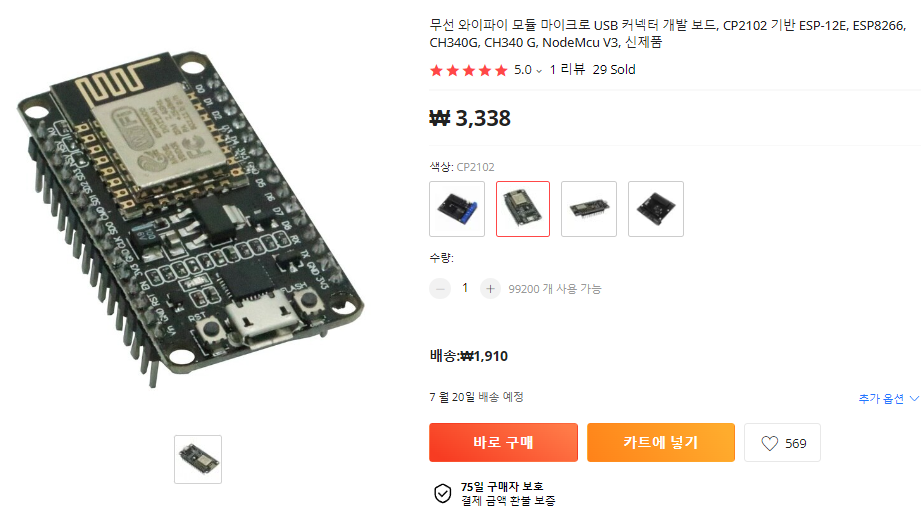
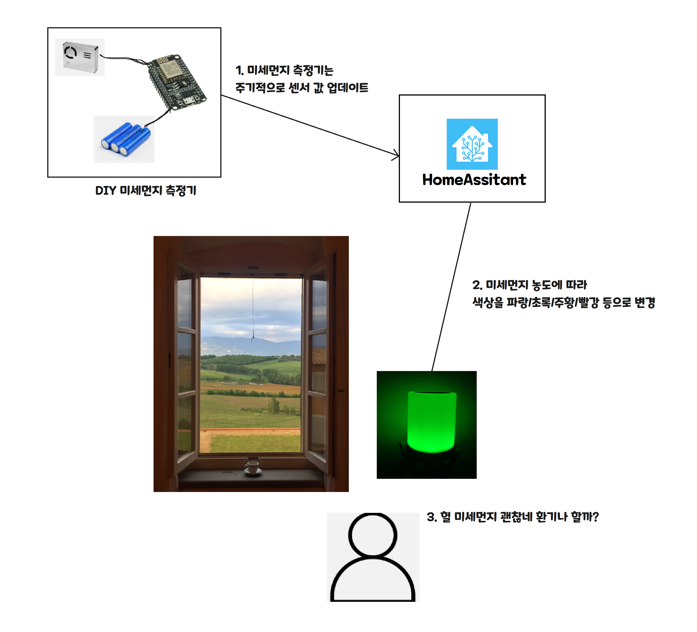
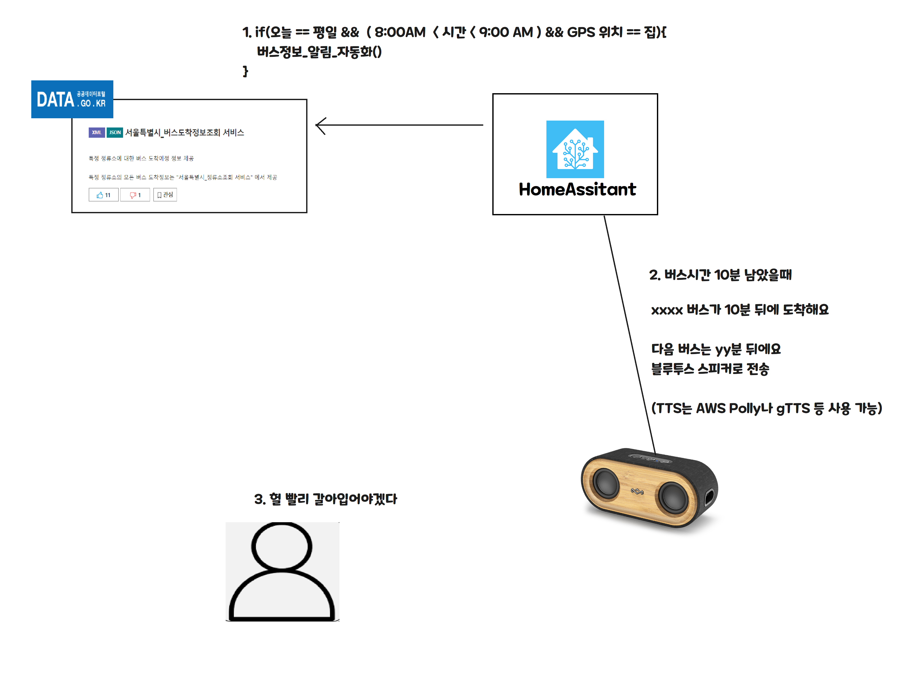

IoT는 꽤 재밌는 주제인데도,

입문 난이도가 높음 + 잘 알려지지 않은 주제라 이걸로 뭘 할 수 있는지도 잘 알려지지 않은 것 같습니다.

저는 여러 플랫폼 중 HomeAssistant(이하 HASS)라는 플랫폼을 직접 설치해서 사용 중인데요, 왜 이런 플랫폼이 필요하고, 우리의 삶에서 뭘 개선시킬 수 있는지 이야기를 하려고 합니다!


### 1. HomeAssitant가 뭔가요? (이하 HA, Hass)

여러 회사의 IoT 디바이스를 한 곳에서 통합 관리하게 해 주는 통합 플랫폼입니다.

[Demo](https://demo.home-assistant.io/#/lovelace/0) 를 확인해 보세요!



### 2. 이걸로 뭘 할 수 있나요?

- 프로그래밍을 할 수 있다면, 문자 그대로 모든 걸 할 수 있습니다!

여러분의 관심에 따라? 할 수 있는 예시를 몇 개 들어볼겠습니다.

- **자동화에 관심이 있다면?**
    - **예시 시나리오 : 화장실 불 끄기가 너무 귀찮아요**





위와 같이, 스마트 전등과 모션 감지 센서를 설치해서

아래와 같이 자동화 할 수 있습니다!

```kotlin
// 실제 코드는 아니고, 의사 코드입니다.
// 자동화 1. 화장실 등 자동 키기
if(화장실_모션_센서.Occupancy transfer to True){
    turn_on (화장실_등)
}

// 자동화 2. 화장실 등 자동 끄기
if(화장실_모션_센서.Occupancy transfer to False && 바뀐지_10분_지남){
    turn_off(화장실_등) 
}
```

- 실제로 hass 화면에선 다음과 같이 자동화를 하게 됩니다.


- **AI에 관심이 있다면?**
    - 예시 시나리오: 음성 비서 만들기
    - 그런데 정말 뭐든 할 수 있는..



- **회로 DIY에 관심이 있다면?**
    - [ESPHome](https://esphome.io/) 같은 프로젝트를 이용해 보세요!



- ESPxx 과 같은, 와이파이와 CPU가 달린 개발 보드를 몇 천원이면 구매할 수 있습니다!

- 아래와 같은 환기 등 만들기 시나리오는 어떠세요? 




- **매번 버스 시간 확인하기 귀찮다면?**

- 공공 API를 이용해서 버스 알림이를 만들어보는건 어떨까요?




이외에도, HomeAssistant라는 플랫폼을 거쳐 더 많은 일들을 할 수 있습니다!

완전히 오픈 소스라, 필요하다면 고칠 수 있단것도 덤이구요!

한번 즐거운 IoT, 같이 해 보시지 않을래요?