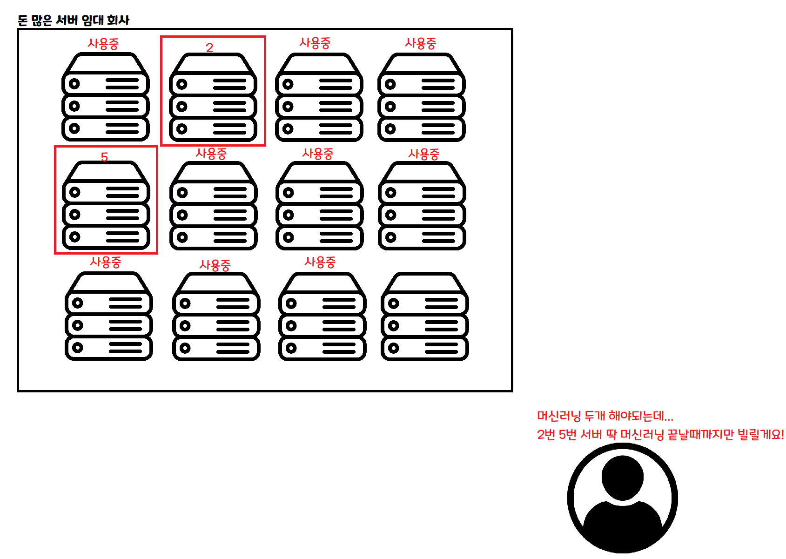

> 이런 서비스를 만든 이야기를 합니다!

> 2024.06.30 추가 : 당시는 ChatGPT가 나오기 전이라, 이런 챗봇 서비스가 흔하지 않던 때였습니다!

> 으아아 도대체 무슨 일이 일어나고 있는 거에요!!

### 1. 왜 이런걸 개발하게 됐나요?

~~원래 길게 뭔가 적었었는데, 남의 TMI는 별로 재미없을 것 같아 간단하게 적습니다. 근데 줄여도 꽤 기네요!~~

취미로 [딥 러닝을 이용한 자연어 처리 입문](https://wikidocs.net/book/2155)을 읽다, [BERT의 문장 임베딩을 이용한 한국어 챗봇](https://wikidocs.net/154530) 파트에서 Train Data를 트윗 기반으로 할 수 있을 것 같은데? 하는 생각이 문득 들었습니다.

> 어 이거.. 트위터 멘션으로도 비슷하게 할 수 있지 않을까?

> 이런 식으로 만들 수 있지 않을까?

문제는 Train Data의 개수인데, Twitter API는 최근 트윗 요청 시, 최대 3200개까지밖에 트윗 데이터를 제공하지 않습니다.

보수적으로, 이 중 절반이 절반이 퍼블릭 트윗 (허공에 쓰는 트윗) 이라 가정하면 약 1600개의 트윗 정도가 Train Data가 되는데, 아시다시피 머신러닝에서 Train Data 1600개는 데이터의 양이 매우 작아 의미있는 챗봇을 만들기는 힘듭니다.

**하지만 재밌어 보이면 일단 해볼만한게 아닐까요?**

그래서 만들어 보기로 했습니다.
아... 그때는 몰랐습니다. 한 200라인쯤 되는 Colab 코드를 서비스로 만들기 위해 한달을 넘게 태우게 될 줄은...

### 2. Serverless ML?

#### 머신 러닝 변환된 데이터를 만드는 아주아주 간단한 구조는 다음과 같습니다.

> 즉, 그냥 서버 한대로 한번에 하나씩 처리하면, 한 사람 처리하는데 약 15분씩 걸립니다!

그러면 대충 한시간당 4명 처리가 가능하네요!
100명이면 25시간,
1000명이 오면 250시간이니까...

**오늘 서비스를 등록하면 10일 뒤에 완료가 됩니다!**
~~심지어 이건 챗봇에서 질문/답변은 제외한 값입니다!~~

> 아.. 이건 좀... 어떻게든 다른 방법을 생각해 봐야겠다...

아! 생각해보니 Serverless 아키텍쳐를 쓰면 좋을 것 같습니다.
Serverless의 개념을 잘 모르시는 분도 계실테니, 간단히 그림을 통해 설명해 볼게요.

> 이게 기존 클라우드 사용 방식입니다. 한달, 일주일, 하루 등 정해진 기간만큼 컴퓨터를 빌리고, 빌린 시간만큼 돈을 냅니다. VPS라는 친구가 이거 비슷한 개념이에요!

> 이건 Serverless 방법입니다. 어떤 작업을 할 때 필요한 만큼 요청하면 딱 그 작업이 끝날 때 까지만 빌릴 수 있습니다.

만약 동시에 사람이 100명이 들어온다면, 100개의 서버를 동시에 빌려서 처리할 수 있습니다.
만약 사람이 한 명도 안 들어온다면, 그 동안은 서버를 빌리지 않아도 됩니다.

이런 아키텍쳐를 적용한다면, 이론적으론 **몇 명이 들어와도 한 명이 들어온것과 같은 속도**로 데이터를 처리할 수 있습니다! ~~물론 실제로는 다른 문제들이 있긴 합니다.~~

#### 아! 문제가 해결됐네요! 대충 이렇게 한번 해 보죠!

### 3. 녹록치 않은 현실

> 대충 어떻게 하면 될 줄 알았는데...

아....
여러분도 갑자기 머리가 아프시죠?
이걸 아주아주 간단하게 줄이면 다음과 같습니다.

> 아 이러니까 좀 이해가 되네요!

핵심적인 부분은 다음과 같습니다.

1. 서버비를 아끼기 위해, 회원가입 / 인증 토큰 발급 등만 홈 서버의 Spring 서버가 처리
2. 무거운 연산인 머신러닝은 클라우드(AWS)에 요청을 보내고, AWS 서버 자원을 활용해 처리.
3. AWS에서 처리 완료시 홈 서버에게 알려주고, 처리 완료 사실을 DB에 저장

개인적으로 홈 서버를 사용하는 것이 있으니, 가벼운 연산은 홈 서버가 처리해 서버 임대료를 줄이고, 무거운 연산은 클라우드 서비스(AWS)에게 맡겨 **가성비**와 **성능**을 둘 다 잡겠다는 꿈과 희망을 가지고 서비스를 만들었습니다!

### 4. 런칭 - 부제 : Bottleneck은 생각치 못한 곳에서 터진다

> 죄송합니다.. 아니 그... 계획은 분명히 완벽했는데..

당연히 이 프로젝트의 Bottleneck은 머신러닝 부분이 될 줄 알았고, 그에 맞춰 전체 시스템을 작성했는데 의외로.. 그렇지가 않았다.

삭제된 메세지 수는 처리량을 가늠할 수 있는 지표이다.
요청이 메세지 형태로 들어왔을 때, 1분동안 몇 개의 요청을 처리하고 요청(메세지)를 삭제했는가를 나타낸다.

보다시피, 트윗 3200개를 긁어오는 스크립트와 BERT로 머신러닝 처리를 하는 Queue는 비슷하게 움직이며 요청을 전부 소화한 것을 볼 수 있다 (1번, 2번 그래프).

하지만 모든 파이프라인 작업이 성공시 Spring에 처리가 완료되었음을 알리고, DB에 "사용 가능" field를 true로 바꿔주는 Queue(3번)가 처리량을 따라가지 못 하는 것을 볼 수 있다.

문제점은, 초기 아키텍쳐는  ServiceReadyQueue가 바로바로 처리되는 것을 가정했다는 것이다.

따라서 Train 완료시 트위터 알림(Serverless)과 Spring 알림이 동시에 가는데, 이 때 트위터 알림은 바로 가지만 DB 작성에는 지연이 걸린다.
즉, 알림을 받고 간 유저가 **최대 33분동안** "사용할 수 없습니다!" 화면을 봐야 하는 문제가 생겼다.

솔직히 여기서 고민을 좀 많이 했었다.
>아... 평생 못 받아볼 트래픽인데... 로그인 막을... 막아야겠지..? 30분씩 밀리는데..?

Spring에서 분당 10개의 메세지를 Consume하므로, 서비스에 등록하는 유저가 6초당 한명 이하라면 bottleneck은 자동으로 해소되겠지만, 모니터링 결과 도저히 줄어드는 추세가 아니어서 일단 로그인을 막기로 했다.

기준은 명확했는데, **처리가 늦게 되는 것** 은 괜찮지만, **처리가 되었다고 나왔는데 서비스를 사용할 수 없는 것** 은 엄청나게 큰 결함이라고 생각했기 때문이다.

따라서, 일단 React 프로젝트에서 급하게 수정해 로그인 버튼과 서비스 등록 버튼을 떼고, 다음과 같이 파이프라인을 급하게 수정했다.

>이렇게 만든 경우, 처리속도엔 변함이 없지만 **알림을 받고 왔는데 사용할 수 없는 경우** 라는 크리티컬한 경우를 피할 수 있게 된다.

이후 잠깐동안 DB 쓰기가 완료될 때 까지(밀린 작업이 처리될 떄까지) 시간을 가지고, 다시 로그인/등록 버튼을 살렸다.

이후, 생각한 대로 정상적으로 작동했다. 비록 Bottleneck 자체는 해결되지 못했지만, 적어도 **완료 알림을 보고 온 사람이 몇십분간 서비스를 사용할 수 없는** 크리티컬한 에러를 피했다.

그리고 모니터링을 하며 원인 분석을 하던 중, 메세지 처리량이 최대 10개에서 Fixed된 것을 보고, 관련 내용을 찾던 중 spring-cloud-aws의 issue에서 [이런](https://github.com/spring-attic/spring-cloud-aws/issues/166) issue를 찾을 수 있었다. 요약하자면, 한 번에 10개의 메세지만 처리할 수 있고, 비동기가 아니라 동기식으로 작동하는 문제가 있다는 것이다.

현재도 열려있는 다른 [issue](https://github.com/awspring/spring-cloud-aws/issues/23)를 보니, 해당 문제는 대대적인 리팩토링이 필요해 3.0.0에서 수정할 예정이라고 한다. 결론적으론..

> 아... 그럼 핫픽스하긴 힘들겠네...

결론적으로, Bottleneck 자체를 간단하게는 해결할 순 없고 이를 해결하기 위해선 Spring이 하는 일 자체도 Serverless 아키텍쳐로 재작성하거나, 라이브러리 의존성을 뜯어고치는 대공사(...) 를 해야 한다는 결론에 이르렀다. 뭐가 됐든, 런칭했는데 오늘 할 일은 아니니까 모니터링이나 좀 더 하기로 했다.

#### 앗! 

이번엔 다른 Queue에 메세지가 쌓이기 시작했다. Tweet 3200개를 긁어오는 큐였다.
바로 모니터링에 들어갔고, 해당 Queue를 핸들링하는 Lambda 함수가 다음과 같이 Error Rate가 100%까지 올라가는 걸 볼 수 있 었다.

> 이건 보나마나 API 리밋이네!

CloudWatch에 들어가서, 해당 Lambda Function의 로그를 까 보니 역시나였다.

>API 리밋 맞네!

무슨 종류의 리밋인진 모르겠지만 
~~(트위터는 유저 리밋, 앱 리밋, 15분 리밋, 하루 리밋, 한달 리밋 등 아주 종류별로 제한이 있다..)~~ 
서비스 등록 버튼을 빼야겠다는 것은 자명했다(..)
서비스 등록 버튼을 빼고, 트위터에 관련 공지를 올리고 나니 폭풍같은 3시간이 지나갔다.

일일 리밋을 먹어서 더이상 내가 할 수 있는 일이 없는고로(..) 서비스 부검을 하고 기록을 남기기로 해서, 지금 이걸 작성하고 있다.

### 5. 결론 및 후기

아... SQS -> Spring 으로 가는 곳이 Bottleneck이 될 줄도 몰랐고,
항상 꿈꿔왔지만 갑자기 많은 트래픽이 몰아쳐서 서버가 못 버틸 때, 패닉 상태가 오는 걸 처음 경험했던 것 같다.

특히, 서비스 전체를 내가 만들었으니(...) 장애 부분은 빠르게 찾았던 것 같은데, 라이브 서비스 중인 서비스를 어떻게 고칠 수 있을지? 사이드 이펙트는 어떻게 될지? 등을 고민하는게 가장 힘들었던 것 같다.

특히 중간처럼 **"서비스에 중대한 장애가 발생한 경우(알람은 왔는데 실행이 불가)"** 라이브 서버에서 빠르게 고쳐야 하는데, 급하게 작성한 코드가 어떤 Side Effect를 일으킬 줄 모르는 채로 급하게 핫픽스를 해야 하는게 심리적으로도 부담되고, 가장 떨리는 떄였던 것 같다.

솔직히 가장 크게 느낀 내용은
>아 이래서 자동화 테스트 자동화 테스트 하는구나...
테스트가 잔뜩 있었으면 만약 비슷한 경우가 생기더라도, 조금 더 마음 편하게 수정할 수 있겠구나

하는 생각을 했었다.

그리고 의도하지 않았지만 AWS 덕을 크게 본 부분이 있는데(?)

> 1. Queue 기반 아키텍쳐 사용을 통해 어떤 부분에서 병목이 발생하고, 에러가 발생하는지 빠르게 알 수 있었다.
만약 SQS를 사용하지 않았다면 Bottleneck을 찾는데 훨씬 많은 시간이 걸렸겠지만, Queue 기반 아키텍쳐를 사용한 덕분에 어떤 부분에서 병목이 나는지 쉽게 찾을 수 있었다.

> 2. Cloudtrail 로그가 매우매우 편하고 중요하다는걸 깨달았다.
모니터링 시스템까지 구축하고 내놓으려다, 일단 한번 내 보고 반응 좋으면 더 개발하자(?) 라는 나이브한 마음가짐으로 일단 출시부터 해 봤었다.
하지만 역시나 문제가 생겼고, 개발 당시에 습관처럼 찍어놓은 상태 변화 및 Exception 출력 등이 에러 처리에 큰 도움이 되었다.
꼭 AWS 안 쓰더라도 로그를 잘 찍고, 로그 보는 법을 잘 알아두자..

> 3. DLQ 설정을 꼭 하자.
Poller(서비스 처리자)가 N번 이상 처리했는데도 Exception 등으로 처리가 안 된 메세지들은 DLQ(Dead Letter Queue)라는 곳에 모아놓을 수 있는데, DLQ를 활용하면 이후 DLQ 리드라이브라는 기능으로 처리되지 않은 메세지를 원래 큐로 돌려보낼 수 있다.
즉, 모종의 이유로 에러가 발생해서 처리되지 못 한 요청이 있다면 해당 요청은 DLQ로 가고, 이후 DLQ 리드라이브를 이용해 중단점부터 다시 처리할 수 있다!

#### 암튼.. 많이 힘들었는데 어떻게든 여차저차 넘긴 것 같아서 다행입니다!

혹시 제가 잘못 알고 있는 부분이나, 개선할 수 있는 부분이 있다면 얼마든지 의견 남겨 주세요! 긴 글 읽어주셔서 정말 감사합니다!