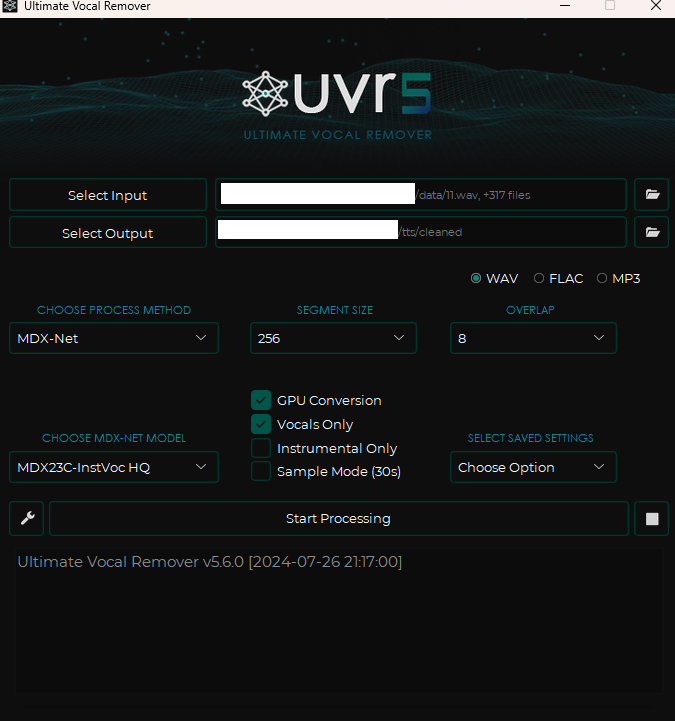
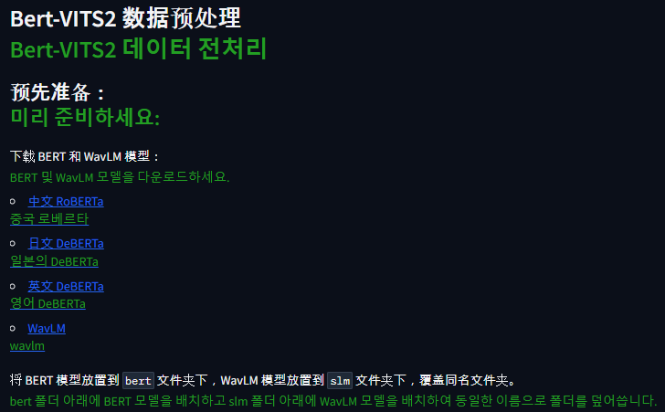
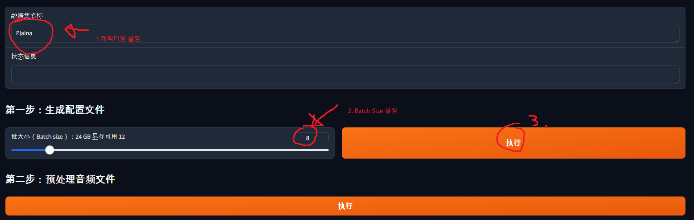
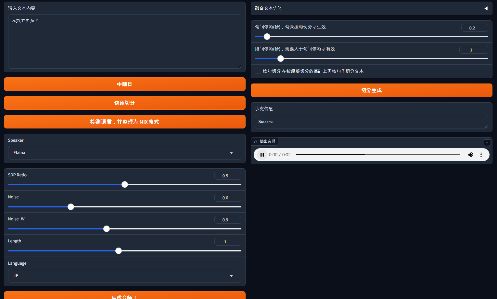

## 우리가 만들 오디오 한번 들어보기 (일본어) 

- [Link](audio.wav)

### 1. TTS?

Text-To-Speech는 문자 그대로, 텍스트를 음성 데이터로 변경해 주는 소프트웨어를 말합니다.

한번 만들어 놓으면, 호출량 걱정 없이 많은 Automation에서 사용할 수 있기에, 직접 한번 만들어 보는 것이 목표입니다.

이왕 만든다면, 내가 아는 캐릭터가 이야기 하면 더 재밌을 것 같지 않나요? 그러므로, 한번 커스텀 데이터를 이용해 직접 모델을 튜닝하고, TTS를 만들어 보는걸 해 볼 예정입니다.

그 중, 저희는 [Bert-Vits2](https://github.com/fishaudio/Bert-VITS2) 라는 모델을 이용하여 학습을 해 볼 예정입니다. 참고로 중국어, 영어, 일본어를 지원합니다.

만약, 나는 캐릭터 목소리같은건 관심 없고 정갈한 한글 목소리가 필요하다! 라는 분은 [Melotts](https://github.com/myshell-ai/MeloTTS)와 Pretrian된 모델을 찾아보시는걸 권해 드립니다.

마지막으로 덧붙여, 모델을 만들고 난 후에는 모델 배포 등을 하지 마시고, 개인 연구용/취미용으로만 사용하는 것을 강력히 권해 드립니다.

준비물은 GPU 달린 우분투 서버와 근성입니다(..)

### 2. 작업 프로세스

학습을 위해서는 적어도 20분~1시간 가량의 깨끗한 음성 데이터가 필요합니다.

직접 녹음할 수 있다면 가장 좋겠지만, 중국어/일본어/영어 데이터를 20분~1시간 발화하는 것은 쉬운 일이 아닙니다.

따라서, 저희는 애니메이션을 이용해서 학습 자료를 만들어 볼 예정입니다.

아이디어는 다음과 같습니다.

1. 자막은 자막 시작 시간과 끝 시간, 텍스트 데이터가 있다.
2. 애니메이션에서 자막 시간만큼을 끊어 음성 데이터를 추출하고, 그 음성 데이터의 Label을 자막 값으로 한다.

그리고, 전체 프로세스는 다음과 같습니다.

1. 좋아하는 애니메이션과, 원어 자막을 구합니다.
2. 자막 데이터와 애니메이션 데이터를 불러와, 대사 부분을 추출합니다.
3. 대사 부분을 추출한 후, 배경 음악 등을 머신러닝으로 제거합니다.
4. 직접 대사를 하나하나 들으면서, 내가 원하는 캐릭터가 아닌 데이터를 삭제합니다.
5. 그러면 "내가 원하는 캐릭터" 의 "음성 데이터와 라벨 데이터"가 모이게 됩니다. 이 데이터로 Bert-VITS2를 학습시킵니다.
6. 완성된 TTS를 가지고 놀아 봅니다!

이 프로세스대로 간결하게 설명해보려고 합니다.

### 3-1. 자막 파일로 대사 부분을 추출하기

애니메이션, 원어 자막은 알아서 구할 거라고 생각하고 패스합니다.

제가 사용했던 자료를 모아놓은 [Github](https://github.com/LemonDouble/tts-preprocess) 에 들어갑니다.

git clone 이후, 의존성을 설치하고 `extract_wav_1.py` 에서 동영상명, 자막 파일 명을 집어넣고 실행시킵니다.

그러면 data 폴더에 1~xxx.wav 파일이 자동으로 생성됩니다.


### 3-2. UVR (ULTIMATE VOCAL REMOVER)을 이용하여 배경 음악 제거하기

[UVR 홈페이지](https://ultimatevocalremover.com/) 에 가서 다운 후 실행합니다.

이후 다음과 같이 설정을 맞춰 주세요.



1. input은 방금 생성한 wav 파일을 전체 넣어줍니다.
2. output은 cleaned 란 폴더를 만들어 넣어 주세요.
3. Choose MDX-NET Models는 Download New Model -> MDX-Net에서 MDX23C-InstVoc HQ 모델을 다운받은 후 선택해 줍니다.
4. GPU Conversion, Vocals Only 옵션을 켜 주고 실행시킵니다.

### 3-3. 수작업으로 저품질 오디오, 다른 캐릭터 대사 제거하기

cleaned 폴더에 들어가서 저품질 오디오 (발소리나 효과음이 섞인 경우, 말이 섞인 경우)와, 다른 캐릭터의 대사를 제거합니다. (파일 삭제)

### 3-4. 라벨 데이터 만들기

`change_name_2.py`를 실행해 clenaed 폴더의 파일 이름을 바꿔주고,
`make_list_3.py`를 실행해 esd.list라는 파일을 만들어 줍니다.

### 3-5. 수집한 데이터 길이 확인하기

`calculate_length.py` 를 실행하여, 몇분 몇초만큼의 데이터를 모았는지 확인합니다.

### 3-6. 반복하기

만약 충분한 데이터가 안 보였다면, 데이터가 모일때까지 앞의 작업을 반복해 주세요.

별도의 디렉토리에 캐릭터 이름으로 폴더를 하나 만들고, 다음과 같이 배치합니다.

```
캐릭터명/
  ㄴesd.list
  ㄴraw/
    ㄴf6df34d9-01c4-4db9-97e9-a35795a5f64b.wav
    ㄴ18bcc2c6-3e23-427c-a04a-9414b6f0b85e.wav
    ...
```

esd.list는 텍스트 편집기로 열어 계속 붙여넣어주면 되고,
raw 폴더 내에는 cleaned 내의 wav 파일들을 붙여넣어주면 됩니다.

계속 반복하여 파일 총 길이가 20분~1시간이 되도록 합시다.

### 3-7. 데이터 학습하기

우분투 서버로 옮깁니다.

우분투에 CUDA가 설치되어 있지 않다면 우분투 CUDA 설치로 검색하여 CUDA를 설치합니다.

[Bert-Vits2](https://github.com/fishaudio/Bert-VITS2) 리포지토리를 Clone하고, [가상환경](https://heytech.tistory.com/295)을 만든 후 `pip install -r requirements.txt` 입력하여 의존성 설치해 줍니다.

이후 `python webui_preprocess.py` 실행합니다.

이후, 해당 Gradio 환경에 접속한 후 파일을 각각 받아 위치에 집어넣습니다.

 

[中文 RoBERTa](https://huggingface.co/hfl/chinese-roberta-wwm-ext-large/tree/main) -> BERT_VITS2/bert/chinese-roberta-wwm-ext-large 폴더에 flax_model.msgpack, pytorch_model.bin,tf_model.h5 다운로드 후 넣기

나머지도 똑같이 용량 큰 파일 다운받아서 넣어 줍니다.

[日文 DeBERTa](https://huggingface.co/ku-nlp/deberta-v2-large-japanese-char-wwm/tree/main) -> Bert-VITS2/bert/deberta-v2-large-japanese-char-wwm 폴더

[英文 DeBERTa](https://huggingface.co/microsoft/deberta-v3-large/tree/main) -> Bert-VITS2/bert/deberta-v3-large 폴더,

[WaveLM](https://huggingface.co/microsoft/wavlm-base-plus/tree/main) -> Bert-VITS2/slm/wavlm-base-plus 폴더

이후, Bert-VITS2/data/{캐릭터 이름}폴더를 만들고 학습 데이터를 옮겨줍니다.

```
Bert-VITS2/
ㄴdata/
  ㄴElaina/
    ㄴesd.list
    ㄴtrain.list
    ㄴval.list
    ㄴraw/
        ㄴf6df34d9-01c4-4db9-97e9-a35795a5f64b.wav
        ㄴ18bcc2c6-3e23-427c-a04a-9414b6f0b85e.wav
        ...
```

이 때, esd.list는 만든 파일 그대로,
val.list는 esd.list의 마지막 5%정도를 떼서 복사 붙여넣기,
train.list는 val.list에 넣은거 빼고 복사 붙여넣기 해서 파일을 만들어주면 됩니다.

예시 :

esd.list
```
f6df34d9-01c4-4db9-97e9-a35795a5f64b.wav|Elaina|JP|ありがとう
b234c567-d890-1234-e567-890f123g4567.wav|Elaina|JP|おはよう
c345d678-e901-2345-f678-901g234h5678.wav|Elaina|JP|すみません
d456e789-f012-3456-g789-012h345i6789.wav|Elaina|JP|さようなら
e567f890-0123-4567-h890-123i456j7890.wav|Elaina|JP|元気ですか？
```

train.list
```
f6df34d9-01c4-4db9-97e9-a35795a5f64b.wav|Elaina|JP|ありがとう
b234c567-d890-1234-e567-890f123g4567.wav|Elaina|JP|おはよう
c345d678-e901-2345-f678-901g234h5678.wav|Elaina|JP|すみません
d456e789-f012-3456-g789-012h345i6789.wav|Elaina|JP|さようなら
```

val.list
```
e567f890-0123-4567-h890-123i456j7890.wav|Elaina|JP|元気ですか？
```

여기까지 했다면, 아까 Gradio에 가서 다음과 같이 설정합니다.



1. 캐릭터 이름(제 경우 Elaina) 를 입력합니다.
2. 배치 사이즈를 선택합니다. 배치 사이즈가 클수록 학습은 빠르나, 배치 사이즈가 너무 크면 GPU 메모리에 다 안 올라갑니다. 저의 경우는 3090이라 12로 설정했는데, 일단 큰거 써 보고 이후에 줄이면 됩니다.
3. 다 설정했다면 버튼을 누릅니다.

버튼을 누르면, Bert-VITS2/config.yml 파일이 생깁니다.
해당 파일을 수정합니다.

1. 7번 라인의 "Data/" 부분을 "data/{캐릭터명}"으로 수정합니다. (제 경우 data/Elaina)
2. 20번 라인의 in_dir을 "audios/raw" -> "raw" 로 변경합니다.
3. 22번 라인의 out_dir을 "audios/wavs" -> "wavs"로 변경합니다.
4. 29번 라인의 transcription_path를 "filelists/esd.list" 로 변경합니다.

이후 Gradio로 다시 돌아가, 第二步：预处理音频文件(2단계: 오디오 파일 전처리), 第三步：预处理标签文件(3단계: 라벨 파일 전처리), 第四步：生成 BERT 特征文件(4단계: BERT 기능 파일 생성) 을 순서대로 눌러줍니다.

이후 Pretrain된 모델을 다운로드 받습니다.

다음 [링크](https://huggingface.co/OedoSoldier/Bert-VITS2-2.3/tree/main) 로 이동하여 DUR_0.pth, D_0.pth, G_0.pth, WD_0.pth을 다운받아 data/{캐릭터명}/models 폴더에 붙여넣기 합니다.

이후 config.yml의 90번 라인의 config_path를  “configs/config.json” 로 변경합니다. (train_ms 부분)

이후 Bert-VITS2 폴더에서 `torchrun --nproc_per_node=1 train_ms.py` 실행시 학습이 진행됩니다!

### 3-8. 음성 출력하기

학습이 진행되면, 음성이 정상적으로 나오는지 확인해야 합니다.

data/{캐릭터명}/models 폴더에 보면, 학습이 진행될수록 여러 파일들이 생깁니다. G_1000.pth 같은 식으로요.

G_xxxx.pth 파일이 목소리를 생성하기 위한 파일입니다.
해당 폴더를 확인 후, config.yml의 105번쨰 줄 (webui 부분)의 model을 "model/G_xxxx.pth" 로 변경합니다. (이떄 xxxx는 현재 디렉토리에 있는 모델)

이후, Bert-VITS2 폴더에서 `python webui.py` 를 입력하면 Gradio가 생기게 되고,해당 Gradio에서 TTS를 테스트 해 볼 수 있습니다.



참고로 이 데이터를 이용해 별도로 서버를 만들고 싶다면, hiyoriUI.py를 참고해 보세요! fastAPI 기반의 서버를 제공합니다.

### 마무리하며

이것으로 간?단히 TTS를 만드는 법에 대한 이야기를 해 봤습니다.

중간중간 구멍이 많이 뚫려 있는데, 비슷한 글이 있어 해당 글에서 헷갈렸던 부분만 집중적으로 다뤄서 그렇습니다.

[Chapter 4. Bert-VITS2 사전 준비 및 훈련 시작](https://info-nemo.com/coding-story/chapter-4-bert-vits2-%ed%95%99%ec%8a%b5-%ec%a0%84-%ec%82%ac%ec%a0%84-%ec%a4%80%eb%b9%84/)

본 글에서 구멍이 나 있는 부분은, 이 글을 같이 보시면 이해가 빠를 거에요.

저의 경우, 별도로 돌리고 있는 머신러닝 서버에 TTS를 이식해 잘 쓰고 있답니다. 

혹시 잘 안 되는 부분 있으시면 편하게 댓글 주시고, 여러분도 즐거운 TTS 만드시길 바랍니다!
