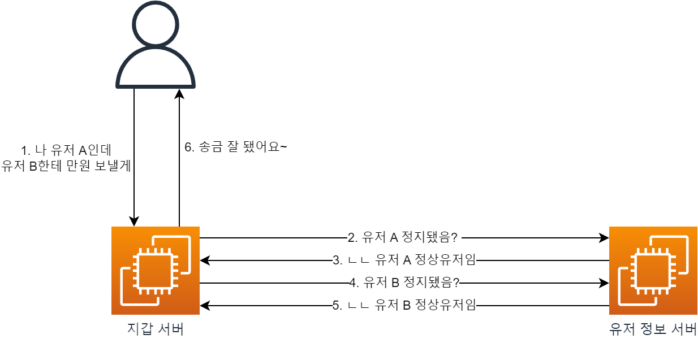
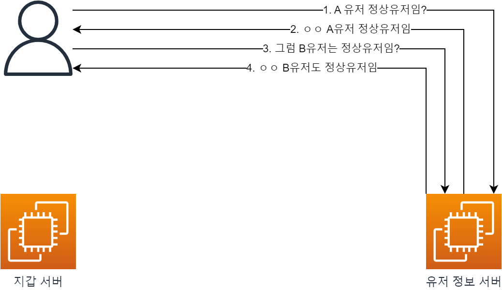
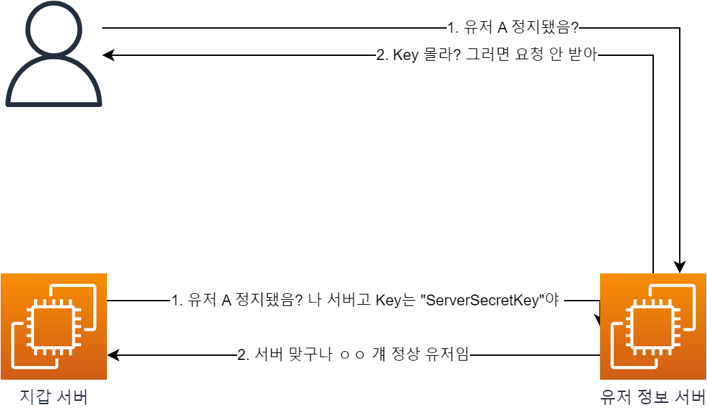
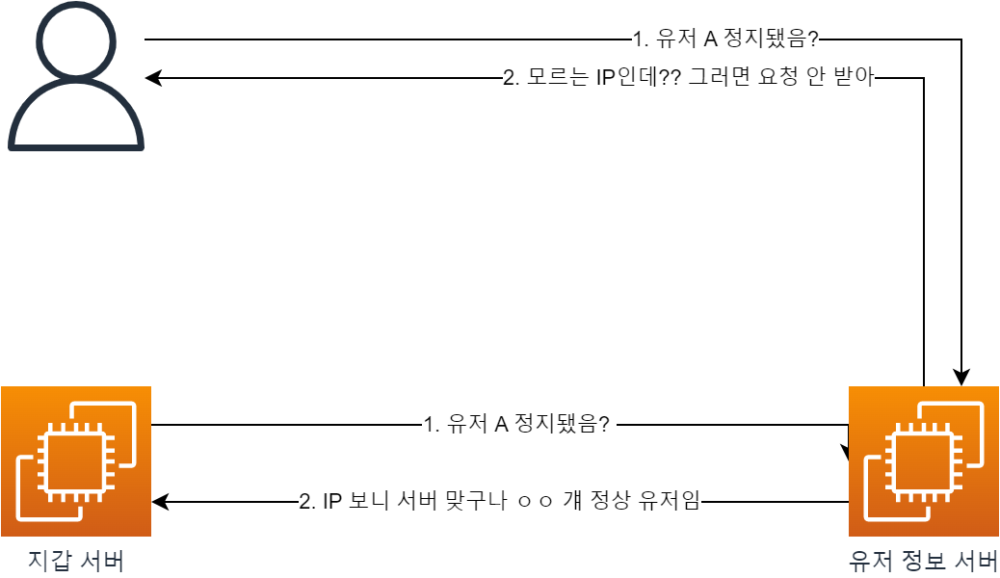
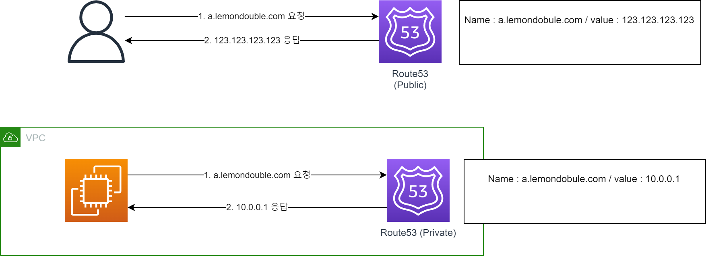
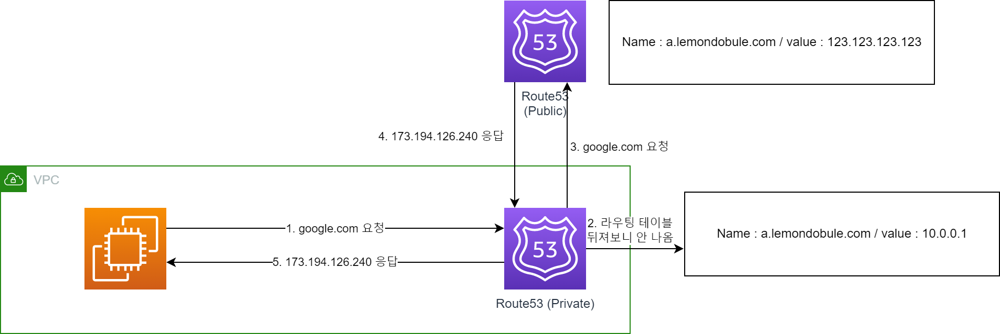
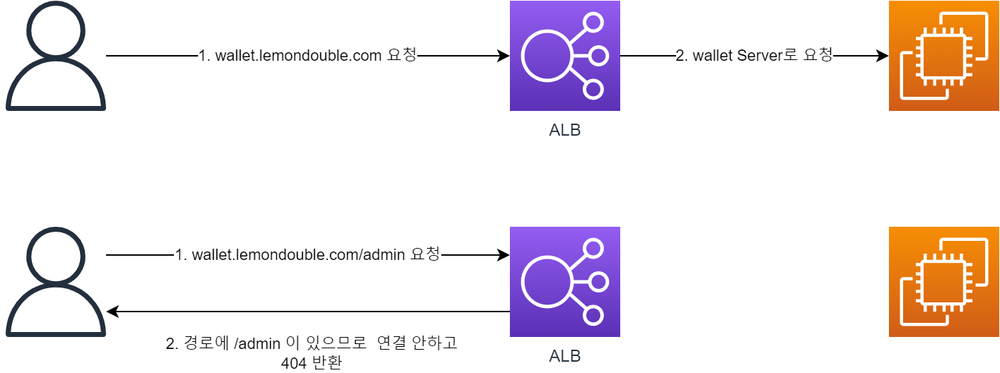
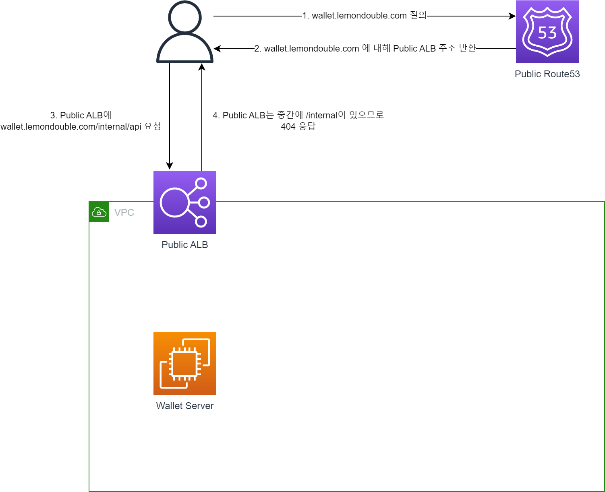
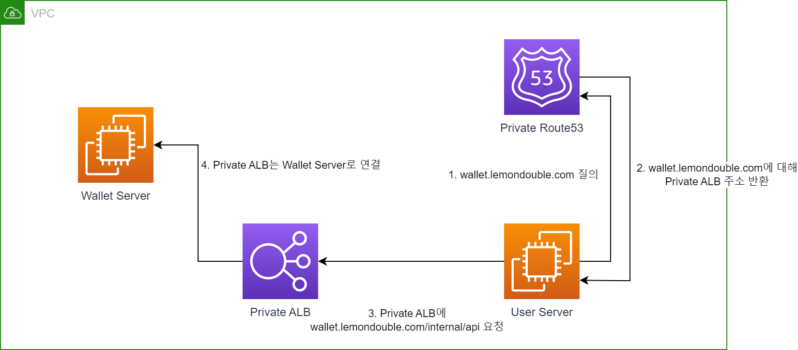
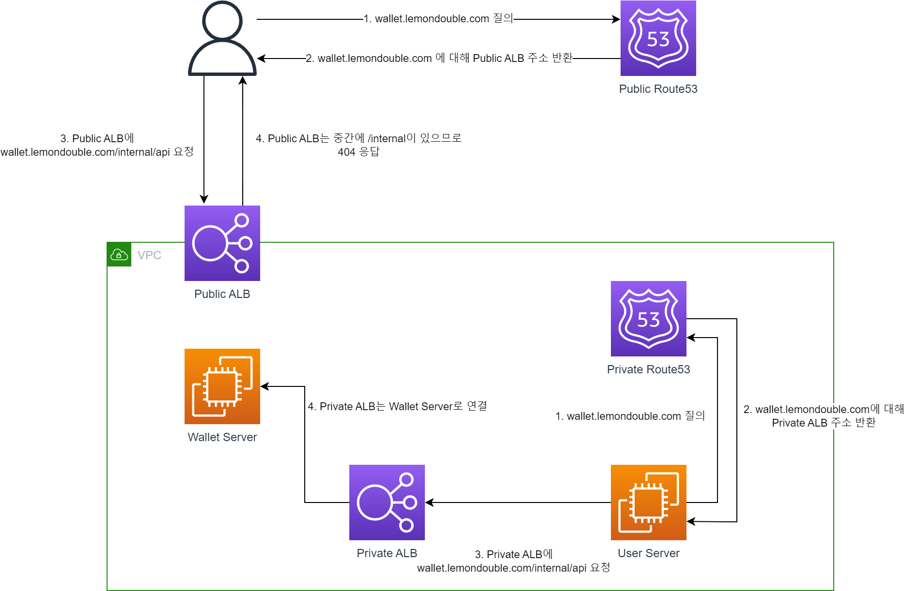

MSA 서비스를 만들면 서버 간 굉장히 잦은 통신이 일어납니다.

예를 들어 (아주 간략화한) 송금 서비스가 있다고 가정해 봅시다.

지갑 서버와 유저정보 서버가 있다면, 송금 API를 호출하면 위와 같은 일이 일어날 겁니다.

---

그런데 만약, **정상 유저 확인 API**를 외부에서 접근할 수 있다면 어떨까요?

악의적인 유저가 작정하고 접근하면, 우리 서비스의 정상 유저 비율을 도표로 나타낼 수도 있을 것입니다(..)

따라서, MSA 구조에서 `서버간 요청에선 API를 사용할 수 있지만`, 이를 `외부 유저가 접근해선 안 되는` 요구사항이 생겼습니다.

어떻게 하면 이 요구사항을 달성할 수 있을까요?

---

### 1. 가장 간단한 방법은, 서버끼리 비밀 Key를 공유하는 방식입니다.

* 환경 변수 등을 이용해서, 서버끼리 서로 같은 비밀 Key를 공유합니다.
* 이를 HTTP Custom Header등에 실어서, 서버가 요청할 때 Key를 같이 보냅니다.
* 서버는 내부 API 요청을 받으면 비밀 Key를 확인하고, 만약 일치하지 않는다면 Reject 합니다.

하지만 이 방법에는 문제가 있습니다.

* 만약에 누가 비밀 Key를 들고 날랐다면? 혹은, Git 등의 외부 저장소에 Key가 노출됐다면?
* 외부에서 당연히 API 요청이 가능할 것입니다.

### 2. 그러면 Whitelist 등을 관리하는건 어떨까요?

* 서버의 IP를 모두 알 수 있다면, `X-Forwarded-For` 헤더 등을 통하여 IP를 확인한 후, 우리가 알고 있는 서버의 IP가 아니라면 차단할 수 있습니다.

그런데 이 방법에도 문제가 좀 있습니다!

* 만약 요청이 너무 많이 들어와서, 서버를 증설한다면 어떨까요?
* 당연히 새 서버의 IP는 알지 못하므로, 차단될 것입니다.

### 3. 네트워크 설정을 통해 외부 진입을 막아 봅시다!

* 1, 2의 방법도 좋은 방법이지만, 아예 외부에서 진입하는 경우 응답이 서버까지 도달하지 않으면 좀 더 안전할 것입니다.
* 이걸 Private DNS / Public DNS를 이용하여 구현해 봅시다!
* `Split Horizon DNS`, 또는 `Multiview DNS` 라고도 불리는 방법입니다.
* 관련 문서 : ( [Link](https://aws.amazon.com/ko/premiumsupport/knowledge-center/internal-version-website/) )
* 그러면 하나하나 차근차근 알아봅시다.

* **1. 먼저 Public DNS / Private DNS에 대해 알아 봅시다.**

* 아주 간단하게 보면, VPC 외부에서 접근할 때 / VPC 내부에서 접근할 때 다른 응답 주소를 줄 수 있습니다.
* VPC 내부에서 접근할 땐 내부 DNS 서버를, 외부에서 접근할땐 외부 DNS 서버를 사용한다고 생각하면 됩니다!

* 그러면, 내부 DNS에 없는 레코드를 요청하면 어떻게 될까요?
* 위 그림과 같이 Private DNS에 먼저 질의한 후, 없는 경우 Public DNS에 질의합니다.
* ( Note : 실제 네트워크 흐름과 정확히 일치하지 않을 수 있습니다. 하지만 중요한 건, Private DNS에 우선권이 있다는 겁니다.)

* **2. 그러면 이제 ALB에 대해 알아 봅시다.**

* ALB (Application Load Balancer)는 들어오는 요청을 평가해서, 적절하게 분배할 수 있습니다.
    * HostName을 기준으로 적절하게 응답할 수 있습니다. 예를 들어..
        * `wallet.lemondouble.com` 으로 들어오면 `wallet server`로 연결할 수 있습니다.
        * `user.lemondouble.com`으로 들어오면 `user server`로 연결해 줄 수 있습니다.
    * Path를 사용해도 같은 작업을 할 수 있습니다.
        * `api.lemondouble.com/wallet` 으로 들어오면 `wallet server`로 연결할 수 있습니다.
        * `api.lemondouble.com/user` 로 들어오면 `user server`로 연결해 줄 수 있습니다.
        * 물론, `특정 Path를 포함하고 있다면 Deny`하는 것도 가능합니다.

* **3. 그러면 이 두개를 합치면?**

* 먼저, Public DNS와 인터넷에 연결된 Public ALB를 만들어 줍니다.
    * 이 때, Public ALB의 규칙은 다음과 같습니다.
    * 우선순위 1. `Hostname이 wallet.lemondouble.com과 일치하고, Path가 /internal* 이면 고정 404 응답`
    * 우선순위 2. `Hostname이 wallet.lemondouble.com과 일치하면 Wallet Server의 80 포트로 연결`

* 이 경우 ALB 규칙은 우선순위대로 적용되므로
    * `wallet.lemondouble.com/api/hello` 의 경우 `우선순위 1` 에 Match되지 않고, `우선순위 2` 에 매치되므로 wallet Server로 연결됩니다.
    * `wallet.lemondouble.com/internal/hello` 의 경우 `우선순위 1` 에 Match되므로, 404 응답을 받습니다.

* 다음으로, Public DNS와 동일하게 Private DNS와, 인터넷에 연결되지 않은 Private ALB를 만들어 줍니다.
    * 이 때, Private ALB의 규칙은 다음과 같습니다.
    * 우선순위 1. `Hostname이 wallet.lemondouble.com과 일치하면 Wallet Server의 80 포트로 연결`

* 이 경우, `/internal*` 에 대해 404를 응답하는 로직이 없으므로, 모든 요청은 Wallet Server로 전달됩니다.

* 둘을 합치면 다음과 같은 모양이 됩니다.
* `wallet.lemondouble.com/internal/hello` API를 호출하였을 때, VPC 외부에서는 404 응답을 받지만, VPC 내부에서는 정상 응답을 받습니다.

### 4. 그러면 네트워크 설정만 하면 충분할까요?

* 얼마나 정보 유출에 민감한 어플리케이션을 만드냐에 따라 다르겠지만, 1 과 3의 방법을 합치면 더 좋을 것입니다. 그러면..
    * 만약 서버끼리의 비밀 Key가 유출되더라도, 네트워크 설정이 막고 있으니 외부 접근이 차단됩니다.
    * 만약 네트워크 설정을 잘못 건드렸더라도, 외부에서는 비밀 Key를 모르므로 외부 접근이 차단됩니다.
    * 실수는 언제나 일어날 수 있으므로, 실수가 일어나더라도 시스템으로 막을 수 있는 방법이 훨씬 좋습니다!!

---

이상으로 Private (또는 Internal) API를 만드는 법을 알아봤습니다.

Private API를 만드는 방법은 다양합니다. 이외에도 AWS의 API Gateway를 이용할 수도, (잘 모르지만) K8S나 Spring Cloud Gateway 등을 사용할 수도 있을..? 겁니다. 

여러 방법 중에 이런 방법도 있구나~ 하고 봐 주시면 감사하겠습니다. 혹시 틀린 게 있다면 댓글 남겨 주세요!

감사합니다.