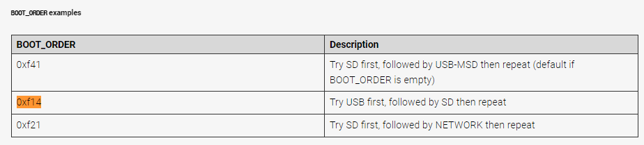

라즈베리 파이는 다 좋은데 SD 카드 부팅이 굉장히 화가 날 때가 많습니다..

삽질한다고 SD카드 빼다가 어디 긁어먹어서 인식이 안 되면 굉장히.. 심란한 경우가 많습니다.

SD카드나 USB나 비슷한 기술 쓰는건 알고 있지만.. 

경험상 USB가 그나마 안정성이 더 나은 경우가 많았습니다. (파손 이슈)

그러니 SD카드를 던져버리고 USB로 부팅시킵시다!

---

`아래는 Ubuntu 22.04 Server 환경에서 작성되었습니다.`

### 1. SD카드 굽기

* 일단 USB로 부팅을 시키려면 부트로더를 손봐야 하는데, 그러려면 일단 SD카드로 한번은 부팅을 해야 합니다..
* SD카드 굽고, SSH 연결 합시다. 이후 커맨드는 전부 터미널에서 진행됩니다.

### 2. eeprom의 Booloader 업데이트

* EEPROM : 컴퓨터구조 시간에 배웠던 ROM인데, 대충 여기에 쓰고 지울 수 있는 ROM이라 생각하시면 됩니다.
* 여따가 Bootloader를 올려놓고 쓰는데, 대충 2020년 9월? 이후 버전의 부트로더부터 USB 부팅을 지원합니다.
* 겸사겸사 업데이트를 해 줍시다.

Ref : https://www.raspberrypi.com/documentation/computers/raspberry-pi.html#automaticupdates

1. `sudo rpi-eeprom-update` 커맨드를 쳐서 현재/최신 버전의 Bootloader를 확인합니다.
2. `sudo rpi-eeprom-update -a` 커맨드를 쳐서 Bootloader 업데이트를 예약합니다.
3. `sudo reboot` 으로 재부팅하면 부팅하는 동안 부트로더 업데이트가 진행됩니다.
4. `sudo rpi-eeprom-update` 커맨드를 쳐서 업데이트가 잘 됐는지 확인합니다.

- Update (2023.05.19)
  - 위 rpi-eeprom-update 는 RPI4 부터 지원합니다.
  - RPI 3B 이하를 사용 중이라면, [Booting Raspberry Pi 3 B With a USB Drive](https://www.instructables.com/Booting-Raspberry-Pi-3-B-With-a-USB-Drive/) 를 참고해 주세요.
  - Raspbian os를 사용하면 해당 가이드를 그대로 따라하면 됩니다.
  - Ubuntu를 사용 중이라면, config.txt는 `boot/firmware/config.txt` 를 수정하셔야 합니다!!!

### 3. 부팅 순서 정리

* Ubuntu Server에는 raspi-config 프로그램이 없으므로 일단 설치합니다.

1. `sudo apt install raspi-config` 입력해서 raspi-config 프로그램을 설치합니다.
2. `sudo raspi-config` 커맨드 입력 후 Advanced Option -> Boot Order 에 들어갑니다.
3. `USB Boot`을 선택하고, `sudo reboot`으로 재부팅합니다.

### 4. 부팅 순서 적용 잘 됐는지 확인

* `vcgencmd bootloader_config`를 입력합니다.
* 아래에 `BOOT_ORDER=0xf14` 라고 세팅되어있는지 확인합니다. 세팅되어있지 않다면 뭔가 설정 중 꼬였으니 1~3을 반복합니다.
* Ref : https://www.raspberrypi.com/documentation/computers/raspberry-pi.html#configuration-properties

### 5. USB에 OS 구운 뒤 꼽고 재부팅

* SD카드를 빼고, USB에 OS를 굽고 재부팅합니다
* 와! 부팅이 됩니다. 굿!